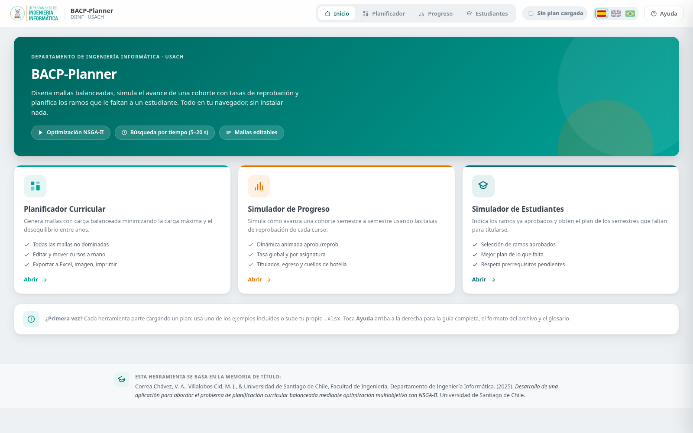
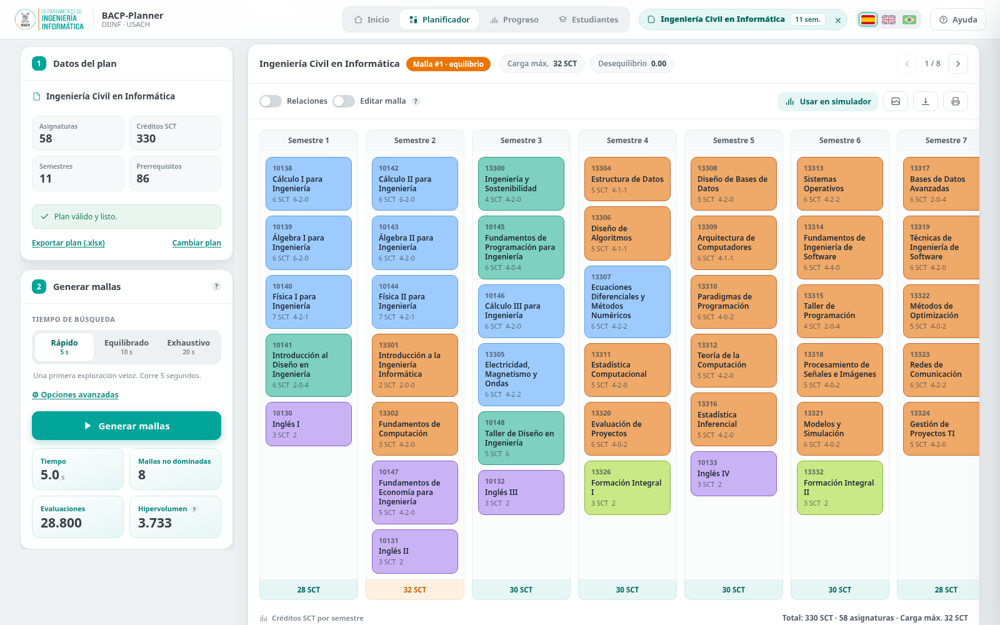
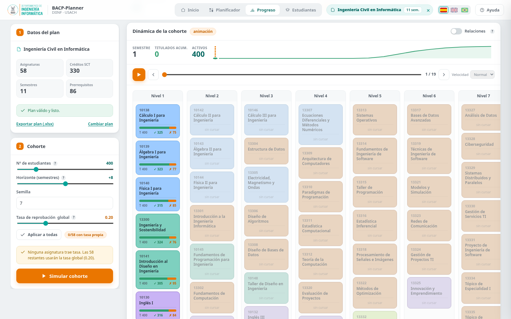
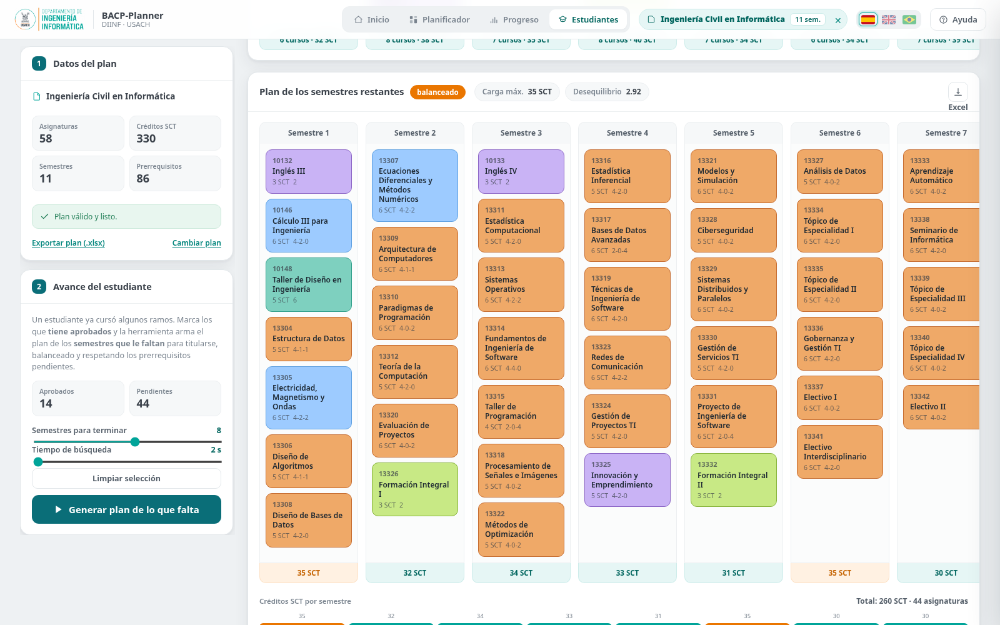
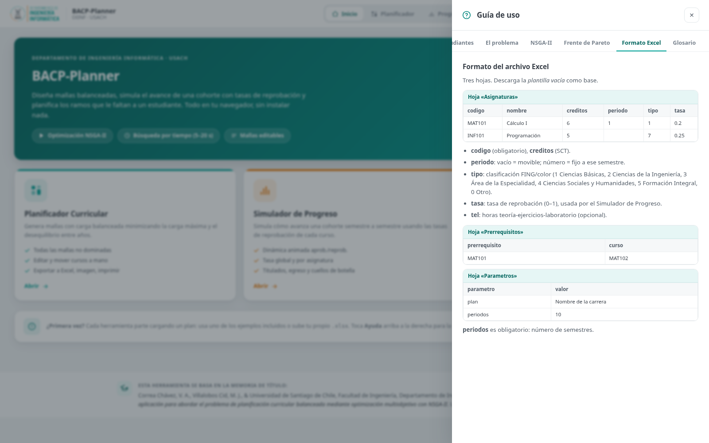

# BACP-Planner

**Planificación curricular balanceada, simulación de cohortes y planificación del avance estudiantil en el navegador.**  
**Balanced curriculum planning, cohort simulation, and student progression planning in the browser.**

[Español](#español) · [English](#english) · [Capturas / Screenshots](#capturas--screenshots) · [Formato Excel / Excel format](#formato-excel--excel-format) · [Arquitectura / Architecture](#arquitectura--architecture)

BACP-Planner es una aplicación web estática desarrollada para el Departamento de Ingeniería Informática de la Universidad de Santiago de Chile. Ejecuta toda la carga de datos, optimización, simulación, edición y exportación directamente en el navegador, sin backend ni base de datos.

BACP-Planner is a static web application developed for the Department of Computer Science at Universidad de Santiago de Chile. Data loading, optimisation, simulation, editing, and export run directly in the browser, with no backend or database.

---

## Capturas / Screenshots

### Inicio / Home



| Planificador curricular / Curriculum planner | Simulador de progreso / Progress simulator |
|---|---|
|  |  |

| Simulador de estudiantes / Student simulator | Ayuda y formato Excel / Help and Excel format |
|---|---|
|  |  |

---

# Español

## 1. ¿Qué es BACP-Planner?

BACP-Planner integra tres herramientas que trabajan sobre un mismo plan de estudios:

1. **Planificador Curricular:** genera mallas factibles y balanceadas mediante optimización multiobjetivo con NSGA-II.
2. **Simulador de Progreso:** simula semestre a semestre el avance de una cohorte considerando tasas de reprobación.
3. **Simulador de Estudiantes:** recibe las asignaturas aprobadas por un estudiante y propone una planificación para los semestres pendientes.

La aplicación funciona como una única página web. `index.html` contiene la interfaz, estilos, modelos de datos, algoritmos, visualizaciones y lógica de interacción. SheetJS se distribuye localmente en `vendor/` para leer y escribir archivos Excel sin depender de una CDN.

## 2. Funcionalidades principales

### Planificador Curricular

- Carga planes desde Excel o desde el ejemplo incorporado.
- Valida asignaturas, periodos y prerrequisitos.
- Genera soluciones factibles mediante NSGA-II.
- Minimiza simultáneamente la carga máxima por semestre y el desequilibrio de créditos entre años.
- Muestra el frente de Pareto y destaca una solución de compromiso o *knee*.
- Permite recorrer todas las mallas no dominadas.
- Permite mover, agregar o editar asignaturas y recalcula los objetivos en tiempo real.
- Visualiza relaciones de prerrequisitos y carga SCT por semestre.
- Exporta una malla, todas las mallas, una imagen PNG o una versión imprimible.

### Simulador de Progreso

- Simula cohortes de 50 a 2.000 estudiantes.
- Usa una tasa global de reprobación y permite tasas específicas por asignatura.
- Mantiene resultados reproducibles mediante una semilla configurable.
- Anima el avance semestre a semestre sobre la propia malla.
- Muestra estudiantes activos, titulados acumulados, aprobaciones y reprobaciones.
- Estima el tiempo promedio de titulación y la proporción de egreso nominal.
- Identifica asignaturas cuello de botella según reprobaciones acumuladas.

### Simulador de Estudiantes

- Permite marcar visualmente las asignaturas ya aprobadas.
- Calcula las asignaturas pendientes y conserva los prerrequisitos aún activos.
- Propone una malla balanceada para los semestres restantes.
- Permite ajustar el número de semestres disponibles y el tiempo de búsqueda.
- Exporta el plan restante a Excel.

### Funciones transversales

- Interfaz en español, inglés y portugués.
- Ejemplo incorporado de Ingeniería Civil en Informática.
- Importación y exportación de archivos `.xlsx`.
- Procesamiento local: los datos no se envían a un servidor de BACP-Planner.
- Diseño adaptable para escritorio y pantallas estrechas.
- Ayuda integrada sobre uso, algoritmos, formato de datos y glosario.

## 3. Ejecución rápida

No se necesita instalar dependencias ni compilar el proyecto.

### Opción A: abrir directamente

Abre `index.html` en un navegador moderno. La aplicación incluye localmente la biblioteca necesaria para Excel.

### Opción B: servidor local recomendado

Desde la carpeta del repositorio:

```bash
python -m http.server 8000
```

Luego abre:

```text
http://localhost:8000/
```

También puedes usar cualquier servidor estático, por ejemplo Apache, Nginx, VS Code Live Server o `npx serve`.

## 4. Publicación en GitHub Pages

1. Crea un repositorio y copia el contenido de esta carpeta en la raíz.
2. Sube los archivos a la rama `main`.
3. En GitHub abre **Settings → Pages**.
4. Selecciona **Deploy from a branch**.
5. Elige la rama `main` y la carpeta `/ (root)`.
6. Guarda la configuración.

La aplicación quedará disponible en una dirección similar a:

```text
https://USUARIO.github.io/NOMBRE-DEL-REPOSITORIO/
```

El archivo `.nojekyll` evita que GitHub Pages procese la aplicación con Jekyll.

## 5. Flujo de uso

### 5.1 Cargar un plan

Cada módulo comienza con un panel de datos. Puedes:

- cargar el ejemplo integrado;
- arrastrar un archivo `.xlsx` al panel;
- seleccionar manualmente un archivo `.xlsx` o `.xls`;
- descargar la plantilla vacía incluida;
- descargar el ejemplo completo incluido.

Al cargar el archivo, la aplicación informa la cantidad de asignaturas, créditos SCT, semestres y relaciones de prerrequisito.

### 5.2 Generar mallas

En **Planificador**:

1. Selecciona un presupuesto de tiempo: rápido, equilibrado o exhaustivo.
2. Abre las opciones avanzadas para modificar población, cruce, mutación, búsqueda local, inmigrantes y semilla.
3. Presiona **Generar mallas**.
4. Recorre el frente de Pareto y selecciona la malla que mejor se ajusta al criterio institucional.
5. Activa **Editar malla** para mover o modificar asignaturas.
6. Exporta la solución o envíala al simulador de progreso.

### 5.3 Simular una cohorte

En **Progreso**:

1. Define el tamaño de la cohorte, horizonte adicional y semilla.
2. Configura la tasa global de reprobación.
3. Conserva las tasas específicas incluidas en el Excel o aplica la tasa global a todas las asignaturas.
4. Presiona **Simular cohorte**.
5. Usa los controles de reproducción para avanzar por los semestres.
6. Revisa egreso, aprobaciones, reprobaciones y cuellos de botella.

### 5.4 Planificar un estudiante

En **Estudiantes**:

1. Carga el plan.
2. Marca las asignaturas aprobadas sobre la malla base.
3. Elige cuántos semestres quedan disponibles.
4. Presiona **Generar plan de lo que falta**.
5. Revisa la carga por semestre y exporta el resultado a Excel.

## 6. Formato Excel

El libro debe contener tres hojas. La aplicación compara los nombres sin distinguir mayúsculas y minúsculas.

### Hoja `Asignaturas`

| Columna | Obligatoria | Tipo | Descripción |
|---|---:|---|---|
| `codigo` | Sí | texto | Identificador único de la asignatura. Se recomienda mantenerlo como texto. |
| `nombre` | Sí | texto | Nombre visible de la asignatura. |
| `creditos` | Sí | número | Créditos SCT usados por los objetivos de balance. |
| `periodo` | No | entero | Semestre fijo. Déjalo vacío para que el optimizador pueda asignarlo. |
| `tel` | No | texto o número | Distribución Teoría–Ejercicios–Laboratorio, por ejemplo `6-2-0` o `620`. |
| `tipo` | No | entero | Categoría académica usada para colorear la malla. |
| `tasa` | No | decimal entre 0 y 1 | Probabilidad de reprobación usada por el simulador de cohortes. |

Valores de `tipo`:

| Valor | Categoría |
|---:|---|
| `1` | Ciencias Básicas |
| `2` | Ciencias de la Ingeniería |
| `3` | Área de la Especialidad |
| `4` | Ciencias Sociales y Humanidades |
| `5` | Formación Integral |
| `0` | Otro / Electivo |

### Hoja `Prerrequisitos`

| Columna | Descripción |
|---|---|
| `prerrequisito` | Código de la asignatura que debe aprobarse primero. |
| `curso` | Código de la asignatura dependiente. |

Cada fila representa una relación dirigida:

```text
prerrequisito → curso
```

### Hoja `Parametros`

| `parametro` | `valor` | Uso |
|---|---|---|
| `plan` | Nombre del plan | Título mostrado en la interfaz y exportaciones. |
| `periodos` | Número entero | Cantidad total de semestres del plan. |

### Archivos incluidos

- `examples/plantilla_plan_estudios.xlsx`: plantilla mínima editable.
- `examples/ejemplo_ing_civil_informatica.xlsx`: ejemplo completo con 58 asignaturas, 330 SCT, 11 semestres y 86 prerrequisitos.

## 7. Modelo de optimización

### 7.1 Problema BACP

El **Balanced Academic Curriculum Problem** asigna cada asignatura a un semestre respetando restricciones académicas y buscando una distribución equilibrada de la carga.

Restricciones principales:

- cada asignatura debe quedar asignada a un semestre válido;
- un prerrequisito debe ubicarse antes que su asignatura dependiente;
- una asignatura con `periodo` fijo debe conservar ese semestre;
- las modificaciones manuales se validan antes de aceptarse.

### 7.2 Objetivos

Para una malla con carga SCT por semestre `L₁, L₂, ..., Lₚ`:

**f₁ — Carga máxima**

```text
f₁ = max(L₁, L₂, ..., Lₚ)
```

**f₂ — Desequilibrio anual**

La aplicación agrupa los semestres en años, suma los créditos de cada par y calcula la raíz de la varianza de esas cargas anuales. Un valor menor representa una distribución más regular entre años.

### 7.3 NSGA-II

El motor implementa en JavaScript:

- población inicial de mallas factibles;
- evaluación multiobjetivo;
- ordenamiento rápido por no dominancia;
- distancia de *crowding*;
- selección por torneo;
- cruce y mutación;
- búsqueda local;
- inmigrantes para conservar diversidad;
- archivo de soluciones no dominadas;
- hipervolumen bidimensional como indicador de convergencia.

Los presets actuales usan presupuestos de 5, 10 y 20 segundos. La ejecución termina por tiempo, no por una cantidad fija de generaciones.

## 8. Simulación de cohortes

La simulación usa un generador pseudoaleatorio con semilla. Cada estudiante intenta las asignaturas habilitadas por sus prerrequisitos. Para cada intento se realiza una prueba Bernoulli con la tasa de reprobación de la asignatura o, cuando está vacía, con la tasa global.

El resultado registra por semestre:

- estudiantes activos;
- asignaturas intentadas;
- aprobaciones y reprobaciones;
- titulados nuevos y acumulados;
- tiempo de término por estudiante;
- intentos y reprobaciones acumuladas por asignatura.

Es una herramienta exploratoria. Los resultados dependen de las tasas ingresadas y no constituyen una predicción institucional validada por sí sola.

## 9. Planificación de estudiantes

El módulo individual elimina del problema las asignaturas aprobadas, conserva los prerrequisitos pendientes y optimiza la distribución de las asignaturas restantes dentro del número de semestres seleccionado.

La salida informa:

- carga máxima restante;
- desequilibrio entre años o bloques pendientes;
- distribución de asignaturas por semestre;
- créditos totales pendientes;
- advertencias cuando la cantidad de semestres es insuficiente para respetar las precedencias.

## 10. Arquitectura

```text
Navegador
  │
  ├── index.html
  │     ├── estructura HTML
  │     ├── diseño CSS y paleta USACH
  │     ├── internacionalización ES / EN / PT
  │     ├── estado central de la aplicación
  │     ├── lector y escritor Excel
  │     ├── motor NSGA-II
  │     ├── simulador de cohortes
  │     ├── planificador individual
  │     ├── renderizado de mallas y gráficos SVG
  │     └── exportaciones
  │
  └── vendor/xlsx.full.min.js
        └── lectura y escritura de libros Excel
```

### Estado principal

La aplicación conserva en memoria:

- el plan cargado;
- las soluciones del planificador y la malla seleccionada;
- las modificaciones manuales;
- la malla usada como base por los simuladores;
- los resultados de la cohorte;
- las asignaturas aprobadas y el plan restante del estudiante;
- el idioma y los parámetros visibles.

No existe persistencia automática en servidor. Para conservar un resultado se debe exportar a Excel o guardar la salida correspondiente.

## 11. Estructura del repositorio

```text
BACP-Planner/
├── index.html
├── README.md
├── LICENSE.md
├── CITATION.cff
├── CHANGELOG.md
├── THIRD_PARTY_NOTICES.md
├── .gitignore
├── .nojekyll
├── assets/
│   ├── screenshot-home.png
│   ├── screenshot-planner.png
│   ├── screenshot-cohort.png
│   ├── screenshot-student.png
│   └── screenshot-help-excel.png
├── examples/
│   ├── plantilla_plan_estudios.xlsx
│   └── ejemplo_ing_civil_informatica.xlsx
└── vendor/
    └── xlsx.full.min.js
```

## 12. Desarrollo

La aplicación no usa un sistema de compilación. Para modificarla:

1. edita `index.html`;
2. inicia un servidor local;
3. prueba los tres módulos;
4. prueba los tres idiomas;
5. prueba importación y exportación Excel;
6. revisa la consola del navegador;
7. actualiza las capturas cuando cambie la interfaz.

Recomendaciones:

- conserva los identificadores HTML utilizados por los eventos JavaScript;
- actualiza los diccionarios de traducción al agregar controles;
- evita introducir dependencias remotas si se desea mantener el funcionamiento sin conexión;
- prueba planes con semestres impares y pares;
- prueba códigos de asignatura como texto para no perder ceros iniciales.

## 13. Lista de pruebas

### Datos

- [ ] Cargar `examples/plantilla_plan_estudios.xlsx`.
- [ ] Cargar `examples/ejemplo_ing_civil_informatica.xlsx`.
- [ ] Cargar un archivo con tasas de reprobación parciales.
- [ ] Confirmar que un archivo sin `periodos` muestra una advertencia.
- [ ] Confirmar que códigos con ceros iniciales se conservan.

### Planificador

- [ ] Ejecutar los presets rápido, equilibrado y exhaustivo.
- [ ] Detener una búsqueda y conservar lo encontrado.
- [ ] Recorrer todas las soluciones no dominadas.
- [ ] Mover una asignatura a otro semestre.
- [ ] Editar SCT, TEL, tipo, tasa y prerrequisitos.
- [ ] Exportar una malla, todas las mallas y PNG.

### Progreso

- [ ] Simular con tasa global.
- [ ] Simular con tasas específicas por asignatura.
- [ ] Repetir una simulación con la misma semilla.
- [ ] Reproducir, pausar y recorrer manualmente los semestres.
- [ ] Revisar distribución de egreso y cuellos de botella.

### Estudiantes

- [ ] Marcar y desmarcar asignaturas aprobadas.
- [ ] Generar planes con distintos números de semestres.
- [ ] Verificar el respeto de prerrequisitos pendientes.
- [ ] Exportar el plan restante a Excel.

### Interfaz

- [ ] Cambiar entre español, inglés y portugués antes y después de cargar un plan.
- [ ] Probar navegación en pantalla estrecha.
- [ ] Abrir todas las secciones de ayuda.
- [ ] Verificar que no existan errores en la consola.

## 14. Privacidad

Los archivos locales se leen mediante APIs del navegador y se procesan en memoria. BACP-Planner no incorpora un backend que reciba los planes cargados. La privacidad final también depende del lugar donde se publique la aplicación y de cualquier modificación posterior al código.

## 15. Compatibilidad

Se recomienda usar versiones recientes de:

- Google Chrome o Chromium;
- Microsoft Edge;
- Mozilla Firefox;
- Safari.

La aplicación usa APIs estándar del navegador: DOM, SVG, Canvas, FileReader, Blob y JavaScript moderno.

## 16. Limitaciones conocidas

- Los resultados de NSGA-II pueden variar entre semillas y presupuestos de tiempo.
- Planes muy grandes requieren más tiempo y memoria del navegador.
- Las tasas de reprobación deben ser estimadas o proporcionadas por el usuario.
- La simulación no modela convalidaciones, abandono, suspensión de estudios, oferta irregular ni reglas institucionales adicionales salvo que se incorporen al código.
- El archivo Excel debe mantener códigos consistentes entre asignaturas y prerrequisitos.
- La aplicación no guarda sesiones automáticamente.

## 17. Citación y créditos

BACP-Planner se basa en la memoria de título:

> Correa Chávez, V. A., Villalobos Cid, M. J., & Universidad de Santiago de Chile, Facultad de Ingeniería, Departamento de Ingeniería Informática. (2025). *Desarrollo de una aplicación para abordar el problema de planificación curricular balanceada mediante optimización multiobjetivo con NSGA-II*. Universidad de Santiago de Chile.

El archivo `CITATION.cff` permite usar el botón **Cite this repository** de GitHub.

Contexto institucional: Universidad de Santiago de Chile, Facultad de Ingeniería, Departamento de Ingeniería Informática.

La documentación y la preparación del repositorio recibieron apoyo asistido por IA. La revisión técnica, validación y responsabilidad final corresponden a los autores y mantenedores del proyecto.

## 18. Licencia

El código del repositorio se distribuye bajo la licencia MIT incluida en `LICENSE.md`. La biblioteca externa incluida en `vendor/` conserva sus propios términos y avisos; revisa `THIRD_PARTY_NOTICES.md`.

---

# English

## 1. What is BACP-Planner?

BACP-Planner combines three tools that work with the same curriculum dataset:

1. **Curriculum Planner:** generates feasible and balanced curricula through NSGA-II multi-objective optimisation.
2. **Progress Simulator:** simulates the semester-by-semester progression of a cohort using course failure rates.
3. **Student Simulator:** receives the courses already passed by a student and proposes a plan for the remaining terms.

The application is a single-page website. `index.html` contains the interface, styles, data models, algorithms, visualisations, and interaction logic. SheetJS is distributed locally in `vendor/`, allowing the application to read and write Excel files without relying on a CDN.

## 2. Main capabilities

### Curriculum Planner

- Loads curricula from Excel or from the built-in example.
- Validates courses, terms, and prerequisite relationships.
- Generates feasible solutions with NSGA-II.
- Minimises peak semester workload and credit imbalance across academic years.
- Displays the Pareto front and highlights a compromise or *knee* solution.
- Allows users to browse all non-dominated curricula.
- Allows courses to be moved, added, or edited while objectives are recalculated immediately.
- Displays prerequisite relationships and SCT workload by term.
- Exports one curriculum, all curricula, a PNG image, or a printable view.

### Progress Simulator

- Simulates cohorts from 50 to 2,000 students.
- Supports a global failure rate and course-specific rates.
- Uses a configurable seed for reproducible runs.
- Animates progression directly on the curriculum grid.
- Displays active students, cumulative graduates, passes, and failures.
- Estimates average completion time and nominal-time graduation.
- Identifies bottleneck courses from accumulated failures.

### Student Simulator

- Lets users mark previously passed courses on the curriculum grid.
- Computes pending courses while preserving active prerequisites.
- Proposes a balanced plan for the remaining terms.
- Allows the number of available terms and the search time to be adjusted.
- Exports the remaining study plan to Excel.

### Shared capabilities

- Spanish, English, and Portuguese interface.
- Built-in Civil Engineering in Computer Science example.
- `.xlsx` import and export.
- Local processing: data are not sent to a BACP-Planner server.
- Responsive layout for desktop and narrow screens.
- Integrated help covering workflows, algorithms, data format, and terminology.

## 3. Quick start

No dependency installation or build step is required.

### Option A: open directly

Open `index.html` in a modern browser. The Excel library is bundled locally.

### Option B: recommended local server

From the repository directory:

```bash
python -m http.server 8000
```

Then open:

```text
http://localhost:8000/
```

Any static server can be used, including Apache, Nginx, VS Code Live Server, or `npx serve`.

## 4. Publishing with GitHub Pages

1. Create a repository and copy the contents of this folder to its root.
2. Push the files to the `main` branch.
3. Open **Settings → Pages** in GitHub.
4. Select **Deploy from a branch**.
5. Choose the `main` branch and `/ (root)`.
6. Save the configuration.

The application will be available from an address similar to:

```text
https://USERNAME.github.io/REPOSITORY-NAME/
```

The `.nojekyll` file prevents GitHub Pages from processing the application with Jekyll.

## 5. User workflow

### 5.1 Load a curriculum

Each module starts with a data panel. Users can:

- load the built-in example;
- drag an `.xlsx` file into the panel;
- choose an `.xlsx` or `.xls` file manually;
- download the included empty template;
- download the complete example workbook.

After loading, the application reports the numbers of courses, SCT credits, terms, and prerequisite relationships.

### 5.2 Generate curricula

In **Planner**:

1. Select a time budget: fast, balanced, or exhaustive.
2. Open the advanced options to edit population, crossover, mutation, local search, immigrants, and seed.
3. Press **Generate curricula**.
4. Browse the Pareto front and select the curriculum that best matches the institutional preference.
5. Enable **Edit curriculum** to move or edit courses.
6. Export the result or send it to the progress simulator.

### 5.3 Simulate a cohort

In **Progress**:

1. Set the cohort size, additional horizon, and random seed.
2. Configure the global failure rate.
3. Keep course-specific rates from the workbook or apply the global rate to every course.
4. Press **Simulate cohort**.
5. Use the playback controls to move through terms.
6. Review graduation, passes, failures, and bottlenecks.

### 5.4 Plan an individual student

In **Students**:

1. Load the curriculum.
2. Mark the courses already passed on the base grid.
3. Choose the number of remaining terms.
4. Press **Generate remaining plan**.
5. Review the workload and export the result to Excel.

## 6. Excel format

The workbook must contain three worksheets. Worksheet names are matched without case sensitivity.

### `Asignaturas` worksheet

| Column | Required | Type | Description |
|---|---:|---|---|
| `codigo` | Yes | text | Unique course identifier. Keeping it as text avoids losing leading zeroes. |
| `nombre` | Yes | text | Course name displayed in the interface. |
| `creditos` | Yes | number | SCT credits used by the balancing objectives. |
| `periodo` | No | integer | Fixed term. Leave it blank so the optimiser can assign the course. |
| `tel` | No | text or number | Theory–Exercises–Laboratory distribution, such as `6-2-0` or `620`. |
| `tipo` | No | integer | Academic category used to colour the curriculum. |
| `tasa` | No | decimal from 0 to 1 | Course failure probability used by the cohort simulator. |

`tipo` values:

| Value | Category |
|---:|---|
| `1` | Basic Sciences |
| `2` | Engineering Sciences |
| `3` | Speciality Area |
| `4` | Social Sciences and Humanities |
| `5` | Integral Education |
| `0` | Other / Elective |

### `Prerrequisitos` worksheet

| Column | Description |
|---|---|
| `prerrequisito` | Code of the course that must be passed first. |
| `curso` | Code of the dependent course. |

Each row represents one directed relationship:

```text
prerequisite → course
```

### `Parametros` worksheet

| `parametro` | `valor` | Purpose |
|---|---|---|
| `plan` | Curriculum name | Title shown in the interface and exports. |
| `periodos` | Integer | Total number of terms. |

### Included workbooks

- `examples/plantilla_plan_estudios.xlsx`: small editable template.
- `examples/ejemplo_ing_civil_informatica.xlsx`: complete example with 58 courses, 330 SCT credits, 11 terms, and 86 prerequisite relationships.

## 7. Optimisation model

### 7.1 BACP

The **Balanced Academic Curriculum Problem** assigns every course to a term while satisfying academic constraints and balancing workload.

Main constraints:

- every course must be assigned to a valid term;
- a prerequisite must appear before its dependent course;
- a course with a fixed `periodo` must remain in that term;
- manual edits are validated before they are accepted.

### 7.2 Objectives

For a curriculum with term workloads `L₁, L₂, ..., Lₚ`:

**f₁ — Peak workload**

```text
f₁ = max(L₁, L₂, ..., Lₚ)
```

**f₂ — Annual imbalance**

The application groups terms into academic years, sums the credits in each pair of terms, and computes the square root of the variance of those yearly workloads. A smaller value indicates a more regular distribution across years.

### 7.3 NSGA-II

The JavaScript engine implements:

- an initial population of feasible curricula;
- multi-objective evaluation;
- fast non-dominated sorting;
- crowding distance;
- tournament selection;
- crossover and mutation;
- local search;
- immigrants to preserve diversity;
- a non-dominated archive;
- two-dimensional hypervolume as a convergence indicator.

The current presets use 5, 10, and 20-second budgets. Runs stop by elapsed time rather than by a fixed number of generations.

## 8. Cohort simulation

The simulator uses a seeded pseudo-random generator. Each student attempts courses enabled by their prerequisites. Every attempt uses a Bernoulli trial with the course-specific failure rate or, when that value is missing, the global rate.

The result records, by term:

- active students;
- course attempts;
- passes and failures;
- new and cumulative graduates;
- individual completion times;
- accumulated attempts and failures by course.

This is an exploratory tool. Results depend on the supplied rates and do not constitute a validated institutional forecast by themselves.

## 9. Student planning

The individual module removes passed courses from the problem, preserves pending prerequisites, and optimises the remaining courses within the selected number of terms.

The output includes:

- remaining peak workload;
- imbalance across the remaining academic years or blocks;
- term-by-term course allocation;
- total pending credits;
- warnings when the available terms cannot satisfy all precedence constraints.

## 10. Architecture

```text
Browser
  │
  ├── index.html
  │     ├── HTML structure
  │     ├── CSS layout and USACH palette
  │     ├── ES / EN / PT internationalisation
  │     ├── central application state
  │     ├── Excel reader and writer
  │     ├── NSGA-II engine
  │     ├── cohort simulator
  │     ├── individual planner
  │     ├── curriculum and SVG chart rendering
  │     └── export pipeline
  │
  └── vendor/xlsx.full.min.js
        └── Excel workbook input and output
```

### Main runtime state

The application keeps in memory:

- the loaded curriculum;
- planner solutions and the selected curriculum;
- manual edits;
- the curriculum used as the simulator base;
- cohort results;
- passed courses and the remaining student plan;
- language and visible parameters.

There is no automatic server-side persistence. Export the corresponding Excel or image output to preserve a result.

## 11. Repository structure

```text
BACP-Planner/
├── index.html
├── README.md
├── LICENSE.md
├── CITATION.cff
├── CHANGELOG.md
├── THIRD_PARTY_NOTICES.md
├── .gitignore
├── .nojekyll
├── assets/
│   ├── screenshot-home.png
│   ├── screenshot-planner.png
│   ├── screenshot-cohort.png
│   ├── screenshot-student.png
│   └── screenshot-help-excel.png
├── examples/
│   ├── plantilla_plan_estudios.xlsx
│   └── ejemplo_ing_civil_informatica.xlsx
└── vendor/
    └── xlsx.full.min.js
```

## 12. Development

The application has no build system. To modify it:

1. edit `index.html`;
2. start a local static server;
3. test all three modules;
4. test all three interface languages;
5. test Excel import and export;
6. check the browser console;
7. update the screenshots after interface changes.

Recommendations:

- preserve HTML identifiers used by JavaScript event handlers;
- update every translation dictionary when adding controls;
- avoid remote dependencies when offline operation must be preserved;
- test curricula with odd and even numbers of terms;
- test course codes as text to preserve leading zeroes.

## 13. Testing checklist

### Data

- [ ] Load `examples/plantilla_plan_estudios.xlsx`.
- [ ] Load `examples/ejemplo_ing_civil_informatica.xlsx`.
- [ ] Load a workbook with partial course-specific failure rates.
- [ ] Confirm that a workbook without `periodos` shows a warning.
- [ ] Confirm that course codes with leading zeroes are preserved.

### Planner

- [ ] Run the fast, balanced, and exhaustive presets.
- [ ] Stop a search and keep the current archive.
- [ ] Browse all non-dominated solutions.
- [ ] Move a course to another term.
- [ ] Edit SCT, TEL, category, failure rate, and prerequisites.
- [ ] Export one curriculum, all curricula, and PNG.

### Progress

- [ ] Simulate with a global failure rate.
- [ ] Simulate with course-specific rates.
- [ ] Repeat a run with the same seed.
- [ ] Play, pause, and move manually through terms.
- [ ] Review completion distribution and bottlenecks.

### Students

- [ ] Mark and unmark passed courses.
- [ ] Generate plans with different numbers of terms.
- [ ] Verify pending prerequisite constraints.
- [ ] Export the remaining plan to Excel.

### Interface

- [ ] Switch between Spanish, English, and Portuguese before and after loading a curriculum.
- [ ] Test navigation on a narrow screen.
- [ ] Open every help section.
- [ ] Confirm that the browser console has no errors.

## 14. Privacy

Local files are read with browser APIs and processed in memory. BACP-Planner does not include a backend that receives uploaded curricula. Final privacy also depends on the hosting environment and any later code modifications.

## 15. Browser compatibility

Recent versions of the following browsers are recommended:

- Google Chrome or Chromium;
- Microsoft Edge;
- Mozilla Firefox;
- Safari.

The application uses standard browser APIs: DOM, SVG, Canvas, FileReader, Blob, and modern JavaScript.

## 16. Known limitations

- NSGA-II results can vary across seeds and time budgets.
- Very large curricula require more browser time and memory.
- Failure rates must be estimated or supplied by the user.
- The simulator does not model credit transfers, withdrawal, study suspension, irregular course offerings, or additional institutional rules unless they are added to the code.
- Course codes must remain consistent across the course and prerequisite worksheets.
- Sessions are not saved automatically.

## 17. Citation and credits

BACP-Planner is based on the undergraduate thesis:

> Correa Chávez, V. A., Villalobos Cid, M. J., & Universidad de Santiago de Chile, Facultad de Ingeniería, Departamento de Ingeniería Informática. (2025). *Desarrollo de una aplicación para abordar el problema de planificación curricular balanceada mediante optimización multiobjetivo con NSGA-II*. Universidad de Santiago de Chile.

`CITATION.cff` enables GitHub's **Cite this repository** button.

Institutional context: Universidad de Santiago de Chile, Faculty of Engineering, Department of Computer Science.

AI-assisted support was used to organise the documentation and prepare the repository. Technical review, validation, and final responsibility remain with the project authors and maintainers.

## 18. Licence

Repository code is distributed under the MIT Licence in `LICENSE.md`. The external library in `vendor/` retains its own terms and notices; see `THIRD_PARTY_NOTICES.md`.
