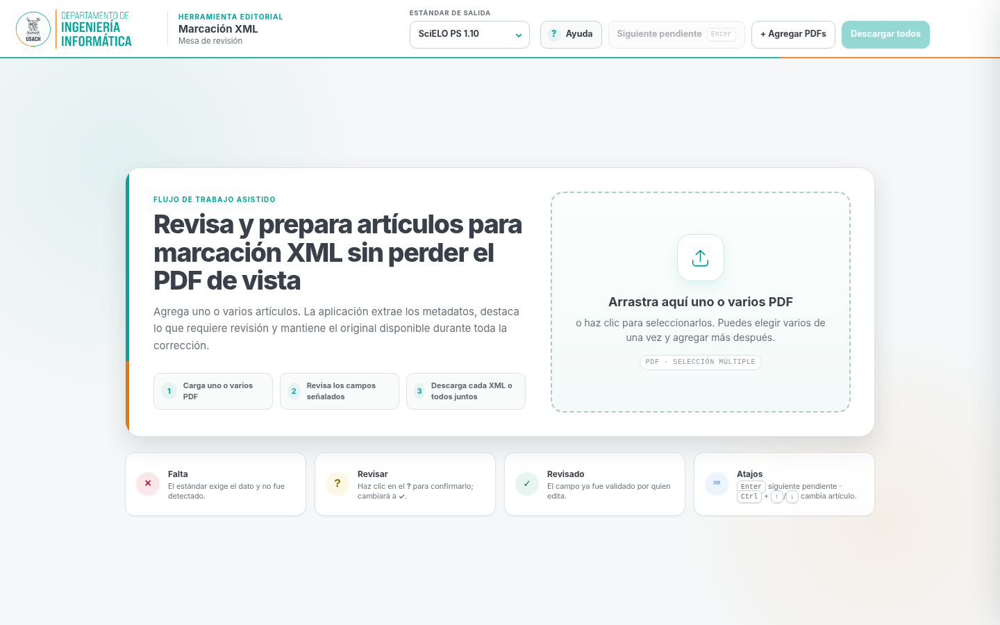
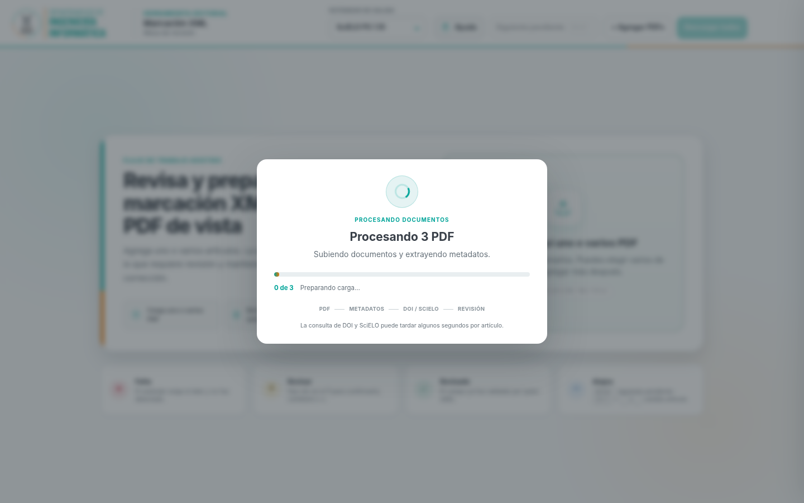

# PDF2JATS · Mesa de Marcación XML

Herramienta web para **revisar, corregir y preparar artículos científicos en XML** a partir de archivos PDF, manteniendo el documento original visible durante todo el proceso editorial.

**Autor:** Manuel José Villalobos Cid  
**Institución:** Departamento de Ingeniería Informática (DIINF), Universidad de Santiago de Chile

> Proyecto desarrollado para apoyar flujos editoriales de preparación y revisión de metadatos, contenido, referencias y salida XML compatible con perfiles basados en JATS y SciELO Publishing Schema.



## Funcionalidades principales

- Carga **uno o varios PDF** y permite agregar nuevos documentos posteriormente.
- Muestra una ventana de espera con progreso mientras se procesa cada archivo.
- Mantiene el **PDF original junto a la ficha editable**.
- Organiza la revisión en pestañas: **Metadatos, Autoría, Contenido, Referencias y Salida XML**.
- Detecta DOI y combina metadatos bibliográficos desde fuentes abiertas.
- Consulta SciELO cuando el artículo ya está indexado y recupera el PID cuando está disponible.
- Permite editar títulos, resúmenes, palabras clave, autores, filiaciones, secciones y referencias.
- Permite corregir secciones detectadas erróneamente sin perder el contenido.
- Busca DOI de referencias y aplica metadatos estructurados cuando la coincidencia es suficientemente confiable.
- Genera salida XML por artículo o descarga conjunta.
- Incluye ayudas contextuales y una sección centralizada de **normativa oficial**.

## Cómo se revisan los campos

La aplicación usa tres estados visuales:

- **× Falta:** el dato requerido no fue encontrado.
- **? Revisar:** el dato fue inferido o requiere confirmación.
- **✓ Revisado:** el dato fue confirmado.

Cuando aparece un **?**, haz clic sobre él para confirmar el bloque; el símbolo cambia a **✓**. Si editas un campo, también queda marcado como revisado automáticamente.


## Carga múltiple

Los PDF pueden seleccionarse de forma múltiple. Durante la carga se muestra el documento actual, el contador de avance y el estado del procesamiento.



## Normativa y fuentes externas

La interfaz concentra los enlaces normativos dentro del panel **Ayuda**, evitando repetir enlaces en cada observación o campo.

El proyecto trabaja con referencias a:

- **SciELO Publishing Schema 1.10**.
- **NISO JATS 1.3**.
- DOI Content Negotiation.
- Crossref REST API.
- DataCite API.
- Búsqueda pública de SciELO para artículos ya incorporados.

Consulta [docs/NORMATIVA.md](docs/NORMATIVA.md) para los enlaces oficiales utilizados por la aplicación.

## Estructura del repositorio

```text
PDF2JATS/
├── app.py
├── requirements.txt
├── ACTIVAR.sh
├── core/
│   ├── extractor.py
│   ├── model.py
│   ├── revision.py
│   ├── doi_metadata.py
│   ├── scielo_metadata.py
│   ├── reference_metadata.py
│   └── ...
├── emisores/
│   ├── jats.py
│   ├── scielo.py
│   └── base.py
├── web/
│   └── index.html
├── docs/
│   ├── GUIA_USO.md
│   ├── ARQUITECTURA.md
│   ├── INSTALACION.md
│   ├── NORMATIVA.md
│   └── images/
├── CITATION.cff
├── AUTHORS.md
├── CONTRIBUTING.md
└── SECURITY.md
```

## Instalación rápida

Requiere Python 3 y un entorno virtual. En el servidor institucional utilizado para producción:

```bash
cd /var/www/html/PDF2JATS
bash ACTIVAR.sh
```

El script crea `.venv` si no existe, instala las dependencias, valida los módulos Python, reinicia `pdf2jats.service` y comprueba que Gunicorn responda localmente.

Para una instalación nueva o una configuración con Apache/Gunicorn, consulta [docs/INSTALACION.md](docs/INSTALACION.md).

## Dependencias

Las dependencias Python declaradas son:

```text
Flask >= 3.0
PyMuPDF >= 1.24
lxml >= 5.0
gunicorn >= 22.0
```

## Flujo general

```text
PDF
 ↓
Extracción de texto y estructura
 ↓
Detección / enriquecimiento de metadatos
 ↓
Revisión editorial en la interfaz
 ↓
Corrección de contenido y referencias
 ↓
Validación de pendientes
 ↓
XML JATS / SciELO
```

Más detalle en [docs/ARQUITECTURA.md](docs/ARQUITECTURA.md).

## Autoría y citación

**Manuel José Villalobos Cid** y el **Departamento de Ingeniería Informática (DIINF), Universidad de Santiago de Chile** se presentan como autores institucionales del proyecto. Para citar el software, el repositorio incluye `CITATION.cff`.

## Estado del proyecto

Versión documentada: **1.10** · agosto de 2026.

La herramienta asiste la preparación editorial, pero la revisión final del XML y su cumplimiento con las reglas de la colección o plataforma de destino siguen requiriendo validación editorial.
