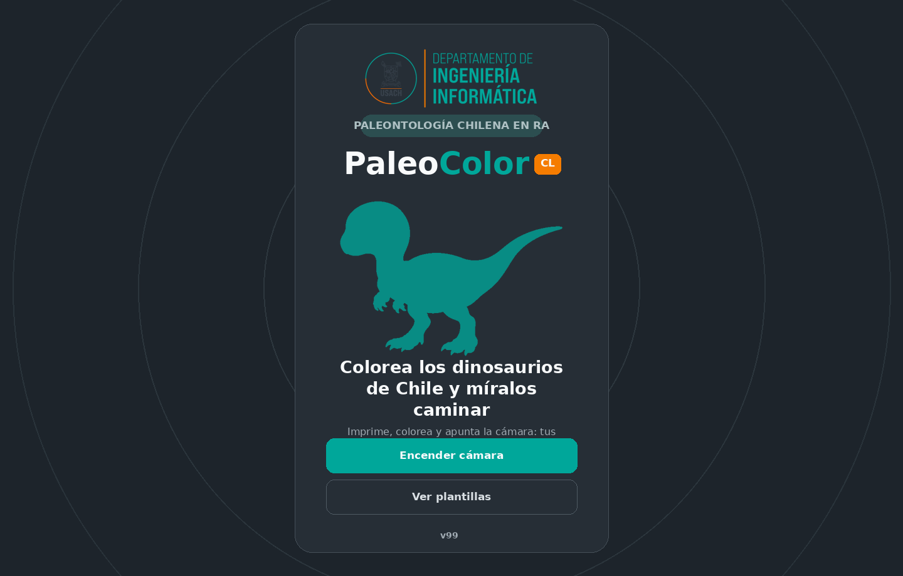
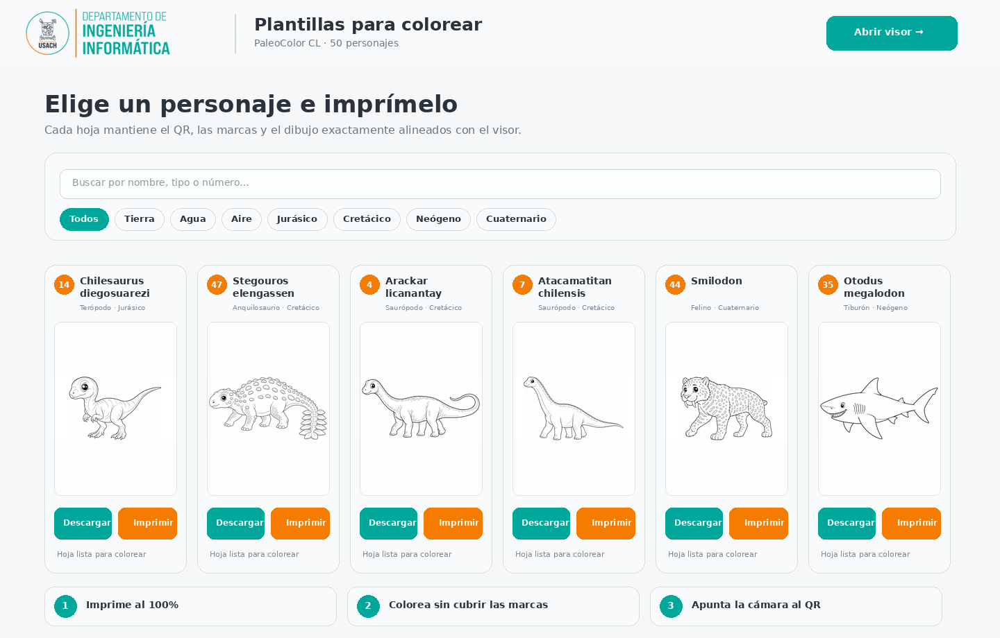
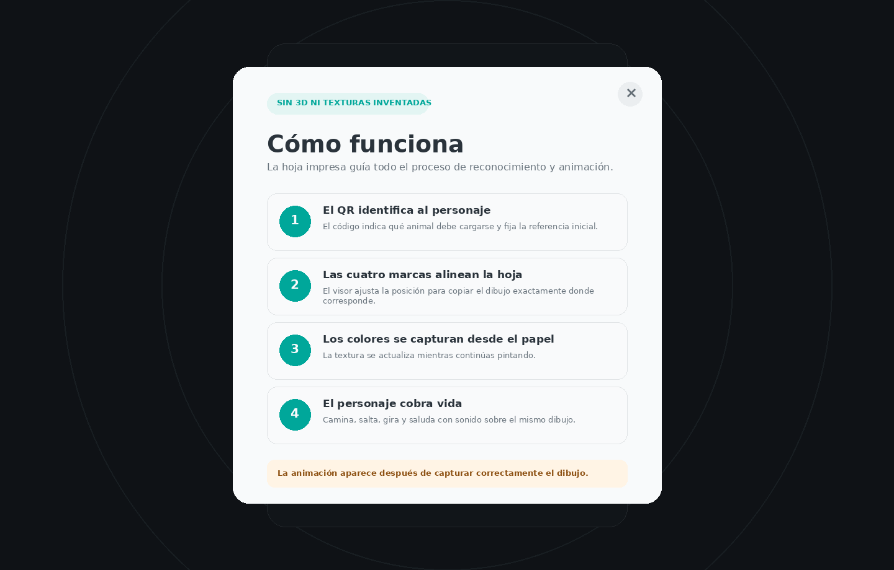

# PaleoColor CL

<p align="center">
  <strong>Animales prehistóricos de Chile que cobran vida con los colores del papel</strong><br>
  Departamento de Ingeniería Informática · Universidad de Santiago de Chile
</p>

<p align="center">
  <a href="#español">Español</a> ·
  <a href="#english">English</a> ·
  <a href="#português">Português</a>
</p>

<p align="center">
  
</p>

---

## Español

### Descripción

**PaleoColor CL** es una aplicación web educativa para niñas y niños que permite imprimir y colorear animales prehistóricos vinculados con Chile y observar cómo el dibujo cobra vida mediante realidad aumentada. La cámara reconoce el código QR de la plantilla, utiliza cuatro marcadores para registrar la hoja, captura los colores aplicados por el usuario y los incorpora a una animación 2D situada sobre el mismo dibujo.

La versión incluida contiene **50 animales prehistóricos**, con especies terrestres, acuáticas y voladoras del Jurásico, Cretácico, Paleógeno, Neógeno y Cuaternario. La interfaz principal está disponible en español, inglés y portugués.

### Capturas de pantalla

| Inicio | Plantillas | Funcionamiento |
|---|---|---|
|  |  |  |

### Funciones principales

- Reconocimiento del personaje mediante QR.
- Registro geométrico de la hoja con cuatro marcadores negros.
- Captura de los colores reales del dibujo, sin crear texturas artificiales.
- Animación 2D con caminata, saltos, giros, saludo, voz y globo de diálogo.
- Actualización de la textura mientras se continúa coloreando.
- Galería con búsqueda y filtros por hábitat y periodo geológico.
- Generación de plantillas imprimibles directamente desde los manifiestos JSON.
- Editor interno de textos y datos paleontológicos.
- Interfaz adaptable a computadores, tabletas y teléfonos.
- Procesamiento local en el navegador: la cámara no se transmite a un servidor.

### Uso

1. Abre `plantillas.html` y elige un animal.
2. Imprime la hoja al 100 %, sin recortarla ni alterar su proporción.
3. Colorea el animal sin cubrir el QR ni los cuatro marcadores negros.
4. Abre `index.html`, enciende la cámara y apunta a la hoja completa.
5. Mantén visibles el QR, las cuatro marcas y el dibujo hasta que aparezca la animación.

La cámara requiere un contexto seguro. Usa **HTTPS** al publicar la aplicación o `localhost` durante el desarrollo.

### Ejecución local

```bash
python -m http.server 8000
```

Luego abre:

```text
http://localhost:8000
```

No abras `index.html` directamente con `file://`, porque los módulos JavaScript y la cámara pueden ser bloqueados por el navegador.

### Publicación en GitHub Pages

> **Importante:** copia el contenido del ZIP directamente en la raíz del repositorio. `index.html` debe quedar junto a `README.md`, no dentro de una carpeta adicional.


1. Crea un repositorio y copia su contenido en la rama `main`.
2. En GitHub, abre **Settings → Pages**.
3. En **Build and deployment**, selecciona **GitHub Actions**.
4. El flujo `.github/workflows/pages.yml` publicará la aplicación automáticamente.

### Estructura

```text
PaleoColorCL/
├── index.html                  # Visor de realidad aumentada
├── plantillas.html             # Galería e impresión de plantillas
├── textos.html                 # Editor de contenidos
├── styles.css                  # Estilos del visor
├── shell.css                   # Estilos de herramientas auxiliares
├── js/                         # Seguimiento, captura, animación e interfaz
├── assets/
│   ├── brand/                  # Identidad visual DIINF-USACH
│   └── characters/             # 50 manifiestos de personajes
├── tools/                      # Sellado de versión y empaquetado
├── docs/screenshots/           # Capturas usadas en este README
├── CITATION.cff
└── LICENSE
```

### Añadir o modificar un personaje

Cada archivo de `assets/characters/` contiene la identidad, textos, arte vectorial, máscaras, articulaciones y parámetros de animación de un personaje. `assets/characters/index.json` controla el catálogo mostrado en la galería.

Para modificar textos sin alterar el dibujo, abre `textos.html`, elige el personaje, edita la ficha y descarga el JSON. Sustituye después el archivo correspondiente en `assets/characters/`.

Al cambiar `APP_VERSION` en `js/config.js`, ejecuta:

```bash
python tools/sellar_version.py
```

Esto actualiza las referencias versionadas de HTML y JavaScript para evitar que el navegador mezcle archivos antiguos y nuevos desde la caché.

### Compatibilidad y privacidad

Se recomienda una versión reciente de Chrome, Edge o Safari con acceso a cámara. El rendimiento depende de la resolución del dispositivo, la iluminación y la visibilidad completa de la plantilla. Todo el análisis de video ocurre dentro del navegador y este repositorio no incluye servicios de almacenamiento ni analítica remota.

### Cita y licencia

La información para citar el software está disponible en `CITATION.cff`. El código se distribuye bajo licencia MIT. Los contenidos paleontológicos deben revisarse periódicamente, ya que las interpretaciones taxonómicas pueden cambiar con nueva evidencia científica.

---

## English

### Description

**PaleoColor CL** is an educational web application for children. Users print and colour prehistoric animals connected with Chile and then watch their own drawing come alive through augmented reality. The camera identifies the template QR code, uses four black markers to register the sheet, captures the colours applied on paper and transfers them to a 2D animation positioned over the original drawing.

This version includes **50 prehistoric animals**, covering terrestrial, aquatic and flying forms from the Jurassic, Cretaceous, Palaeogene, Neogene and Quaternary. The main interface is available in Spanish, English and Portuguese.

### Screenshots

| Home | Templates | How it works |
|---|---|---|
|  |  |  |

### Main features

- Character identification through QR codes.
- Geometric sheet registration using four black markers.
- Capture of the real colours from the drawing without invented textures.
- 2D animation with walking, jumping, turning, waving, speech and dialogue bubbles.
- Texture updates while the child continues colouring.
- Searchable gallery with habitat and geological-period filters.
- Printable templates generated directly from character JSON manifests.
- Built-in editor for palaeontological texts and facts.
- Responsive interface for computers, tablets and phones.
- Local browser processing: camera images are not sent to a server.

### How to use it

1. Open `plantillas.html` and choose an animal.
2. Print the sheet at 100% scale without cropping or changing its proportions.
3. Colour the animal without covering the QR code or the four black markers.
4. Open `index.html`, enable the camera and point it at the complete sheet.
5. Keep the QR code, all four markers and the drawing visible until the animation appears.

Camera access requires a secure context. Use **HTTPS** in production or `localhost` during development.

### Local execution

```bash
python -m http.server 8000
```

Then open:

```text
http://localhost:8000
```

Do not open `index.html` directly through `file://`, because JavaScript modules and camera access may be blocked by the browser.

### GitHub Pages deployment

> **Important:** copy the ZIP contents directly to the repository root. `index.html` must be beside `README.md`, not inside an additional folder.


1. Create a repository and copy the project to the `main` branch.
2. Open **Settings → Pages** in GitHub.
3. Under **Build and deployment**, select **GitHub Actions**.
4. `.github/workflows/pages.yml` will publish the application automatically.

### Project structure

```text
PaleoColorCL/
├── index.html                  # Augmented-reality viewer
├── plantillas.html             # Template gallery and printing
├── textos.html                 # Content editor
├── styles.css                  # Viewer styles
├── shell.css                   # Auxiliary-tool styles
├── js/                         # Tracking, capture, animation and interface
├── assets/
│   ├── brand/                  # DIINF-USACH visual identity
│   └── characters/             # 50 character manifests
├── tools/                      # Version stamping and packaging
├── docs/screenshots/           # README screenshots
├── CITATION.cff
└── LICENSE
```

### Adding or modifying a character

Each file under `assets/characters/` stores a character's identity, educational text, vector artwork, masks, joints and animation settings. `assets/characters/index.json` controls the catalogue displayed in the gallery.

To edit facts without changing the artwork, open `textos.html`, select a character, modify its content and download the JSON file. Replace the corresponding file under `assets/characters/`.

After changing `APP_VERSION` in `js/config.js`, run:

```bash
python tools/sellar_version.py
```

This updates versioned HTML and JavaScript references so that browsers do not combine old and new modules from their cache.

### Compatibility and privacy

A recent version of Chrome, Edge or Safari with camera access is recommended. Performance depends on device resolution, lighting and full visibility of the printed template. All video analysis takes place inside the browser; the repository contains no remote storage or analytics service.

### Citation and licence

Citation metadata are provided in `CITATION.cff`. The source code is distributed under the MIT Licence. Palaeontological facts should be reviewed periodically because taxonomic interpretations can change as new scientific evidence becomes available.

---

## Português

### Descrição

**PaleoColor CL** é uma aplicação web educativa para crianças. Os usuários imprimem e pintam animais pré-históricos relacionados ao Chile e observam o próprio desenho ganhar vida por meio de realidade aumentada. A câmera identifica o código QR do modelo, usa quatro marcadores pretos para registrar a folha, captura as cores aplicadas no papel e transfere essas cores para uma animação 2D posicionada sobre o desenho original.

Esta versão inclui **50 animais pré-históricos**, com formas terrestres, aquáticas e voadoras do Jurássico, Cretáceo, Paleógeno, Neógeno e Quaternário. A interface principal está disponível em espanhol, inglês e português.

### Capturas de tela

| Início | Modelos | Como funciona |
|---|---|---|
|  |  |  |

### Principais funções

- Identificação da personagem por código QR.
- Registro geométrico da folha com quatro marcadores pretos.
- Captura das cores reais do desenho, sem criar texturas artificiais.
- Animação 2D com caminhada, saltos, giros, aceno, voz e balão de diálogo.
- Atualização da textura enquanto a criança continua pintando.
- Galeria com busca e filtros por habitat e período geológico.
- Modelos imprimíveis gerados diretamente a partir dos manifestos JSON.
- Editor interno de textos e informações paleontológicas.
- Interface responsiva para computadores, tablets e celulares.
- Processamento local no navegador: as imagens da câmera não são enviadas a um servidor.

### Como usar

1. Abra `plantillas.html` e escolha um animal.
2. Imprima a folha em escala de 100%, sem recortar nem alterar suas proporções.
3. Pinte o animal sem cobrir o QR ou os quatro marcadores pretos.
4. Abra `index.html`, ligue a câmera e aponte para a folha completa.
5. Mantenha visíveis o QR, as quatro marcas e o desenho até que a animação apareça.

O acesso à câmera exige um contexto seguro. Use **HTTPS** ao publicar a aplicação ou `localhost` durante o desenvolvimento.

### Execução local

```bash
python -m http.server 8000
```

Depois, abra:

```text
http://localhost:8000
```

Não abra `index.html` diretamente com `file://`, pois os módulos JavaScript e o acesso à câmera podem ser bloqueados pelo navegador.

### Publicação no GitHub Pages

> **Importante:** copie o conteúdo do ZIP diretamente para a raiz do repositório. `index.html` deve ficar ao lado de `README.md`, e não dentro de uma pasta adicional.


1. Crie um repositório e copie o projeto para a branch `main`.
2. No GitHub, abra **Settings → Pages**.
3. Em **Build and deployment**, selecione **GitHub Actions**.
4. O fluxo `.github/workflows/pages.yml` publicará a aplicação automaticamente.

### Estrutura

```text
PaleoColorCL/
├── index.html                  # Visualizador de realidade aumentada
├── plantillas.html             # Galeria e impressão de modelos
├── textos.html                 # Editor de conteúdo
├── styles.css                  # Estilos do visualizador
├── shell.css                   # Estilos das ferramentas auxiliares
├── js/                         # Rastreamento, captura, animação e interface
├── assets/
│   ├── brand/                  # Identidade visual DIINF-USACH
│   └── characters/             # 50 manifestos de personagens
├── tools/                      # Versionamento e empacotamento
├── docs/screenshots/           # Capturas usadas neste README
├── CITATION.cff
└── LICENSE
```

### Adicionar ou modificar uma personagem

Cada arquivo em `assets/characters/` contém a identidade, os textos educativos, a arte vetorial, as máscaras, as articulações e os parâmetros de animação de uma personagem. `assets/characters/index.json` controla o catálogo mostrado na galeria.

Para modificar os textos sem alterar o desenho, abra `textos.html`, selecione a personagem, edite a ficha e baixe o JSON. Depois, substitua o arquivo correspondente em `assets/characters/`.

Depois de alterar `APP_VERSION` em `js/config.js`, execute:

```bash
python tools/sellar_version.py
```

Isso atualiza as referências versionadas de HTML e JavaScript para impedir que o navegador misture módulos antigos e novos armazenados em cache.

### Compatibilidade e privacidade

Recomenda-se uma versão recente do Chrome, Edge ou Safari com acesso à câmera. O desempenho depende da resolução do dispositivo, da iluminação e da visibilidade completa do modelo impresso. Toda a análise de vídeo ocorre dentro do navegador; o repositório não inclui armazenamento remoto nem serviço de análise.

### Citação e licença

Os metadados de citação estão disponíveis em `CITATION.cff`. O código-fonte é distribuído sob a Licença MIT. As informações paleontológicas devem ser revisadas periodicamente, pois as interpretações taxonômicas podem mudar com novas evidências científicas.

---

## Catalogue / Catálogo

The repository includes 50 prehistoric animals. Scientific names are shared across languages and are listed in `assets/characters/index.json`. The catalogue can be filtered by habitat and geological period from `plantillas.html`.

El repositorio contiene 50 animales prehistóricos. Sus nombres científicos se encuentran en `assets/characters/index.json`, y el catálogo puede filtrarse por hábitat y periodo geológico desde `plantillas.html`.

O repositório contém 50 animais pré-históricos. Os nomes científicos estão em `assets/characters/index.json`, e o catálogo pode ser filtrado por habitat e período geológico em `plantillas.html`.
