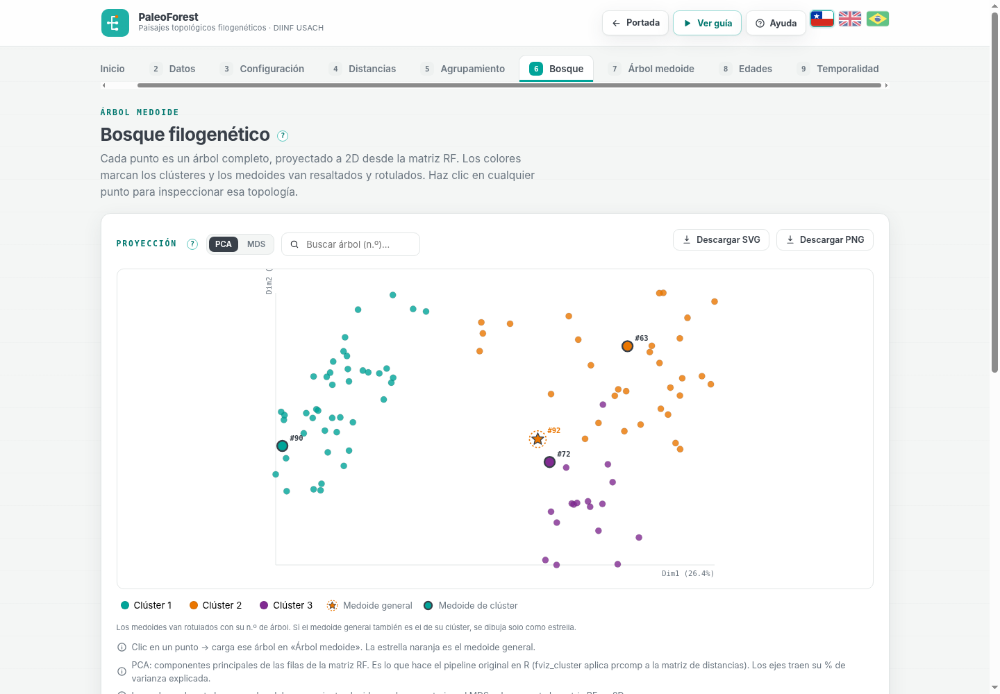
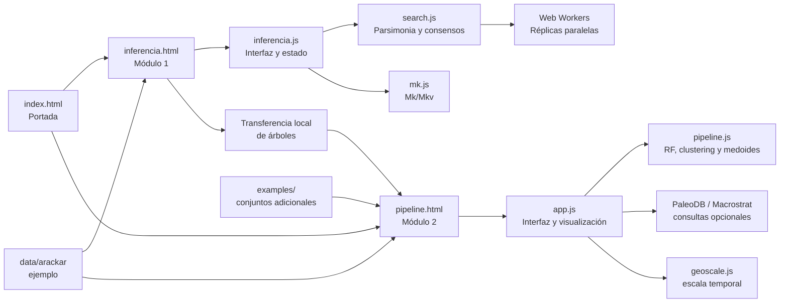
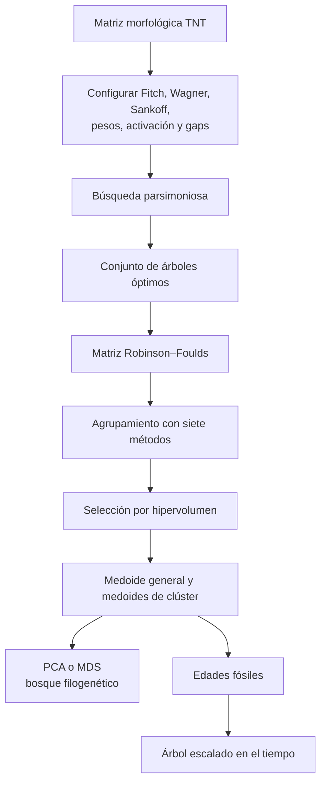
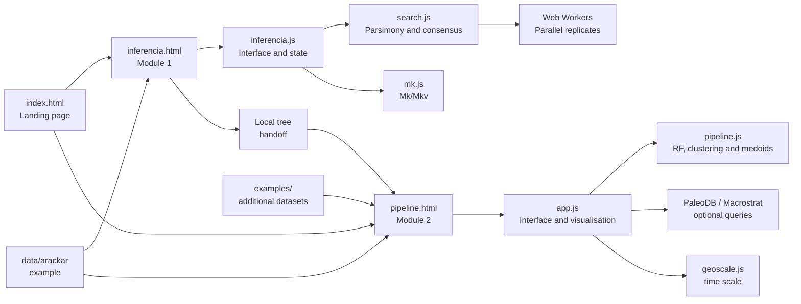
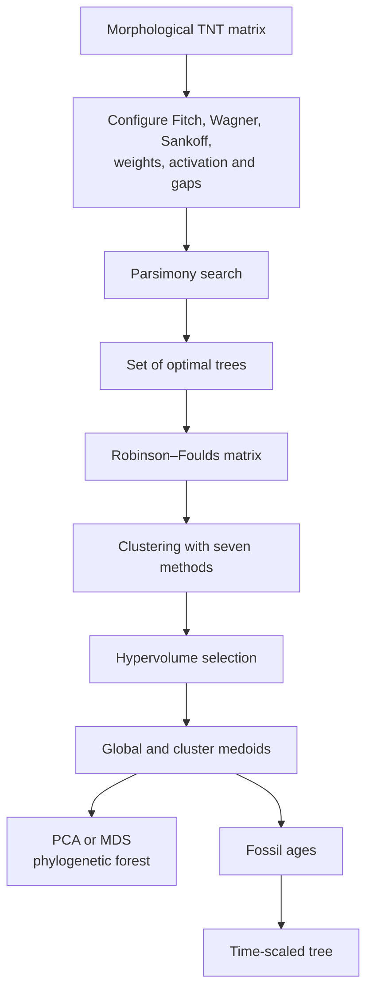
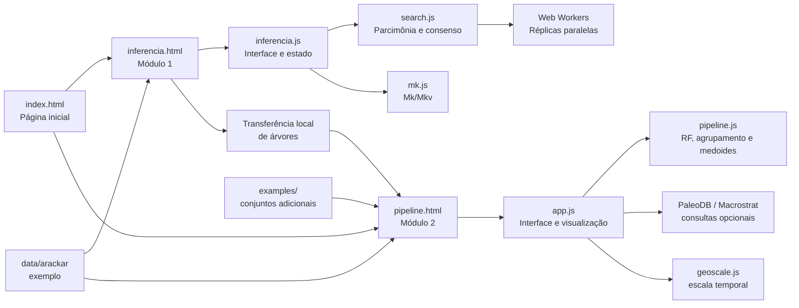
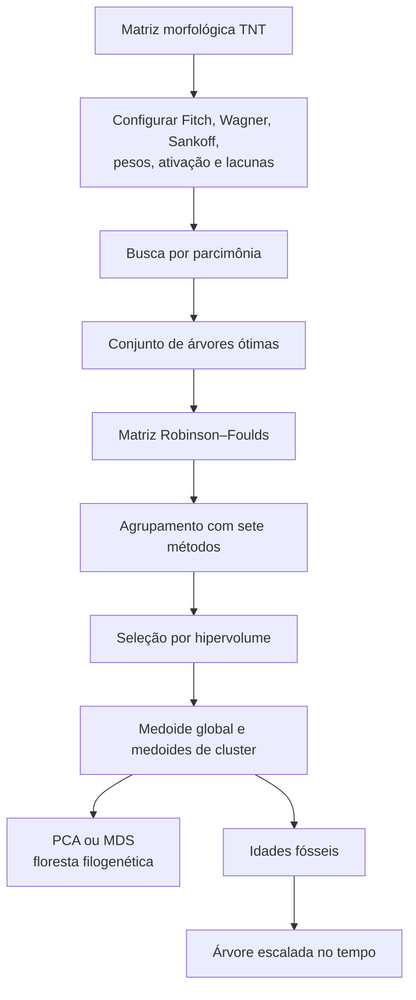

# PaleoForest

<p align="center">
  
</p>

<p align="center">
  <b>Suite web para inferencia filogenética morfológica y análisis de paisajes topológicos</b><br>
  <b>Web suite for morphological phylogenetic inference and topological-landscape analysis</b><br>
  <b>Suíte web para inferência filogenética morfológica e análise de paisagens topológicas</b>
</p>

<p align="center">
  <a href="https://mvillalobosc.diinf.usach.cl/PaleoForest/">Live application / Aplicación en línea</a>
  <a href="#español">Español</a> ·
  <a href="#english">English</a> ·
  <a href="#português">Português</a>
</p>

<p align="center">
  
</p>

---

## Español

### 1. ¿Qué es PaleoForest?

**PaleoForest** es una aplicación web estática para trabajar con datos filogenéticos morfológicos desde la matriz de caracteres hasta la exploración de un conjunto de árboles igualmente parsimoniosos.

La suite se divide en dos módulos independientes y conectados:

| Módulo | Propósito |
|---|---|
| **Inferencia filogenética** | Permite cargar, crear y editar matrices TNT, configurar el tratamiento de los caracteres y buscar árboles más parsimoniosos. |
| **Paisajes topológicos** | Calcula distancias Robinson–Foulds, agrupa topologías, selecciona árboles medoides y representa los resultados en el tiempo geológico. |

Toda la ejecución ocurre en el navegador. La aplicación no necesita backend, base de datos, compilación ni instalación de dependencias para usar los archivos incluidos.

### 2. Funcionalidades principales

#### Módulo 1: inferencia filogenética

- Carga matrices morfológicas en formato `.tnt`.
- Incluye un editor de celdas, taxones y caracteres.
- Permite añadir o eliminar taxones y caracteres.
- Gestiona datos faltantes (`?`), vacíos (`-`) y polimorfismos.
- Configura caracteres no aditivos, aditivos y Sankoff.
- Permite activar, desactivar y ponderar caracteres.
- Lee, edita y exporta bloques `ccode`.
- Busca árboles mediante adición aleatoria, Neighbor Joining o árboles iniciales aleatorios.
- Implementa rearreglos NNI, SPR y TBR.
- Incluye ratchet, múltiples réplicas, semilla reproducible y fusión de árboles.
- Puede distribuir las réplicas entre Web Workers.
- Conserva las topologías empatadas en el mejor puntaje encontrado.
- Genera consensos estricto, de mayoría y de mayoría extendida.
- Calcula soporte de biparticiones dentro del conjunto.
- Puede puntuar la meseta de árboles con Mk/Mkv como análisis complementario.
- Exporta matrices, árboles, consensos y resultados en formatos reutilizables.

#### Módulo 2: paisajes topológicos

- Carga árboles en `.tre`, `.tree`, `.nwk` o `.newick`.
- Usa una matriz TNT para comprobar parsimonia y configuración de caracteres.
- Lee rangos fósiles desde `ages.csv`.
- Calcula la matriz de distancias Robinson–Foulds normalizadas.
- Detecta y excluye automáticamente un consenso estricto agregado al final del archivo de árboles.
- Implementa **PAM, K-Means, FANNY, CLARA, SOM, DBSCAN y MST-kNN**.
- Evalúa las particiones mediante Dunn, Connectivity y Silhouette.
- Selecciona la combinación método–número de clústeres mediante hipervolumen multiobjetivo.
- Identifica el medoide general y los medoides de cada clúster.
- Proyecta el conjunto con PCA o MDS clásico.
- Muestra el bosque filogenético como un gráfico interactivo.
- Calcula soporte de nodos para el árbol seleccionado.
- Consulta opcionalmente PaleoDB y Macrostrat para completar edades fósiles.
- Escala el árbol en el tiempo geológico con varios métodos.
- Exporta tablas y visualizaciones en formatos como CSV, SVG y PNG.
- Ofrece interfaz completa en **español**, **inglés** y **portugués**.

### 3. Estructura del repositorio

```text
.
├── index.html
├── inferencia.html
├── pipeline.html
├── README.md
├── assets/
│   ├── favicon.svg
│   ├── styles.css
│   └── readme/
│       ├── screenshot-home.png
│       ├── screenshot-inference.png
│       ├── screenshot-pipeline.png
│       └── screenshot-forest.png
├── js/
│   ├── hub.js
│   ├── inferencia.js
│   ├── search.js
│   ├── search-pool.js
│   ├── search-worker.js
│   ├── mk.js
│   ├── app.js
│   ├── pipeline.js
│   ├── paleodb.js
│   ├── macrostrat.js
│   ├── geoscale.js
│   ├── i18n.js
│   ├── i18n-inf.js
│   ├── cite.js
│   └── tour.js
├── data/
│   └── arackar/
│       ├── dataset.js
│       ├── matrix.tnt
│       ├── trees.tre
│       ├── trees.nwk
│       ├── ages.csv
│       └── meta.json
├── examples/
│   ├── Arackar_licanantay/
│   ├── Burkesuchus_mallingrandensis/
│   └── Chilesaurus_diegosuarezi/
└── tools/
    └── prep.py
```

| Archivo o carpeta | Rol |
|---|---|
| `index.html` | Portada que conecta ambos módulos. |
| `inferencia.html` | Interfaz del editor de matrices y de la búsqueda de árboles. |
| `pipeline.html` | Interfaz del análisis de paisajes topológicos. |
| `assets/styles.css` | Diseño visual, respuesta móvil y paleta institucional. |
| `js/hub.js` | Lógica de la portada y navegación entre módulos. |
| `js/inferencia.js` | Estado, interfaz y flujo del módulo de inferencia. |
| `js/search.js` | Motor de búsqueda parsimoniosa, rearreglos, ratchet, consensos y soporte. |
| `js/search-pool.js` y `js/search-worker.js` | Paralelización de réplicas mediante Web Workers. |
| `js/mk.js` | Puntaje complementario Mk/Mkv sobre los árboles encontrados. |
| `js/app.js` | Estado, interfaz, visualizaciones y exportación del módulo topológico. |
| `js/pipeline.js` | Distancias, proyecciones, agrupamiento, hipervolumen, medoides y parsimonia. |
| `js/paleodb.js` | Consulta y emparejamiento de taxones con Paleobiology Database. |
| `js/macrostrat.js` | Consulta opcional de unidades estratigráficas en Macrostrat. |
| `js/geoscale.js` | Escala cronoestratigráfica usada en la temporalidad. |
| `js/i18n.js` y `js/i18n-inf.js` | Diccionarios ES/EN/PT de la aplicación. |
| `data/arackar/` | Conjunto precargado de *Arackar licanantay*. |
| `examples/` | Conjuntos adicionales para carga manual. |
| `tools/prep.py` | Utilidad para preparar los archivos web desde datos de origen. |

### 4. Capturas

| Portada de la suite | Editor de matriz morfológica |
|---|---|
|  |  |

| Pipeline topológico | Bosque filogenético |
|---|---|
|  |  |

Las capturas fueron generadas directamente desde los archivos HTML, CSS, JavaScript y datos incluidos en esta aplicación. No corresponden a imágenes tomadas de las tesis.

### 5. Manual de uso

#### 5.1 Elegir un módulo

La portada permite entrar por cualquiera de los dos módulos:

1. **Inferencia filogenética**, para comenzar desde una matriz morfológica.
2. **Paisajes topológicos**, para comenzar desde un conjunto de árboles ya disponible.

Los módulos pueden usarse por separado. Cuando una búsqueda termina en el módulo 1, los árboles encontrados pueden enviarse directamente al módulo 2 desde el navegador.

#### 5.2 Construir o cargar una matriz

En **Inferencia filogenética → Matriz** existen tres opciones:

| Opción | Uso |
|---|---|
| **Cargar archivo** | Lee una matriz TNT propia. |
| **Usar el ejemplo** | Carga la matriz de *Arackar licanantay*. |
| **Matriz vacía** | Crea una matriz nueva para edición manual. |

La vista **Celdas** muestra taxones por filas y caracteres por columnas. La vista **Caracteres** resume estados observados, cobertura, polimorfismos, tipo, activación y peso de cada carácter.

El símbolo `?` representa un dato faltante. El símbolo `-` puede tratarse como faltante o como un estado propio. Esta elección modifica el cálculo y no es solo visual.

#### 5.3 Configurar los caracteres

Cada carácter puede usar uno de estos modelos de costo:

| Tipo | Interpretación |
|---|---|
| **Fitch / no aditivo** | Cualquier cambio de estado cuesta un paso. |
| **Wagner / aditivo** | El costo depende de la distancia entre los estados. |
| **Sankoff** | El usuario define una matriz de costos de transición. |

La interfaz también permite desactivar caracteres, cambiar sus pesos y editar el bloque `ccode`. Las ediciones se incorporan al `.tnt` exportado.

#### 5.4 Ejecutar la búsqueda de árboles

En **Búsqueda** se configuran:

- Número de réplicas.
- Tipo de árbol inicial: adición aleatoria, NJ o aleatorio.
- Operador de rearreglo: NNI, SPR o TBR.
- Iteraciones y fuerza del ratchet.
- Pesos iguales o pesos implícitos.
- Concavidad `k` para pesos implícitos.
- Fusión de árboles.
- Número de hilos.
- Tope de topologías guardadas.
- Semilla aleatoria.

La misma semilla, matriz y parametrización permiten repetir la búsqueda. El tope de árboles es un límite de memoria; si se alcanza, la interfaz informa que el conjunto quedó truncado.

#### 5.5 Revisar y exportar los resultados

El panel **Resultados** muestra el mejor puntaje, la cantidad de topologías distintas, la bitácora por réplica, los consensos y el soporte de biparticiones.

Desde allí se pueden descargar o copiar:

- Árboles en `.tre` y `.nwk`.
- Archivo NEXUS.
- Consensos.
- Newick del árbol seleccionado.
- Resultados Mk/Mkv en CSV.

El botón **Enviar al módulo 2** transfiere solo los árboles óptimos encontrados. Los árboles de consenso no se incorporan al análisis de paisajes.

#### 5.6 Cargar datos en el módulo topológico

El módulo 2 puede recibir los árboles desde el módulo 1 o cargar manualmente:

| Entrada | Contenido |
|---|---|
| Árboles | `.tre`, `.tree`, `.nwk` o `.newick`. |
| Matriz | `.tnt`, usada para comprobar parsimonia y tipos de caracteres. |
| Edades | `.csv` con al menos taxón, primera aparición y última aparición. |

El ejemplo de *Arackar licanantay* viene precargado y puede activarse con un botón.

#### 5.7 Ejecutar el análisis topológico

El orden del módulo 2 es:

```text
Inicio → Datos → Configuración → Distancias → Agrupamiento
       → Bosque → Árbol medoide → Edades → Temporalidad
```

Los pasos de resultados permanecen bloqueados hasta pulsar **Ejecutar análisis** en Configuración. Esto evita iniciar un cálculo largo por accidente.

#### 5.8 Interpretar el bosque filogenético

Cada punto del bosque representa un árbol completo. La posición en dos dimensiones se obtiene desde la matriz RF mediante:

- **PCA**, opción predeterminada y compatible con el comportamiento del pipeline original en R.
- **MDS clásico**, alternativa que intenta conservar las distancias RF en el plano.

Los colores corresponden a los clústeres seleccionados. La estrella marca el medoide general y los puntos destacados representan los medoides de clúster. Al seleccionar un punto, la aplicación abre esa topología en las vistas de árbol.

#### 5.9 Completar edades y escalar el árbol

La aplicación utiliza primero las edades incluidas en `ages.csv`. Los taxones sin rango pueden completarse de tres maneras:

1. Consulta opcional a PaleoDB.
2. Consulta por unidad estratigráfica en Macrostrat.
3. Edición manual.

La temporalidad permite usar los métodos `basic`, `equal`, `aba`, `zlba` y `mbl`, además de activar distintos niveles de la escala geológica.

### 6. Arquitectura técnica



PaleoForest usa HTML, CSS y JavaScript nativo. Los cálculos, las tablas y los SVG se generan en el cliente. No existe una API propia ni un servicio de almacenamiento en el servidor.

### 7. Flujo de datos



### 8. Métodos implementados

#### 8.1 Inferencia morfológica

| Componente | Métodos disponibles |
|---|---|
| Costo por carácter | Fitch, Wagner y Sankoff. |
| Pesos | Iguales, pesos declarados y pesos implícitos. |
| Árbol inicial | Adición aleatoria, Neighbor Joining y aleatorio. |
| Rearreglo | NNI, SPR y TBR. |
| Intensificación | Ratchet y fusión de árboles. |
| Consensos | Estricto, mayoría de 50% y mayoría extendida. |
| Análisis complementario | Puntaje Mk/Mkv de los árboles ya encontrados. |

El cálculo Mk/Mkv no realiza una búsqueda completa de máxima verosimilitud. Optimiza una longitud de rama global para ordenar los árboles de la meseta parsimoniosa.

#### 8.2 Paisaje topológico

| Componente | Métodos disponibles |
|---|---|
| Distancia | Robinson–Foulds normalizada. |
| Agrupamiento | PAM, K-Means, FANNY, CLARA, SOM, DBSCAN y MST-kNN. |
| Evaluación | Dunn, Connectivity y Silhouette. |
| Selección | Hipervolumen sobre cuatro objetivos: minimizar `k`, maximizar Dunn, minimizar Connectivity y maximizar Silhouette. |
| Representación | PCA o MDS clásico. |
| Árbol representativo | Medoide general y medoides por clúster. |
| Temporalidad | `basic`, `equal`, `aba`, `zlba` y `mbl`. |

DBSCAN y MST-kNN determinan su número de grupos de manera interna. Los demás métodos se evalúan en el rango de `k` definido por el usuario.

### 9. Formatos de entrada y salida

#### Entradas

| Formato | Uso |
|---|---|
| `.tnt` | Matriz de caracteres, `xread`, `ccode`, pesos y activación. |
| `.tre`, `.tree` | Conjunto de árboles en sintaxis compatible con TNT/Newick. |
| `.nwk`, `.newick` | Árboles en Newick. |
| `.csv` | Rangos fósiles y metadatos temporales. |

El archivo de edades incluido usa `;` como separador y contiene, entre otras, las columnas `TIPS`, `FIRST` y `LAST`.

#### Salidas

| Formato | Contenido |
|---|---|
| `.tnt` | Matriz editada y configuración `ccode`. |
| `.tre`, `.nwk`, `.nex` | Árboles óptimos y consensos. |
| `.csv` | Edades, métricas, resultados de agrupamiento o puntajes Mk/Mkv. |
| `.svg`, `.png` | Bosque filogenético, árboles y otras visualizaciones. |

### 10. Conjuntos incluidos

| Carpeta | Árboles | Taxones | Edades |
|---|---:|---:|---:|
| `data/arackar/` | 97 líneas de árbol; 96 MPT después de excluir el consenso estricto | 88 | 88 |
| `examples/Arackar_licanantay/` | 97 | 88 | 88 |
| `examples/Burkesuchus_mallingrandensis/` | 100 | 111 | 111 |
| `examples/Chilesaurus_diegosuarezi/` | 100 | 62 | No incluidas |

Los conjuntos de `examples/` se cargan manualmente. El conjunto de `data/arackar/` es el ejemplo integrado en la interfaz.

### 11. Ejecución local

No se necesita instalar paquetes. Se recomienda servir la carpeta mediante HTTP para evitar restricciones de `file://`, CORS y Web Workers.

Con Python 3:

```bash
python3 -m http.server 8000
```

Luego abre:

```text
http://localhost:8000/
```

También se puede usar cualquier servidor estático, como Apache, nginx, `http-server` o la extensión Live Server de Visual Studio Code.

### 12. Despliegue manual en GitHub Pages

1. Crea un repositorio vacío en GitHub.
2. Sube el contenido de la carpeta `PaleoForest`, no el ZIP.
3. Comprueba que `index.html` y `README.md` estén en la raíz.
4. Entra a `Settings → Pages`.
5. En **Build and deployment**, selecciona `Deploy from a branch`.
6. Elige la rama `main` y la carpeta `/root`.
7. Guarda la configuración.

GitHub Pages utilizará `index.html` como portada de la aplicación. El README se mostrará en la página principal del repositorio.

Antes de publicar un repositorio abierto, añade una licencia adecuada. El código entregado originalmente no incluye un archivo `LICENSE`.

### 13. Mantención y actualización

#### 13.1 Cambiar el ejemplo predeterminado

El ejemplo integrado se encuentra en `data/arackar/`. Para reemplazarlo, se deben mantener coordinados:

- `dataset.js`
- `matrix.tnt`
- `trees.tre`
- `trees.nwk`
- `ages.csv`
- `meta.json`

El script `tools/prep.py` sirve como base para regenerar los archivos web desde los datos de origen.

#### 13.2 Añadir conjuntos adicionales

Crea una carpeta dentro de `examples/` con:

```text
matrix.tnt
trees.tre
trees.nwk
ages.csv      # opcional
info.json
```

Los conjuntos de esta carpeta no aparecen automáticamente en un selector; se cargan manualmente desde el módulo 2.

#### 13.3 Actualizar textos o idiomas

- Textos del módulo 2 y elementos compartidos: `js/i18n.js`.
- Textos de la portada y del módulo 1: `js/i18n-inf.js`.
- Referencias y botones de cita: `js/cite.js`.

Cada clave debe mantenerse en los tres idiomas para evitar que la interfaz muestre el nombre interno de la clave.

#### 13.4 Actualizar estilos

Toda la identidad visual se concentra en `assets/styles.css`. El diseño usa variables CSS, tarjetas, tablas, SVG responsivos y reglas específicas para dispositivos móviles.

### 14. Validación y reproducibilidad

Para *Arackar licanantay*, la aplicación reproduce elementos centrales del pipeline de referencia:

| Resultado | Referencia | Aplicación web |
|---|---:|---:|
| Árboles binarios más parsimoniosos | 96 | 96 |
| Puntaje de parsimonia | 1322 | 1322 |
| Método seleccionado | FANNY, `k = 3` | FANNY, `k = 3` |
| Medoide general | Árbol 92 | Árbol 92 |
| Medoides de clúster | 90, 15, 72 | 90, 63, 72 |

El tercer medoide difiere porque la implementación JavaScript y `fanny()` de R no necesariamente convergen al mismo óptimo local.

El archivo original contiene 97 líneas: 96 árboles binarios igualmente parsimoniosos y un consenso estricto al final. PaleoForest verifica las biparticiones y excluye ese consenso por defecto antes de construir la matriz RF.

Para documentar una ejecución reproducible se recomienda registrar:

- Versión de la matriz y de los árboles.
- Tratamiento del símbolo `-`.
- Lista de caracteres aditivos, inactivos y ponderados.
- Tipo de pesos y valor de `k` cuando corresponda.
- Número de réplicas.
- Operador de rearreglo.
- Parámetros del ratchet.
- Tope de árboles.
- Semilla.
- Rango de `k` y métodos de agrupamiento habilitados.

### 15. Red, almacenamiento y privacidad

La aplicación funciona localmente y no envía matrices ni árboles a un servidor propio.

Las únicas consultas externas se realizan cuando el usuario solicita información de edades:

| Servicio | Uso |
|---|---|
| Paleobiology Database | Buscar ocurrencias y rangos temporales por taxón. |
| Macrostrat | Buscar la edad de una formación o unidad estratigráfica. |

La transferencia entre módulos usa almacenamiento local del navegador y se consume al abrir el módulo 2. Los datos no se guardan en una base de datos remota.

### 16. Limitaciones conocidas

- El tiempo de cálculo aumenta con el número de taxones, caracteres, árboles, réplicas y valores de `k`.
- Las búsquedas TBR y las configuraciones con muchas réplicas pueden tardar varios minutos.
- Un tope bajo de árboles puede truncar la meseta de soluciones óptimas.
- PaleoDB y Macrostrat dependen de servicios externos y pueden devolver coincidencias ambiguas.
- El escalamiento temporal depende de la calidad de los rangos fósiles.
- Mk/Mkv se usa para puntuar árboles existentes con una longitud de rama global; no sustituye una búsqueda completa de máxima verosimilitud.
- La reproducción exacta de métodos estocásticos de R no está garantizada aunque se use una semilla equivalente.
- Bajo `file://`, algunos navegadores limitan Web Workers o la lectura de archivos; se recomienda un servidor local.
- El repositorio original no especifica una licencia de distribución.

### 17. Cita sugerida

#### Publicación del método

> Concha-Toro, C., Riquelme-Zamora, C., Aranciaga-Rolando, M., & Villalobos-Cid, M. (2026). *Exploring topological landscapes in morphological phylogenetics using clustering and medoid selection: case studies from Chilean fossil taxa*. Organisms Diversity & Evolution. https://doi.org/10.1007/s13127-026-00702-8

#### Plataforma original

> Acosta Méndez, C. A. (2024). *Desarrollo de aplicación web para el análisis filogenético de datos paleontológicos*. Tesis para optar al título de Ingeniero Civil en Informática. Profesor guía: Manuel Villalobos Cid. Departamento de Ingeniería en Informática, Universidad de Santiago de Chile.

#### Pipeline de medoides

> Concha, C. (2023). *Tratamiento de politomías en análisis filogenéticos morfológicos mediante algoritmos de agrupamiento: estudio de Burkesuchus mallingrandensis y Arackar licanantay*. Universidad de Santiago de Chile.

#### Datos del ejemplo

> Rubilar-Rogers, D., Vargas, A. O., González Riga, B., Soto-Acuña, S., Alarcón-Muñoz, J., Iriarte-Díaz, J., Arévalo, C., & Gutstein, C. S. (2021). *Arackar licanantay gen. et sp. nov. a new lithostrotian (Dinosauria, Sauropoda) from the Upper Cretaceous of the Atacama Region, northern Chile*. Cretaceous Research, 124, 104802.

### 18. Créditos

Desarrollo académico vinculado al **Departamento de Ingeniería en Informática de la Universidad de Santiago de Chile (DIINF–USACH)**.

Fuentes y servicios complementarios:

- Paleobiology Database para ocurrencias y edades fósiles.
- Macrostrat para unidades estratigráficas.
- International Commission on Stratigraphy para la escala temporal.
- Datos morfológicos y árboles de los trabajos citados.

---

## English

### 1. What is PaleoForest?

**PaleoForest** is a static web application for working with morphological phylogenetic data, from the character matrix to the exploration of a set of equally parsimonious trees.

The suite is divided into two independent but connected modules:

| Module | Purpose |
|---|---|
| **Phylogenetic inference** | Loads, creates and edits TNT matrices, configures character treatment and searches for most-parsimonious trees. |
| **Topological landscapes** | Computes Robinson–Foulds distances, clusters topologies, selects medoid trees and represents results in geological time. |

Everything runs in the browser. The application requires no backend, database, build process or dependency installation to use the included files.

### 2. Main features

#### Module 1: phylogenetic inference

- Loads morphological matrices in `.tnt` format.
- Includes a cell, taxon and character editor.
- Adds or removes taxa and characters.
- Handles missing data (`?`), gaps (`-`) and polymorphisms.
- Configures unordered, ordered and Sankoff characters.
- Activates, deactivates and weights characters.
- Reads, edits and exports `ccode` blocks.
- Builds starting trees through random addition, Neighbor Joining or random generation.
- Implements NNI, SPR and TBR rearrangements.
- Includes ratchet, multiple replicates, reproducible seeds and tree fusing.
- Can distribute replicates across Web Workers.
- Keeps topologies tied at the best score found.
- Generates strict, majority-rule and extended-majority consensuses.
- Computes split support within the tree set.
- Can score the tree plateau with Mk/Mkv as a complementary analysis.
- Exports matrices, trees, consensuses and reusable results.

#### Module 2: topological landscapes

- Loads trees from `.tre`, `.tree`, `.nwk` or `.newick` files.
- Uses a TNT matrix to check parsimony and character settings.
- Reads fossil ranges from `ages.csv`.
- Computes a normalised Robinson–Foulds distance matrix.
- Automatically detects and excludes a strict consensus appended to the tree file.
- Implements **PAM, K-Means, FANNY, CLARA, SOM, DBSCAN and MST-kNN**.
- Evaluates partitions with Dunn, Connectivity and Silhouette.
- Selects the method–cluster-count combination through multiobjective hypervolume.
- Identifies the global medoid and each cluster medoid.
- Projects the tree set with PCA or classical MDS.
- Displays the phylogenetic forest as an interactive plot.
- Computes node support for the selected tree.
- Optionally queries PaleoDB and Macrostrat to complete fossil ages.
- Time-scales the tree with several methods.
- Exports tables and visualisations in formats such as CSV, SVG and PNG.
- Provides complete interfaces in **Spanish**, **English** and **Portuguese**.

### 3. Repository structure

```text
.
├── index.html
├── inferencia.html
├── pipeline.html
├── README.md
├── assets/
│   ├── favicon.svg
│   ├── styles.css
│   └── readme/
│       ├── screenshot-home.png
│       ├── screenshot-inference.png
│       ├── screenshot-pipeline.png
│       └── screenshot-forest.png
├── js/
│   ├── hub.js
│   ├── inferencia.js
│   ├── search.js
│   ├── search-pool.js
│   ├── search-worker.js
│   ├── mk.js
│   ├── app.js
│   ├── pipeline.js
│   ├── paleodb.js
│   ├── macrostrat.js
│   ├── geoscale.js
│   ├── i18n.js
│   ├── i18n-inf.js
│   ├── cite.js
│   └── tour.js
├── data/
│   └── arackar/
│       ├── dataset.js
│       ├── matrix.tnt
│       ├── trees.tre
│       ├── trees.nwk
│       ├── ages.csv
│       └── meta.json
├── examples/
│   ├── Arackar_licanantay/
│   ├── Burkesuchus_mallingrandensis/
│   └── Chilesaurus_diegosuarezi/
└── tools/
    └── prep.py
```

| File or folder | Role |
|---|---|
| `index.html` | Landing page connecting both modules. |
| `inferencia.html` | Matrix editor and tree-search interface. |
| `pipeline.html` | Topological-landscape analysis interface. |
| `assets/styles.css` | Visual design, mobile behaviour and institutional palette. |
| `js/hub.js` | Landing-page logic and module navigation. |
| `js/inferencia.js` | State, interface and workflow of the inference module. |
| `js/search.js` | Parsimony engine, rearrangements, ratchet, consensus and support. |
| `js/search-pool.js` and `js/search-worker.js` | Replicate parallelisation with Web Workers. |
| `js/mk.js` | Complementary Mk/Mkv scoring of discovered trees. |
| `js/app.js` | State, interface, visualisation and export for the landscape module. |
| `js/pipeline.js` | Distances, projections, clustering, hypervolume, medoids and parsimony. |
| `js/paleodb.js` | Taxon queries and matching against the Paleobiology Database. |
| `js/macrostrat.js` | Optional stratigraphic-unit queries to Macrostrat. |
| `js/geoscale.js` | Chronostratigraphic scale used for time-scaling. |
| `js/i18n.js` and `js/i18n-inf.js` | ES/EN/PT application dictionaries. |
| `data/arackar/` | Preloaded *Arackar licanantay* dataset. |
| `examples/` | Additional datasets for manual loading. |
| `tools/prep.py` | Utility for preparing browser-ready files from source data. |

### 4. Screenshots

| Suite landing page | Morphological matrix editor |
|---|---|
|  |  |

| Topological pipeline | Phylogenetic forest |
|---|---|
|  |  |

The screenshots were generated directly from the HTML, CSS, JavaScript and data files included in this application. They were not taken from the theses.

### 5. User guide

#### 5.1 Choose a module

The landing page provides access to either module:

1. **Phylogenetic inference**, when starting from a morphological matrix.
2. **Topological landscapes**, when a tree set is already available.

The modules can be used independently. When a search finishes in module 1, the discovered trees can be sent directly to module 2 through the browser.

#### 5.2 Build or load a matrix

Under **Phylogenetic inference → Matrix**, three options are available:

| Option | Use |
|---|---|
| **Load file** | Reads a user-provided TNT matrix. |
| **Use the example** | Loads the *Arackar licanantay* matrix. |
| **Empty matrix** | Creates a new matrix for manual editing. |

The **Cells** view displays taxa as rows and characters as columns. The **Characters** view summarises observed states, coverage, polymorphisms, type, activation and weight for each character.

The `?` symbol represents missing data. The `-` symbol can be treated as missing or as a separate state. This choice changes the calculation and is not merely visual.

#### 5.3 Configure characters

Each character can use one of the following cost models:

| Type | Interpretation |
|---|---|
| **Fitch / unordered** | Any state change costs one step. |
| **Wagner / ordered** | Cost depends on the distance between states. |
| **Sankoff** | The user defines a transition-cost matrix. |

The interface also deactivates characters, changes their weights and edits the `ccode` block. Changes are included in the exported `.tnt` file.

#### 5.4 Run the tree search

The **Search** panel configures:

- Number of replicates.
- Starting-tree mode: random addition, NJ or random.
- Rearrangement operator: NNI, SPR or TBR.
- Ratchet iterations and strength.
- Equal or implied weights.
- Concavity `k` for implied weights.
- Tree fusing.
- Number of threads.
- Maximum number of retained topologies.
- Random seed.

The same seed, matrix and parameter settings make the search repeatable. The tree cap is a memory limit; when reached, the interface reports that the set is truncated.

#### 5.5 Review and export results

The **Results** panel shows the best score, number of distinct topologies, replicate log, consensus trees and split support.

It can download or copy:

- Trees in `.tre` and `.nwk` formats.
- A NEXUS file.
- Consensus trees.
- Newick for the selected tree.
- Mk/Mkv scores as CSV.

The **Send to module 2** button transfers only the optimal trees found. Consensus trees are not included in the landscape analysis.

#### 5.6 Load data into the landscape module

Module 2 can receive trees from module 1 or manually load:

| Input | Content |
|---|---|
| Trees | `.tre`, `.tree`, `.nwk` or `.newick`. |
| Matrix | `.tnt`, used to check parsimony and character types. |
| Ages | `.csv` with at least taxon, first appearance and last appearance. |

The *Arackar licanantay* example is bundled and can be activated with one button.

#### 5.7 Run the topological analysis

The module 2 order is:

```text
Home → Data → Settings → Distances → Clustering
     → Forest → Medoid tree → Ages → Temporality
```

Result steps remain locked until **Run analysis** is pressed under Settings. This prevents an expensive calculation from starting accidentally.

#### 5.8 Interpret the phylogenetic forest

Each point in the forest represents a complete tree. Its two-dimensional position is obtained from the RF matrix through:

- **PCA**, the default option and the one matching the original R pipeline behaviour.
- **Classical MDS**, an alternative that attempts to preserve RF distances in the plane.

Colours represent the selected clusters. The star marks the global medoid, and highlighted points are cluster medoids. Selecting a point opens that topology in the tree views.

#### 5.9 Complete ages and time-scale the tree

The application first uses ages included in `ages.csv`. Missing ranges can be completed through:

1. An optional PaleoDB query.
2. A Macrostrat query by stratigraphic unit.
3. Manual editing.

The temporality view supports the `basic`, `equal`, `aba`, `zlba` and `mbl` methods and allows different geological-scale levels to be activated.

### 6. Technical architecture



PaleoForest uses native HTML, CSS and JavaScript. Calculations, tables and SVG graphics are generated on the client. There is no proprietary API or server-side storage service.

### 7. Data flow



### 8. Implemented methods

#### 8.1 Morphological inference

| Component | Available methods |
|---|---|
| Character cost | Fitch, Wagner and Sankoff. |
| Weights | Equal, declared and implied weights. |
| Starting tree | Random addition, Neighbor Joining and random. |
| Rearrangement | NNI, SPR and TBR. |
| Intensification | Ratchet and tree fusing. |
| Consensus | Strict, 50% majority rule and extended majority. |
| Complementary analysis | Mk/Mkv scoring of the already discovered trees. |

The Mk/Mkv calculation is not a full maximum-likelihood search. It optimises one global branch length to rank trees on the parsimony plateau.

#### 8.2 Topological landscape

| Component | Available methods |
|---|---|
| Distance | Normalised Robinson–Foulds. |
| Clustering | PAM, K-Means, FANNY, CLARA, SOM, DBSCAN and MST-kNN. |
| Evaluation | Dunn, Connectivity and Silhouette. |
| Selection | Hypervolume over four objectives: minimise `k`, maximise Dunn, minimise Connectivity and maximise Silhouette. |
| Representation | PCA or classical MDS. |
| Representative tree | Global medoid and cluster medoids. |
| Time-scaling | `basic`, `equal`, `aba`, `zlba` and `mbl`. |

DBSCAN and MST-kNN determine their number of groups internally. The remaining methods are evaluated across the user-defined `k` range.

### 9. Input and output formats

#### Inputs

| Format | Use |
|---|---|
| `.tnt` | Character matrix, `xread`, `ccode`, weights and activation. |
| `.tre`, `.tree` | Tree set in TNT/Newick-compatible syntax. |
| `.nwk`, `.newick` | Trees in Newick format. |
| `.csv` | Fossil ranges and temporal metadata. |

The bundled age file uses `;` as delimiter and includes the `TIPS`, `FIRST` and `LAST` columns, among others.

#### Outputs

| Format | Content |
|---|---|
| `.tnt` | Edited matrix and `ccode` configuration. |
| `.tre`, `.nwk`, `.nex` | Optimal trees and consensuses. |
| `.csv` | Ages, metrics, clustering results or Mk/Mkv scores. |
| `.svg`, `.png` | Phylogenetic forest, trees and other visualisations. |

### 10. Bundled datasets

| Folder | Trees | Taxa | Ages |
|---|---:|---:|---:|
| `data/arackar/` | 97 tree lines; 96 MPTs after excluding the strict consensus | 88 | 88 |
| `examples/Arackar_licanantay/` | 97 | 88 | 88 |
| `examples/Burkesuchus_mallingrandensis/` | 100 | 111 | 111 |
| `examples/Chilesaurus_diegosuarezi/` | 100 | 62 | Not included |

Datasets under `examples/` are loaded manually. `data/arackar/` is the example integrated into the interface.

### 11. Local execution

No packages need to be installed. Serving the folder through HTTP is recommended to avoid `file://`, CORS and Web Worker restrictions.

With Python 3:

```bash
python3 -m http.server 8000
```

Then open:

```text
http://localhost:8000/
```

Any static server can be used, including Apache, nginx, `http-server` or the Visual Studio Code Live Server extension.

### 12. Manual deployment to GitHub Pages

1. Create an empty GitHub repository.
2. Upload the contents of the `PaleoForest` folder, not the ZIP file.
3. Check that `index.html` and `README.md` are at the repository root.
4. Open `Settings → Pages`.
5. Under **Build and deployment**, select `Deploy from a branch`.
6. Choose the `main` branch and `/root` folder.
7. Save the configuration.

GitHub Pages will use `index.html` as the application landing page. The README will appear on the repository home page.

Before publishing an open repository, add an appropriate licence. The original supplied source does not contain a `LICENSE` file.

### 13. Maintenance and updates

#### 13.1 Change the default example

The integrated example is stored under `data/arackar/`. Replacing it requires keeping the following files aligned:

- `dataset.js`
- `matrix.tnt`
- `trees.tre`
- `trees.nwk`
- `ages.csv`
- `meta.json`

The `tools/prep.py` script provides a basis for regenerating browser-ready files from source data.

#### 13.2 Add extra datasets

Create a folder under `examples/` containing:

```text
matrix.tnt
trees.tre
trees.nwk
ages.csv      # optional
info.json
```

Datasets in this folder are not automatically added to a selector; they are loaded manually from module 2.

#### 13.3 Update text or languages

- Module 2 and shared text: `js/i18n.js`.
- Landing page and module 1 text: `js/i18n-inf.js`.
- References and citation buttons: `js/cite.js`.

Every key should be maintained in all three languages to prevent the interface from displaying an internal key name.

#### 13.4 Update styles

The complete visual identity is concentrated in `assets/styles.css`. It contains CSS variables, cards, tables, responsive SVG behaviour and mobile-specific rules.

### 14. Validation and reproducibility

For *Arackar licanantay*, the application reproduces central elements of the reference pipeline:

| Result | Reference | Web application |
|---|---:|---:|
| Binary most-parsimonious trees | 96 | 96 |
| Parsimony score | 1322 | 1322 |
| Selected method | FANNY, `k = 3` | FANNY, `k = 3` |
| Global medoid | Tree 92 | Tree 92 |
| Cluster medoids | 90, 15, 72 | 90, 63, 72 |

The third medoid differs because the JavaScript implementation and R's `fanny()` do not necessarily converge to the same local optimum.

The original file contains 97 lines: 96 equally parsimonious binary trees and one strict consensus at the end. PaleoForest checks the splits and excludes that consensus by default before building the RF matrix.

A reproducible run should record:

- Matrix and tree-set version.
- Treatment of the `-` symbol.
- Ordered, inactive and weighted characters.
- Weighting mode and `k` value where applicable.
- Number of replicates.
- Rearrangement operator.
- Ratchet settings.
- Tree cap.
- Seed.
- `k` range and enabled clustering methods.

### 15. Network, storage and privacy

The application runs locally and does not upload matrices or trees to a proprietary server.

External requests occur only when the user asks for age information:

| Service | Use |
|---|---|
| Paleobiology Database | Search occurrences and temporal ranges by taxon. |
| Macrostrat | Search the age of a formation or stratigraphic unit. |

The module handoff uses browser-local storage and is consumed when module 2 opens. Data are not stored in a remote database.

### 16. Known limitations

- Runtime increases with the number of taxa, characters, trees, replicates and `k` values.
- TBR searches and high-replicate configurations may take several minutes.
- A low tree cap can truncate the optimal-tree plateau.
- PaleoDB and Macrostrat depend on external services and may return ambiguous matches.
- Time-scaling depends on the quality of fossil ranges.
- Mk/Mkv scores existing trees with a global branch length and does not replace a complete maximum-likelihood search.
- Exact reproduction of stochastic R methods is not guaranteed even with an equivalent seed.
- Under `file://`, some browsers restrict Web Workers or file access; a local server is recommended.
- The original repository does not specify a distribution licence.

### 17. Suggested citation

#### Method publication

> Concha-Toro, C., Riquelme-Zamora, C., Aranciaga-Rolando, M., & Villalobos-Cid, M. (2026). *Exploring topological landscapes in morphological phylogenetics using clustering and medoid selection: case studies from Chilean fossil taxa*. Organisms Diversity & Evolution. https://doi.org/10.1007/s13127-026-00702-8

#### Original platform

> Acosta Méndez, C. A. (2024). *Desarrollo de aplicación web para el análisis filogenético de datos paleontológicos*. Thesis submitted for the degree of Civil Engineer in Computer Science. Supervisor: Manuel Villalobos Cid. Department of Computer Science, Universidad de Santiago de Chile.

#### Medoid pipeline

> Concha, C. (2023). *Tratamiento de politomías en análisis filogenéticos morfológicos mediante algoritmos de agrupamiento: estudio de Burkesuchus mallingrandensis y Arackar licanantay*. Universidad de Santiago de Chile.

#### Example data

> Rubilar-Rogers, D., Vargas, A. O., González Riga, B., Soto-Acuña, S., Alarcón-Muñoz, J., Iriarte-Díaz, J., Arévalo, C., & Gutstein, C. S. (2021). *Arackar licanantay gen. et sp. nov. a new lithostrotian (Dinosauria, Sauropoda) from the Upper Cretaceous of the Atacama Region, northern Chile*. Cretaceous Research, 124, 104802.

### 18. Credits

Academic development associated with the **Department of Computer Science, Universidad de Santiago de Chile (DIINF–USACH)**.

Complementary sources and services:

- Paleobiology Database for fossil occurrences and ages.
- Macrostrat for stratigraphic units.
- International Commission on Stratigraphy for the geological time scale.
- Morphological data and trees from the cited studies.

---

## Português

### 1. O que é o PaleoForest?

**PaleoForest** é uma aplicação web estática para trabalhar com dados filogenéticos morfológicos, desde a matriz de caracteres até a exploração de um conjunto de árvores igualmente parcimoniosas.

A suíte é dividida em dois módulos independentes, mas conectados:

| Módulo | Finalidade |
|---|---|
| **Inferência filogenética** | Carrega, cria e edita matrizes TNT, configura o tratamento dos caracteres e busca árvores mais parcimoniosas. |
| **Paisagens topológicas** | Calcula distâncias Robinson–Foulds, agrupa topologias, seleciona árvores medoides e representa os resultados no tempo geológico. |

Toda a execução ocorre no navegador. A aplicação não precisa de backend, banco de dados, compilação nem instalação de dependências para usar os arquivos incluídos.

### 2. Funcionalidades principais

#### Módulo 1: inferência filogenética

- Carrega matrizes morfológicas em formato `.tnt`.
- Inclui editor de células, táxons e caracteres.
- Adiciona ou remove táxons e caracteres.
- Gerencia dados faltantes (`?`), lacunas (`-`) e polimorfismos.
- Configura caracteres não ordenados, ordenados e Sankoff.
- Ativa, desativa e pondera caracteres.
- Lê, edita e exporta blocos `ccode`.
- Constrói árvores iniciais por adição aleatória, Neighbor Joining ou geração aleatória.
- Implementa rearranjos NNI, SPR e TBR.
- Inclui ratchet, múltiplas réplicas, sementes reproduzíveis e fusão de árvores.
- Pode distribuir réplicas entre Web Workers.
- Mantém as topologias empatadas no melhor escore encontrado.
- Gera consensos estrito, de maioria e de maioria estendida.
- Calcula suporte de bipartições dentro do conjunto.
- Pode pontuar o platô de árvores com Mk/Mkv como análise complementar.
- Exporta matrizes, árvores, consensos e resultados reutilizáveis.

#### Módulo 2: paisagens topológicas

- Carrega árvores em `.tre`, `.tree`, `.nwk` ou `.newick`.
- Usa uma matriz TNT para verificar parcimônia e configuração dos caracteres.
- Lê intervalos fósseis de `ages.csv`.
- Calcula a matriz de distâncias Robinson–Foulds normalizadas.
- Detecta e exclui automaticamente um consenso estrito anexado ao final do arquivo de árvores.
- Implementa **PAM, K-Means, FANNY, CLARA, SOM, DBSCAN e MST-kNN**.
- Avalia as partições com Dunn, Connectivity e Silhouette.
- Seleciona a combinação método–número de clusters por hipervolume multiobjetivo.
- Identifica o medoide global e os medoides de cada cluster.
- Projeta o conjunto com PCA ou MDS clássico.
- Exibe a floresta filogenética como gráfico interativo.
- Calcula suporte de nós para a árvore selecionada.
- Consulta opcionalmente PaleoDB e Macrostrat para completar idades fósseis.
- Escala a árvore no tempo geológico com vários métodos.
- Exporta tabelas e visualizações em formatos como CSV, SVG e PNG.
- Oferece interfaces completas em **espanhol**, **inglês** e **português**.

### 3. Estrutura do repositório

```text
.
├── index.html
├── inferencia.html
├── pipeline.html
├── README.md
├── assets/
│   ├── favicon.svg
│   ├── styles.css
│   └── readme/
│       ├── screenshot-home.png
│       ├── screenshot-inference.png
│       ├── screenshot-pipeline.png
│       └── screenshot-forest.png
├── js/
│   ├── hub.js
│   ├── inferencia.js
│   ├── search.js
│   ├── search-pool.js
│   ├── search-worker.js
│   ├── mk.js
│   ├── app.js
│   ├── pipeline.js
│   ├── paleodb.js
│   ├── macrostrat.js
│   ├── geoscale.js
│   ├── i18n.js
│   ├── i18n-inf.js
│   ├── cite.js
│   └── tour.js
├── data/
│   └── arackar/
│       ├── dataset.js
│       ├── matrix.tnt
│       ├── trees.tre
│       ├── trees.nwk
│       ├── ages.csv
│       └── meta.json
├── examples/
│   ├── Arackar_licanantay/
│   ├── Burkesuchus_mallingrandensis/
│   └── Chilesaurus_diegosuarezi/
└── tools/
    └── prep.py
```

| Arquivo ou pasta | Função |
|---|---|
| `index.html` | Página inicial que conecta os dois módulos. |
| `inferencia.html` | Interface do editor de matrizes e da busca de árvores. |
| `pipeline.html` | Interface da análise de paisagens topológicas. |
| `assets/styles.css` | Design visual, comportamento móvel e paleta institucional. |
| `js/hub.js` | Lógica da página inicial e navegação entre módulos. |
| `js/inferencia.js` | Estado, interface e fluxo do módulo de inferência. |
| `js/search.js` | Motor de parcimônia, rearranjos, ratchet, consenso e suporte. |
| `js/search-pool.js` e `js/search-worker.js` | Paralelização de réplicas com Web Workers. |
| `js/mk.js` | Pontuação complementar Mk/Mkv das árvores encontradas. |
| `js/app.js` | Estado, interface, visualização e exportação do módulo topológico. |
| `js/pipeline.js` | Distâncias, projeções, agrupamento, hipervolume, medoides e parcimônia. |
| `js/paleodb.js` | Consultas e correspondência de táxons com a Paleobiology Database. |
| `js/macrostrat.js` | Consulta opcional de unidades estratigráficas no Macrostrat. |
| `js/geoscale.js` | Escala cronoestratigráfica usada na temporalidade. |
| `js/i18n.js` e `js/i18n-inf.js` | Dicionários ES/EN/PT da aplicação. |
| `data/arackar/` | Conjunto pré-carregado de *Arackar licanantay*. |
| `examples/` | Conjuntos adicionais para carregamento manual. |
| `tools/prep.py` | Utilitário para preparar arquivos web a partir dos dados de origem. |

### 4. Capturas de tela

| Página inicial da suíte | Editor da matriz morfológica |
|---|---|
|  |  |

| Pipeline topológico | Floresta filogenética |
|---|---|
|  |  |

As capturas foram geradas diretamente a partir dos arquivos HTML, CSS, JavaScript e dados incluídos nesta aplicação. Elas não foram retiradas das teses.

### 5. Manual de uso

#### 5.1 Escolher um módulo

A página inicial permite entrar por qualquer um dos módulos:

1. **Inferência filogenética**, para começar por uma matriz morfológica.
2. **Paisagens topológicas**, para começar por um conjunto de árvores já disponível.

Os módulos podem ser usados separadamente. Quando uma busca termina no módulo 1, as árvores encontradas podem ser enviadas diretamente ao módulo 2 pelo navegador.

#### 5.2 Construir ou carregar uma matriz

Em **Inferência filogenética → Matriz**, há três opções:

| Opção | Uso |
|---|---|
| **Carregar arquivo** | Lê uma matriz TNT do usuário. |
| **Usar o exemplo** | Carrega a matriz de *Arackar licanantay*. |
| **Matriz vazia** | Cria uma nova matriz para edição manual. |

A vista **Células** mostra táxons nas linhas e caracteres nas colunas. A vista **Caracteres** resume estados observados, cobertura, polimorfismos, tipo, ativação e peso de cada caractere.

O símbolo `?` representa dado faltante. O símbolo `-` pode ser tratado como faltante ou como estado próprio. Essa escolha altera o cálculo e não é apenas visual.

#### 5.3 Configurar os caracteres

Cada caractere pode usar um destes modelos de custo:

| Tipo | Interpretação |
|---|---|
| **Fitch / não ordenado** | Qualquer mudança de estado custa um passo. |
| **Wagner / ordenado** | O custo depende da distância entre os estados. |
| **Sankoff** | O usuário define uma matriz de custos de transição. |

A interface também desativa caracteres, modifica pesos e edita o bloco `ccode`. As alterações são incluídas no arquivo `.tnt` exportado.

#### 5.4 Executar a busca de árvores

O painel **Busca** configura:

- Número de réplicas.
- Tipo de árvore inicial: adição aleatória, NJ ou aleatória.
- Operador de rearranjo: NNI, SPR ou TBR.
- Iterações e intensidade do ratchet.
- Pesos iguais ou pesos implícitos.
- Concavidade `k` para pesos implícitos.
- Fusão de árvores.
- Número de threads.
- Limite de topologias mantidas.
- Semente aleatória.

A mesma semente, matriz e parametrização tornam a busca repetível. O limite de árvores é um teto de memória; quando ele é atingido, a interface informa que o conjunto foi truncado.

#### 5.5 Revisar e exportar os resultados

O painel **Resultados** mostra o melhor escore, a quantidade de topologias distintas, o registro por réplica, os consensos e o suporte de bipartições.

É possível baixar ou copiar:

- Árvores em `.tre` e `.nwk`.
- Arquivo NEXUS.
- Consensos.
- Newick da árvore selecionada.
- Escores Mk/Mkv em CSV.

O botão **Enviar ao módulo 2** transfere apenas as árvores ótimas encontradas. Os consensos não entram na análise de paisagens.

#### 5.6 Carregar dados no módulo topológico

O módulo 2 pode receber árvores do módulo 1 ou carregar manualmente:

| Entrada | Conteúdo |
|---|---|
| Árvores | `.tre`, `.tree`, `.nwk` ou `.newick`. |
| Matriz | `.tnt`, usada para verificar parcimônia e tipos de caracteres. |
| Idades | `.csv` com pelo menos táxon, primeira ocorrência e última ocorrência. |

O exemplo de *Arackar licanantay* está incluído e pode ser ativado com um botão.

#### 5.7 Executar a análise topológica

A ordem do módulo 2 é:

```text
Início → Dados → Configuração → Distâncias → Agrupamento
       → Floresta → Árvore medoide → Idades → Temporalidade
```

As etapas de resultados permanecem bloqueadas até que **Executar análise** seja pressionado em Configuração. Isso evita iniciar um cálculo longo por acidente.

#### 5.8 Interpretar a floresta filogenética

Cada ponto da floresta representa uma árvore completa. Sua posição em duas dimensões é obtida a partir da matriz RF por:

- **PCA**, opção padrão e compatível com o comportamento do pipeline original em R.
- **MDS clássico**, alternativa que tenta preservar as distâncias RF no plano.

As cores representam os clusters selecionados. A estrela marca o medoide global, e os pontos destacados representam os medoides dos clusters. Ao selecionar um ponto, a aplicação abre essa topologia nas visualizações de árvore.

#### 5.9 Completar idades e escalar a árvore

A aplicação usa primeiro as idades incluídas em `ages.csv`. Os intervalos ausentes podem ser completados por:

1. Consulta opcional ao PaleoDB.
2. Consulta ao Macrostrat por unidade estratigráfica.
3. Edição manual.

A temporalidade oferece os métodos `basic`, `equal`, `aba`, `zlba` e `mbl`, além da ativação de diferentes níveis da escala geológica.

### 6. Arquitetura técnica



PaleoForest usa HTML, CSS e JavaScript nativos. Cálculos, tabelas e gráficos SVG são gerados no cliente. Não existe API própria nem serviço de armazenamento no servidor.

### 7. Fluxo de dados



### 8. Métodos implementados

#### 8.1 Inferência morfológica

| Componente | Métodos disponíveis |
|---|---|
| Custo por caractere | Fitch, Wagner e Sankoff. |
| Pesos | Iguais, declarados e implícitos. |
| Árvore inicial | Adição aleatória, Neighbor Joining e aleatória. |
| Rearranjo | NNI, SPR e TBR. |
| Intensificação | Ratchet e fusão de árvores. |
| Consenso | Estrito, maioria de 50% e maioria estendida. |
| Análise complementar | Pontuação Mk/Mkv das árvores já encontradas. |

O cálculo Mk/Mkv não realiza uma busca completa de máxima verossimilhança. Ele otimiza um único comprimento global de ramo para ordenar as árvores do platô parcimonioso.

#### 8.2 Paisagem topológica

| Componente | Métodos disponíveis |
|---|---|
| Distância | Robinson–Foulds normalizada. |
| Agrupamento | PAM, K-Means, FANNY, CLARA, SOM, DBSCAN e MST-kNN. |
| Avaliação | Dunn, Connectivity e Silhouette. |
| Seleção | Hipervolume com quatro objetivos: minimizar `k`, maximizar Dunn, minimizar Connectivity e maximizar Silhouette. |
| Representação | PCA ou MDS clássico. |
| Árvore representativa | Medoide global e medoides por cluster. |
| Escala temporal | `basic`, `equal`, `aba`, `zlba` e `mbl`. |

DBSCAN e MST-kNN determinam internamente o número de grupos. Os demais métodos são avaliados no intervalo de `k` definido pelo usuário.

### 9. Formatos de entrada e saída

#### Entradas

| Formato | Uso |
|---|---|
| `.tnt` | Matriz de caracteres, `xread`, `ccode`, pesos e ativação. |
| `.tre`, `.tree` | Conjunto de árvores em sintaxe compatível com TNT/Newick. |
| `.nwk`, `.newick` | Árvores em formato Newick. |
| `.csv` | Intervalos fósseis e metadados temporais. |

O arquivo de idades incluído usa `;` como separador e contém, entre outras, as colunas `TIPS`, `FIRST` e `LAST`.

#### Saídas

| Formato | Conteúdo |
|---|---|
| `.tnt` | Matriz editada e configuração `ccode`. |
| `.tre`, `.nwk`, `.nex` | Árvores ótimas e consensos. |
| `.csv` | Idades, métricas, resultados de agrupamento ou escores Mk/Mkv. |
| `.svg`, `.png` | Floresta filogenética, árvores e outras visualizações. |

### 10. Conjuntos incluídos

| Pasta | Árvores | Táxons | Idades |
|---|---:|---:|---:|
| `data/arackar/` | 97 linhas de árvore; 96 MPT após excluir o consenso estrito | 88 | 88 |
| `examples/Arackar_licanantay/` | 97 | 88 | 88 |
| `examples/Burkesuchus_mallingrandensis/` | 100 | 111 | 111 |
| `examples/Chilesaurus_diegosuarezi/` | 100 | 62 | Não incluídas |

Os conjuntos em `examples/` são carregados manualmente. `data/arackar/` é o exemplo integrado à interface.

### 11. Execução local

Não é necessário instalar pacotes. Recomenda-se servir a pasta por HTTP para evitar restrições de `file://`, CORS e Web Workers.

Com Python 3:

```bash
python3 -m http.server 8000
```

Depois abra:

```text
http://localhost:8000/
```

Também é possível usar qualquer servidor estático, como Apache, nginx, `http-server` ou a extensão Live Server do Visual Studio Code.

### 12. Implantação manual no GitHub Pages

1. Crie um repositório vazio no GitHub.
2. Envie o conteúdo da pasta `PaleoForest`, não o arquivo ZIP.
3. Verifique se `index.html` e `README.md` estão na raiz.
4. Abra `Settings → Pages`.
5. Em **Build and deployment**, selecione `Deploy from a branch`.
6. Escolha a branch `main` e a pasta `/root`.
7. Salve a configuração.

O GitHub Pages usará `index.html` como página inicial da aplicação. O README aparecerá na página principal do repositório.

Antes de publicar um repositório aberto, adicione uma licença adequada. O código original fornecido não contém um arquivo `LICENSE`.

### 13. Manutenção e atualização

#### 13.1 Alterar o exemplo padrão

O exemplo integrado está em `data/arackar/`. Para substituí-lo, mantenha sincronizados:

- `dataset.js`
- `matrix.tnt`
- `trees.tre`
- `trees.nwk`
- `ages.csv`
- `meta.json`

O script `tools/prep.py` serve como base para regenerar os arquivos web a partir dos dados de origem.

#### 13.2 Adicionar conjuntos extras

Crie uma pasta em `examples/` contendo:

```text
matrix.tnt
trees.tre
trees.nwk
ages.csv      # opcional
info.json
```

Os conjuntos dessa pasta não são adicionados automaticamente a um seletor; eles são carregados manualmente pelo módulo 2.

#### 13.3 Atualizar textos ou idiomas

- Textos do módulo 2 e compartilhados: `js/i18n.js`.
- Textos da página inicial e do módulo 1: `js/i18n-inf.js`.
- Referências e botões de citação: `js/cite.js`.

Cada chave deve ser mantida nos três idiomas para evitar que a interface mostre o nome interno da chave.

#### 13.4 Atualizar estilos

Toda a identidade visual está concentrada em `assets/styles.css`. O arquivo contém variáveis CSS, cartões, tabelas, SVG responsivos e regras específicas para dispositivos móveis.

### 14. Validação e reprodutibilidade

Para *Arackar licanantay*, a aplicação reproduz elementos centrais do pipeline de referência:

| Resultado | Referência | Aplicação web |
|---|---:|---:|
| Árvores binárias mais parcimoniosas | 96 | 96 |
| Escore de parcimônia | 1322 | 1322 |
| Método selecionado | FANNY, `k = 3` | FANNY, `k = 3` |
| Medoide global | Árvore 92 | Árvore 92 |
| Medoides de cluster | 90, 15, 72 | 90, 63, 72 |

O terceiro medoide difere porque a implementação JavaScript e o `fanny()` do R não convergem necessariamente ao mesmo ótimo local.

O arquivo original contém 97 linhas: 96 árvores binárias igualmente parcimoniosas e um consenso estrito no final. PaleoForest verifica as bipartições e exclui esse consenso por padrão antes de construir a matriz RF.

Uma execução reproduzível deve registrar:

- Versão da matriz e do conjunto de árvores.
- Tratamento do símbolo `-`.
- Caracteres ordenados, inativos e ponderados.
- Tipo de pesos e valor de `k`, quando aplicável.
- Número de réplicas.
- Operador de rearranjo.
- Parâmetros do ratchet.
- Limite de árvores.
- Semente.
- Intervalo de `k` e métodos de agrupamento habilitados.

### 15. Rede, armazenamento e privacidade

A aplicação funciona localmente e não envia matrizes nem árvores para um servidor próprio.

As consultas externas ocorrem apenas quando o usuário solicita informações de idade:

| Serviço | Uso |
|---|---|
| Paleobiology Database | Buscar ocorrências e intervalos temporais por táxon. |
| Macrostrat | Buscar a idade de uma formação ou unidade estratigráfica. |

A transferência entre módulos usa armazenamento local do navegador e é consumida quando o módulo 2 é aberto. Os dados não são armazenados em um banco de dados remoto.

### 16. Limitações conhecidas

- O tempo de execução aumenta com o número de táxons, caracteres, árvores, réplicas e valores de `k`.
- Buscas TBR e configurações com muitas réplicas podem levar vários minutos.
- Um limite baixo de árvores pode truncar o platô de soluções ótimas.
- PaleoDB e Macrostrat dependem de serviços externos e podem retornar correspondências ambíguas.
- A escala temporal depende da qualidade dos intervalos fósseis.
- Mk/Mkv pontua árvores existentes com um comprimento global de ramo e não substitui uma busca completa de máxima verossimilhança.
- A reprodução exata de métodos estocásticos do R não é garantida, mesmo com semente equivalente.
- Em `file://`, alguns navegadores restringem Web Workers ou acesso a arquivos; recomenda-se um servidor local.
- O repositório original não especifica uma licença de distribuição.

### 17. Citação sugerida

#### Publicação do método

> Concha-Toro, C., Riquelme-Zamora, C., Aranciaga-Rolando, M., & Villalobos-Cid, M. (2026). *Exploring topological landscapes in morphological phylogenetics using clustering and medoid selection: case studies from Chilean fossil taxa*. Organisms Diversity & Evolution. https://doi.org/10.1007/s13127-026-00702-8

#### Plataforma original

> Acosta Méndez, C. A. (2024). *Desarrollo de aplicación web para el análisis filogenético de datos paleontológicos*. Tese para obtenção do título de Engenheiro Civil em Informática. Orientador: Manuel Villalobos Cid. Departamento de Engenharia Informática, Universidad de Santiago de Chile.

#### Pipeline de medoides

> Concha, C. (2023). *Tratamiento de politomías en análisis filogenéticos morfológicos mediante algoritmos de agrupamiento: estudio de Burkesuchus mallingrandensis y Arackar licanantay*. Universidad de Santiago de Chile.

#### Dados do exemplo

> Rubilar-Rogers, D., Vargas, A. O., González Riga, B., Soto-Acuña, S., Alarcón-Muñoz, J., Iriarte-Díaz, J., Arévalo, C., & Gutstein, C. S. (2021). *Arackar licanantay gen. et sp. nov. a new lithostrotian (Dinosauria, Sauropoda) from the Upper Cretaceous of the Atacama Region, northern Chile*. Cretaceous Research, 124, 104802.

### 18. Créditos

Desenvolvimento acadêmico associado ao **Departamento de Engenharia Informática da Universidad de Santiago de Chile (DIINF–USACH)**.

Fontes e serviços complementares:

- Paleobiology Database para ocorrências e idades fósseis.
- Macrostrat para unidades estratigráficas.
- International Commission on Stratigraphy para a escala do tempo geológico.
- Dados morfológicos e árvores dos estudos citados.
