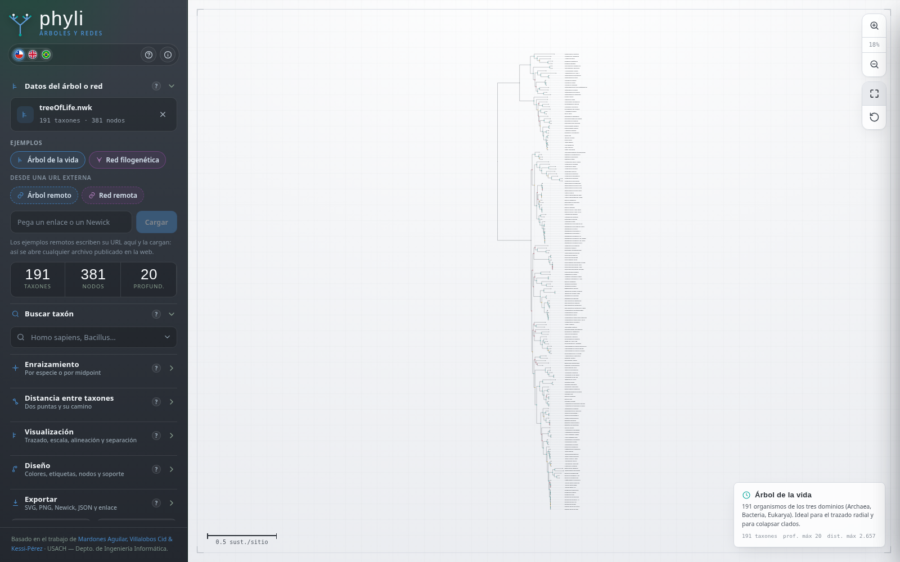
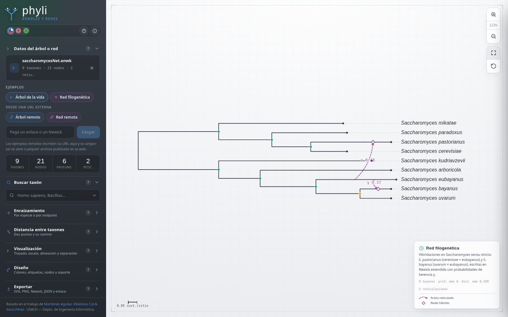
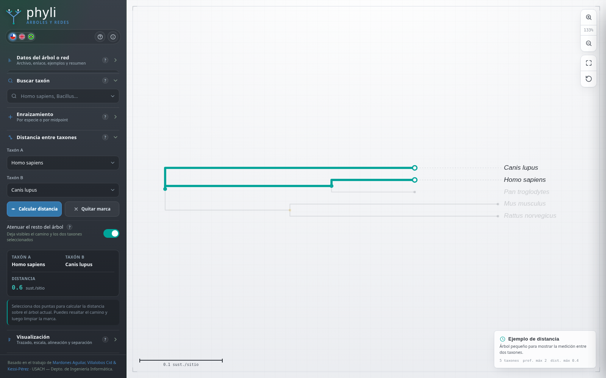
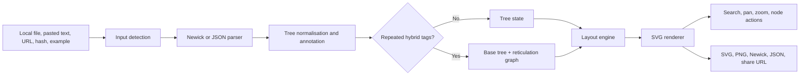
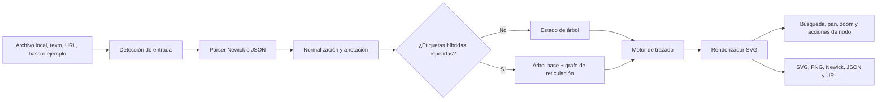

# Phyli

<p align="center">
  
</p>

<p align="center">
  <strong>Interactive visualisation of phylogenetic trees and networks in the browser</strong><br>
  <strong>Visualización interactiva de árboles y redes filogenéticas en el navegador</strong>
</p>

<p align="center">
  <a href="https://mvillalobosc.diinf.usach.cl/Phyli/">Live application / Aplicación en línea</a>
  ·
  <a href="#english">English</a>
  ·
  <a href="#español">Español</a>
  ·
  <a href="#screenshots--capturas">Screenshots / Capturas</a>
</p>

---

## Screenshots / Capturas

| Rectangular phylogram / Filograma rectangular | Radial tree / Árbol radial |
|---|---|
|  |  |

| Extended-Newick network / Red en Newick extendido | Taxon distance / Distancia entre taxones |
|---|---|
|  |  |

| Export panel / Panel de exportación |
|---|
|  |

---

<a id="english"></a>

# English

## 1. About Phyli

**Phyli** is a static, client-side web application for loading, exploring, editing, and exporting **phylogenetic trees and phylogenetic networks**. It supports classic **Newick**, **extended Newick**, and Phyli **JSON projects**.

The application runs almost entirely from a single `index.html` file. Parsing, layout, interaction, rerooting, distance calculation, network reconstruction, and export are performed in the browser. No application backend, database, account, or server-side computation is required.

When the application opens without an encoded tree in the URL, it automatically loads the embedded **Tree of Life** example containing 191 taxa.

**Public deployment:** <https://mvillalobosc.diinf.usach.cl/Phyli/>

## 2. Current capabilities

| Area | Implemented behaviour |
|---|---|
| Trees | Classic Newick parsing with tip names, internal clade names, branch lengths, bracketed support, and numeric internal support labels. |
| Networks | Extended-Newick parsing with repeated hybrid tags, reticulation edges, hybrid nodes, support values, and inheritance probabilities `γ`. |
| Data input | Local files, pasted Newick/eNewick/JSON, remote URLs, URL fragments, path-based input on Apache, compressed share links, and embedded examples. |
| Search | Searchable tip selector using complete or partial taxon names, with viewport recentring and expansion of hidden collapsed paths. |
| Rooting | Reroot by a selected terminal taxon or by midpoint. Rooting is disabled for networks to preserve hybrid relationships. |
| Distance | Path distance between two terminal taxa using branch lengths when available, otherwise topological steps. The selected path can remain highlighted while the rest of the tree is dimmed. |
| Layout | Step, curved, straight, radial, and radial-step layouts. |
| Scale | Phylogram and cladogram modes, optional aligned tips, branch ordering, radial fan angle, and adjustable taxon spacing. |
| Editing | Collapse or expand clades, focus a clade, assign a clade colour, remove a clade colour, and reset the viewport or styles. |
| Styling | Branch width and colour, internal-node radius and colour, label size and colour, guide lines, support markers, internal labels, reticulation edges, and `γ` labels. |
| Export | SVG, high-resolution PNG at 2×, Newick/extended Newick, JSON project, and compressed share URL. |
| Interface | Spanish, English, and Portuguese interface translation, contextual help, tooltips, responsive sidebar, zoom, pan, and fit-to-view controls. |

## 3. Quick start

### 3.1 Open directly

Open `index.html` in a modern browser. Most functions work directly because the application code is embedded in the page.

### 3.2 Run with a local server

A local server is preferable during development and when testing remote or relative resources.

```bash
python -m http.server 8000
```

Then open:

```text
http://localhost:8000/
```

### 3.3 Repository contents

The supplied application is intentionally compact:

```text
Phyli/
├── index.html
├── htaccess
├── README.md
└── assets/
    ├── screenshot-main.png
    ├── screenshot-radial.png
    ├── screenshot-network.png
    ├── screenshot-distance.png
    └── screenshot-export.png
```

| Item | Purpose |
|---|---|
| `index.html` | Complete application: HTML interface, CSS, parser, rendering, interaction, internationalisation, and export logic. |
| `htaccess` | Apache rewrite configuration supplied without the leading dot. Rename it to `.htaccess` when deploying it as an Apache configuration file. |
| `README.md` | Project documentation for GitHub or another repository browser. |
| `assets/` | Real screenshots generated from the supplied application. |

## 4. Input formats

### 4.1 Supported local file extensions

| Extension | Intended content |
|---|---|
| `.nwk`, `.new`, `.tre`, `.tree`, `.txt` | Classic Newick trees. |
| `.enwk`, `.enw`, `.net` | Extended-Newick phylogenetic networks. |
| `.json` | Phyli project files or compatible legacy project structures. |

The parser determines whether the input is a tree or a network from its content rather than relying only on the extension.

### 4.2 Classic Newick

```newick
((Homo_sapiens:0.10,Pan_troglodytes:0.10)95:0.20,
 (Mus_musculus:0.25,Rattus_norvegicus:0.25)88:0.15,
 Canis_lupus:0.30);
```

Phyli recognises:

| Syntax | Meaning |
|---|---|
| `(A,B)` | Internal grouping or clade. |
| `Taxon_name` | Terminal or internal label. Underscores are displayed as spaces. |
| `:0.25` | Branch length. |
| `[95]` | Support value stored as a bracket annotation. |
| `)95:0.1` | Numeric internal label interpreted as support. |
| `;` | End of the Newick expression. |

### 4.3 Extended Newick

A hybrid node is represented by repeating the same hybrid identifier. The current parser recognises tags such as `#H`, `#LGT`, and `#R`.

```newick
((A:1,(B:1)#H1:0.5::0.7)x:1,
 (#H1:0.5::0.3,C:1)y:1)root;
```

The branch annotation model is:

```text
:length:support:gamma
```

Empty intermediate values are allowed. Therefore, `:0.5::0.7` represents a branch length of `0.5`, no support value, and an inheritance probability `γ = 0.7`.

When repeated hybrid tags are found, Phyli folds the repeated occurrences into:

1. A base rooted tree.
2. One or more reticulation edges.
3. Diamond-shaped hybrid nodes.
4. Optional support and inheritance-probability labels.

### 4.4 JSON projects

The current JSON export stores the original Newick or extended-Newick representation together with visual state. This includes layout, scale mode, alignment, ordering, radial angle, taxon spacing, style properties, visibility toggles, and project metadata.

Phyli also recognises an earlier JSON structure containing a nested `tree` object and converts it back to Newick during import.

## 5. Loading data

| Method | Procedure and behaviour |
|---|---|
| Local file | Drag a supported file into the upload area or use the file picker. Processing remains in the browser. |
| Embedded example | Select **Tree of Life** or **Phylogenetic network**. |
| Pasted content | Paste Newick, extended Newick, or JSON into the URL/input field and select **Load**. |
| Remote file | Paste an `http://` or `https://` address. The remote server must permit browser access through CORS. Raw GitHub URLs normally work. |
| URL fragment | Put the tree after `#`, use `#nwk=...`, or open a compressed `#z=...` link generated by Phyli. |
| Remote source parameter | Use `#src=https://.../tree.nwk` or the equivalent extended-Newick file. |
| Apache path | With the supplied rewrite rule enabled, place Newick directly in the route. Hybrid `#` characters must be encoded as `%23`. |

Examples:

```text
https://example.org/Phyli/#(A:1,(B:1,C:1));
https://example.org/Phyli/#nwk=(A:1,(B:1,C:1));
https://example.org/Phyli/#src=https://example.org/data/network.enwk
https://example.org/Phyli/(A:1,(B:1,C:1));
```

The compressed `#z=` form is produced by **Share link** and can preserve the tree or network together with relevant view settings.

## 6. Working with trees

### 6.1 Search and navigation

The taxon search field uses the current tip list. It accepts exact and partial names. Selecting a result highlights the taxon, recentres the viewport, and expands any collapsed ancestors required to make the result visible.

The stage supports:

| Action | Result |
|---|---|
| Mouse wheel or zoom buttons | Zoom around the current view. |
| Drag on the stage | Pan the tree or network. |
| Fit button | Fit the complete visualisation into the viewport. |
| Reset button | Restore the default styles and visual settings. |
| Hover | Show taxon, branch length, support, descendant count, or reticulation information. |
| Click an internal node | Open actions for collapse/expand, focus, clade colour, and colour removal. |

### 6.2 Rooting by taxon

Phyli converts the current tree to an undirected weighted graph, finds the edge connected to the selected terminal taxon, inserts a new artificial root on that edge, and reconstructs the directed tree from the new root.

When branch lengths exist, the selected edge is divided into two parts so that its total length is preserved.

### 6.3 Midpoint rooting

Midpoint rooting follows the weighted diameter of the tree:

1. Start from an arbitrary leaf and find the farthest leaf `A`.
2. Traverse again from `A` and find the farthest leaf `B`.
3. Reconstruct the path between `A` and `B`.
4. Place the root at half of the total path distance.
5. Split the edge containing that midpoint and rebuild the rooted tree.

For a tree-shaped input, the traversal and reconstruction are linear in the number of nodes.

### 6.4 Distance between two taxa

The distance tool finds the path between two terminal nodes in the current rooted base tree.

| Input state | Reported unit |
|---|---|
| Branch lengths available | Sum of branch lengths, displayed as substitutions per site. |
| No usable branch lengths | Number of topological steps. |

The tool stores the selected node identifiers, the path edge set, and the path node set. When **Dim the rest of the tree** is enabled, the path and both selected taxa remain emphasised while unrelated elements are faded.

## 7. Working with phylogenetic networks

Network mode is activated automatically when repeated extended-Newick hybrid tags are detected.

### 7.1 Visual encoding

| Element | Rendering |
|---|---|
| Base-tree branch | Standard solid branch. |
| Reticulation edge | Curved, dashed purple arrow. |
| Hybrid node | Diamond marker. |
| Inheritance probability | `γ` label placed near the reticulation edge. |
| Network summary | Taxa, nodes, maximum depth, number of reticulations, and maximum distance. |

### 7.2 Network-specific rules

| Function | Behaviour in network mode |
|---|---|
| Root by taxon | Disabled. |
| Midpoint rooting | Disabled. |
| Taxon distance | Calculated on the base tree; reticulation edges are not included in the path. |
| Reticulation visibility | Can be switched on or off from the Design panel. |
| `γ` visibility | Can be switched on or off independently. |
| Newick export | Serialises the current network back to extended Newick with repeated hybrid tags and edge annotations. |

Rooting is deliberately disabled because rebuilding a network as a simple rooted tree would orphan or invalidate its reticulation edges.

## 8. Layout and visual design

### 8.1 Layouts

| Layout | Description |
|---|---|
| Step | Rectangular phylogeny with horizontal and vertical segments. |
| Curved | Smooth parent-child transitions. |
| Straight | Direct diagonal segments. |
| Radial | Polar projection suitable for large trees. |
| Radial step | Polar projection with stepped branch geometry. |

### 8.2 Scale modes

| Mode | Coordinate rule |
|---|---|
| Phylogram | Horizontal or radial depth is proportional to accumulated branch length. A scale bar is shown. |
| Cladogram | Branch lengths are ignored and depth is determined by topological level. |

**Align tips** projects terminal nodes to a common outer coordinate. **Order branches** places smaller clades first to create a ladderised view. Radial layouts also provide a configurable fan angle from 30° to 360°.

### 8.3 Styling controls

The Design panel controls:

1. Branch width and colour.
2. Internal-node radius and colour.
3. Label size and colour.
4. Tip guide lines.
5. Bootstrap/support markers.
6. Internal clade labels.
7. Reticulation edges in network mode.
8. Inheritance-probability labels in network mode.

Support markers use qualitative colour classes for high, medium, and low support. The exact support value remains available through interaction.

## 9. Export and reproducibility

| Export | Result |
|---|---|
| SVG | Standalone vector figure preserving branches, labels, support markers, colours, reticulations, and collapsed-clade symbols. |
| PNG | Raster export rendered from SVG through Canvas at 2× resolution. |
| Newick | Current rooted tree topology or current extended-Newick network. |
| JSON | Reopenable Phyli project containing data and visual settings. |
| Share link | Compressed URL containing the tree/network and relevant view state. |

SVG is the preferred format for manuscripts and later editing in Inkscape, Illustrator, or Figma. PNG is suitable for slides and reports. JSON is safer than a share URL for very large or sensitive projects.

## 10. Software architecture

Phyli is a framework-free single-page application.



### 10.1 Main internal modules

| Module | Responsibility |
|---|---|
| Input layer | FileReader, pasted content, remote fetch, URL decoding, compressed URL decoding, and example loading. |
| Parser | Tokenisation of Newick delimiters, labels, bracket annotations, branch fields, and hybrid tags. |
| Network extraction | Merges repeated hybrid occurrences and constructs reticulation edges. |
| Annotation | Parent references, depth, accumulated distance, leaf count, descendant maxima, and summary statistics. |
| Rooting | Graph conversion, selected-edge rerooting, weighted midpoint rooting, and reconstruction. |
| Distance | Base-tree path discovery, edge/node highlighting, and distance accumulation. |
| Layout | Rectangular across/depth assignment and polar conversion for radial views. |
| Rendering | Layered SVG groups for guides, branches, reticulations, wedges, support, nodes, and labels. |
| Interaction | Tooltips, node menus, search, collapsed-path expansion, zoom, pan, and viewport fitting. |
| Export | SVG serialisation, PNG Canvas conversion, recursive Newick/eNewick serialisation, JSON state, and LZString URL compression. |
| Internationalisation | Runtime translation of text nodes and attributes into Spanish, English, or Portuguese. |

### 10.2 Runtime dependencies

The application does not require a JavaScript framework or package manager. LZString is embedded in `index.html` for compressed URLs. The display font is requested from Google Fonts when an internet connection is available; application logic and the remaining interface are embedded locally.

## 11. Deployment

### 11.1 Generic static hosting

Upload `index.html` and any documentation assets to a static web directory. Hash-based Newick and `#z=` share links work without server rewrite rules.

### 11.2 GitHub Pages

GitHub Pages can serve the application directly. Keep links hash-based because GitHub Pages does not apply the supplied Apache rewrite file.

Recommended repository root:

```text
index.html
README.md
.nojekyll
assets/
```

### 11.3 Apache under `/Phyli/`

The supplied `htaccess` file contains rules for direct path input. Before deployment:

1. Rename `htaccess` to `.htaccess`.
2. Confirm that `mod_rewrite` is enabled.
3. Keep `RewriteBase /Phyli/` only when the application is actually installed under `/Phyli/`.
4. Change `RewriteBase` when using another subdirectory.
5. Ensure the server permits the `AllowEncodedSlashes NoDecode` directive where required.

The rewrite sends non-existent paths to `index.html`, allowing routes such as:

```text
https://example.org/Phyli/(A:1,(B:1,C:1));
```

In extended Newick placed in the path, encode hybrid markers as `%23`.

## 12. Privacy and data handling

Local files are read with `FileReader` and are not uploaded to a Phyli backend because no such backend exists. Remote loading sends a request only to the URL supplied by the user. Share links place compressed project data in the URL, so they should not be used for private or sensitive trees unless exposure through the address is acceptable.

## 13. Performance

Most core operations are linear for a tree with `n` nodes.

| Operation | Expected complexity |
|---|---|
| Parse and annotation | `O(n)` |
| Rectangular layout | `O(n)` |
| Radial projection | `O(n)` |
| SVG construction | `O(n)` visible elements |
| Midpoint rooting | `O(n)` for a tree |
| Taxon search | `O(number of leaves)` |

Very large trees may become slow because every visible branch, label, support marker, interaction target, and reticulation is represented by an SVG/DOM element.

## 14. Browser compatibility

Phyli uses standard browser APIs: SVG, Canvas, Blob URLs, FileReader, Fetch, DOM events, Clipboard where available, and localStorage for the selected language.

The target environment is a current desktop version of:

1. Chrome or Chromium.
2. Microsoft Edge.
3. Firefox.
4. Safari.

## 15. Known limitations

1. Newick and extended-Newick dialects vary; uncommon annotations may require preprocessing.
2. Very large trees can produce dense labels and expensive SVG output.
3. Remote loading depends on the source server's CORS policy.
4. Share URLs are subject to practical browser and server URL-length limits.
5. Network distance currently follows only the base tree and excludes reticulation edges.
6. Rooting is intentionally unavailable for networks.
7. Path-based Newick requires server-side rewrite support; hash-based input does not.

## 16. Validation checklist

### Data and parsing

- [ ] Open the embedded Tree of Life example.
- [ ] Open the embedded Saccharomyces network.
- [ ] Load local `.nwk`, `.enwk`, and `.json` files.
- [ ] Paste classic Newick, extended Newick, and JSON.
- [ ] Test a remote raw URL with CORS enabled.
- [ ] Confirm that invalid Newick produces a readable error.

### Tree operations

- [ ] Search for a visible taxon.
- [ ] Search for a taxon inside a collapsed clade.
- [ ] Root by a terminal taxon.
- [ ] Root by midpoint.
- [ ] Calculate a distance with branch lengths.
- [ ] Calculate a distance without branch lengths.

### Network operations

- [ ] Confirm reticulation count and hybrid markers.
- [ ] Toggle reticulation edges.
- [ ] Toggle `γ` labels.
- [ ] Export and reopen extended Newick.
- [ ] Confirm rooting controls remain disabled.

### Visualisation and export

- [ ] Test all five layouts.
- [ ] Test phylogram and cladogram modes.
- [ ] Test aligned tips, branch ordering, radial angle, and spacing.
- [ ] Collapse, expand, focus, colour, and reset a clade.
- [ ] Export SVG, PNG, Newick, and JSON.
- [ ] Open a generated share link in another tab.
- [ ] Switch between Spanish, English, and Portuguese after loading data.

## 17. Citation, licence, and credits

The application includes the following original-work citation:

> Mardones Aguilar, R. I. N., Villalobos Cid, M. J., & Universidad de Santiago de Chile, Facultad de Ingeniería, Departamento de Ingeniería Informática. (2006). *Desarrollo de aplicación en línea para la interacción y visualización de árboles filogenéticos*. Universidad de Santiago de Chile.

The About panel states that the base project is distributed under **Creative Commons Attribution-ShareAlike 4.0 International (CC BY-SA 4.0)**. A repository release should also include an explicit `LICENSE` file so that the terms are visible outside the application.

Current continuity, documentation, and web-development credits:

| Contributor | Contact |
|---|---|
| Manuel Villalobos Cid | [manuel.villalobos@usach.cl](mailto:manuel.villalobos@usach.cl) |
| Rodrigo Mardones Aguilar | [rodrigo.mardones.a@usach.cl](mailto:rodrigo.mardones.a@usach.cl) |
| Eduardo Kessi-Pérez | Universidad de Santiago de Chile |

Institutional context: Universidad de Santiago de Chile, Facultad de Ingeniería, Departamento de Ingeniería Informática.

---

<a id="español"></a>

# Español

## 1. Acerca de Phyli

**Phyli** es una aplicación web estática del lado del cliente para cargar, explorar, editar y exportar **árboles filogenéticos y redes filogenéticas**. Admite **Newick** clásico, **Newick extendido** y proyectos **JSON** de Phyli.

La aplicación funciona casi por completo desde un único archivo `index.html`. El parseo, el trazado, las interacciones, el enraizamiento, el cálculo de distancias, la reconstrucción de redes y las exportaciones se ejecutan en el navegador. No requiere backend de aplicación, base de datos, cuenta de usuario ni procesamiento en el servidor.

Cuando la aplicación se abre sin un árbol codificado en la URL, carga automáticamente el ejemplo integrado **Árbol de la vida**, que contiene 191 taxones.

**Despliegue público:** <https://mvillalobosc.diinf.usach.cl/Phyli/>

## 2. Funcionalidades actuales

| Área | Comportamiento implementado |
|---|---|
| Árboles | Parseo de Newick clásico con nombres de puntas, nombres de clados internos, longitudes de rama, soporte entre corchetes y etiquetas internas numéricas interpretadas como soporte. |
| Redes | Parseo de Newick extendido con etiquetas híbridas repetidas, aristas de reticulación, nodos híbridos, valores de soporte y probabilidades de herencia `γ`. |
| Entrada de datos | Archivos locales, Newick/eNewick/JSON pegado, URLs remotas, fragmentos de URL, entrada en la ruta con Apache, enlaces compartidos comprimidos y ejemplos integrados. |
| Búsqueda | Selector buscable de puntas mediante nombres completos o parciales, recentrado de la vista y expansión de rutas ocultas por clados colapsados. |
| Enraizamiento | Enraizamiento mediante un taxón terminal seleccionado o por punto medio. Se desactiva en redes para preservar las relaciones híbridas. |
| Distancia | Distancia entre dos taxones terminales usando longitudes de rama cuando existen o pasos topológicos en caso contrario. El camino puede mantenerse resaltado mientras el resto del árbol se atenúa. |
| Trazados | Escalón, curvo, recto, radial y radial escalonado. |
| Escala | Modos filograma y cladograma, alineación opcional de puntas, ordenamiento de ramas, ángulo del abanico radial y separación ajustable entre taxones. |
| Edición | Colapsar o expandir clados, enfocar un clado, asignar color, quitar color y restablecer la vista o los estilos. |
| Diseño | Grosor y color de ramas, radio y color de nodos internos, tamaño y color de etiquetas, líneas guía, marcadores de soporte, nombres internos, aristas reticuladas y etiquetas `γ`. |
| Exportación | SVG, PNG de alta resolución a 2×, Newick/Newick extendido, proyecto JSON y URL compartible comprimida. |
| Interfaz | Traducción al español, inglés y portugués, ayudas contextuales, tooltips, barra lateral responsive, zoom, desplazamiento y ajuste a la vista. |

## 3. Inicio rápido

### 3.1 Apertura directa

Abre `index.html` en un navegador moderno. La mayoría de las funciones opera directamente porque el código de la aplicación está integrado en la página.

### 3.2 Servidor local

Se recomienda un servidor local durante el desarrollo y para probar recursos remotos o rutas relativas.

```bash
python -m http.server 8000
```

Luego abre:

```text
http://localhost:8000/
```

### 3.3 Contenido del repositorio

La aplicación entregada mantiene una estructura intencionalmente compacta:

```text
Phyli/
├── index.html
├── htaccess
├── README.md
└── assets/
    ├── screenshot-main.png
    ├── screenshot-radial.png
    ├── screenshot-network.png
    ├── screenshot-distance.png
    └── screenshot-export.png
```

| Elemento | Propósito |
|---|---|
| `index.html` | Aplicación completa: interfaz HTML, CSS, parser, renderizado, interacción, internacionalización y exportación. |
| `htaccess` | Configuración de reescritura para Apache entregada sin el punto inicial. Debe renombrarse como `.htaccess` al desplegarla como configuración de Apache. |
| `README.md` | Documentación del proyecto para GitHub u otro visor de repositorios. |
| `assets/` | Capturas reales generadas desde la aplicación entregada. |

## 4. Formatos de entrada

### 4.1 Extensiones admitidas para archivos locales

| Extensión | Contenido esperado |
|---|---|
| `.nwk`, `.new`, `.tre`, `.tree`, `.txt` | Árboles en Newick clásico. |
| `.enwk`, `.enw`, `.net` | Redes filogenéticas en Newick extendido. |
| `.json` | Proyectos de Phyli o estructuras antiguas compatibles. |

El parser determina si la entrada es un árbol o una red a partir del contenido y no únicamente de la extensión.

### 4.2 Newick clásico

```newick
((Homo_sapiens:0.10,Pan_troglodytes:0.10)95:0.20,
 (Mus_musculus:0.25,Rattus_norvegicus:0.25)88:0.15,
 Canis_lupus:0.30);
```

Phyli reconoce:

| Sintaxis | Significado |
|---|---|
| `(A,B)` | Agrupación interna o clado. |
| `Nombre_taxon` | Etiqueta terminal o interna. Los guiones bajos se muestran como espacios. |
| `:0.25` | Longitud de rama. |
| `[95]` | Valor de soporte almacenado como anotación entre corchetes. |
| `)95:0.1` | Etiqueta interna numérica interpretada como soporte. |
| `;` | Fin de la expresión Newick. |

### 4.3 Newick extendido

Un nodo híbrido se representa repitiendo el mismo identificador híbrido. El parser actual reconoce etiquetas como `#H`, `#LGT` y `#R`.

```newick
((A:1,(B:1)#H1:0.5::0.7)x:1,
 (#H1:0.5::0.3,C:1)y:1)root;
```

El modelo de anotación de una rama es:

```text
:length:support:gamma
```

Se permiten valores intermedios vacíos. Por tanto, `:0.5::0.7` representa una longitud de rama de `0.5`, sin valor de soporte y con una probabilidad de herencia `γ = 0.7`.

Cuando se encuentran etiquetas híbridas repetidas, Phyli combina sus apariciones para construir:

1. Un árbol base enraizado.
2. Una o más aristas de reticulación.
3. Nodos híbridos con forma de rombo.
4. Etiquetas opcionales de soporte y probabilidad de herencia.

### 4.4 Proyectos JSON

La exportación JSON actual guarda la representación Newick o Newick extendido original junto con el estado visual. Esto incluye trazado, modo de escala, alineación, ordenamiento, ángulo radial, separación entre taxones, propiedades de estilo, controles de visibilidad y metadatos del proyecto.

Phyli también reconoce una estructura JSON anterior que contiene un objeto `tree` anidado y lo convierte nuevamente a Newick durante la importación.

## 5. Carga de datos

| Método | Procedimiento y comportamiento |
|---|---|
| Archivo local | Arrastra un archivo admitido al área de carga o usa el selector. El procesamiento permanece en el navegador. |
| Ejemplo integrado | Selecciona **Árbol de la vida** o **Red filogenética**. |
| Contenido pegado | Pega Newick, Newick extendido o JSON en el campo de entrada y selecciona **Cargar**. |
| Archivo remoto | Pega una dirección `http://` o `https://`. El servidor remoto debe permitir el acceso del navegador mediante CORS. Las URLs raw de GitHub normalmente funcionan. |
| Fragmento de URL | Coloca el árbol después de `#`, usa `#nwk=...` o abre un enlace comprimido `#z=...` generado por Phyli. |
| Parámetro de fuente remota | Usa `#src=https://.../tree.nwk` o un archivo equivalente en Newick extendido. |
| Ruta en Apache | Con la regla de reescritura habilitada, coloca Newick directamente en la ruta. Los caracteres híbridos `#` deben codificarse como `%23`. |

Ejemplos:

```text
https://example.org/Phyli/#(A:1,(B:1,C:1));
https://example.org/Phyli/#nwk=(A:1,(B:1,C:1));
https://example.org/Phyli/#src=https://example.org/data/network.enwk
https://example.org/Phyli/(A:1,(B:1,C:1));
```

La forma comprimida `#z=` es generada por **Compartir enlace** y puede conservar el árbol o la red junto con los ajustes relevantes de la vista.

## 6. Trabajo con árboles

### 6.1 Búsqueda y navegación

El buscador de taxones utiliza la lista de puntas del árbol actual. Acepta nombres exactos o parciales. Al seleccionar un resultado, resalta el taxón, recentra la vista y expande los ancestros colapsados necesarios para hacerlo visible.

El visor admite:

| Acción | Resultado |
|---|---|
| Rueda del mouse o botones de zoom | Acercar o alejar la vista. |
| Arrastrar sobre el visor | Desplazar el árbol o la red. |
| Botón de ajuste | Encajar la visualización completa en el visor. |
| Botón de restablecimiento | Recuperar los estilos y ajustes visuales predeterminados. |
| Pasar el cursor | Mostrar información del taxón, longitud de rama, soporte, descendientes o reticulación. |
| Clic en un nodo interno | Abrir acciones para colapsar/expandir, enfocar, colorear el clado y quitar su color. |

### 6.2 Enraizamiento por taxón

Phyli convierte el árbol actual en un grafo no dirigido y ponderado, encuentra la arista conectada al taxón terminal seleccionado, inserta una raíz artificial en esa arista y reconstruye el árbol dirigido desde la nueva raíz.

Cuando existen longitudes de rama, la arista seleccionada se divide en dos partes y conserva su longitud total.

### 6.3 Enraizamiento por punto medio

El enraizamiento por punto medio sigue el diámetro ponderado del árbol:

1. Parte desde una hoja arbitraria y encuentra la hoja más lejana `A`.
2. Recorre nuevamente desde `A` y encuentra la hoja más lejana `B`.
3. Reconstruye el camino entre `A` y `B`.
4. Ubica la raíz a la mitad de la distancia total.
5. Divide la arista que contiene ese punto medio y reconstruye el árbol enraizado.

Para una entrada con estructura de árbol, el recorrido y la reconstrucción son lineales respecto del número de nodos.

### 6.4 Distancia entre dos taxones

La herramienta de distancia encuentra el camino entre dos nodos terminales del árbol base enraizado actual.

| Estado de la entrada | Unidad informada |
|---|---|
| Existen longitudes de rama | Suma de longitudes de rama, mostrada como sustituciones por sitio. |
| No existen longitudes utilizables | Número de pasos topológicos. |

La herramienta guarda los identificadores seleccionados y los conjuntos de aristas y nodos del camino. Cuando se activa **Atenuar el resto del árbol**, el camino y ambos taxones permanecen destacados mientras los elementos no relacionados pierden opacidad.

## 7. Trabajo con redes filogenéticas

El modo de red se activa automáticamente cuando se detectan etiquetas híbridas repetidas en Newick extendido.

### 7.1 Codificación visual

| Elemento | Renderizado |
|---|---|
| Rama del árbol base | Rama sólida estándar. |
| Arista de reticulación | Flecha curva, segmentada y morada. |
| Nodo híbrido | Marcador con forma de rombo. |
| Probabilidad de herencia | Etiqueta `γ` cercana a la arista reticulada. |
| Resumen de la red | Taxones, nodos, profundidad máxima, número de reticulaciones y distancia máxima. |

### 7.2 Reglas específicas para redes

| Función | Comportamiento en modo de red |
|---|---|
| Enraizar por taxón | Desactivado. |
| Enraizar por punto medio | Desactivado. |
| Distancia entre taxones | Se calcula sobre el árbol base; las aristas reticuladas no se incluyen en el camino. |
| Visibilidad de reticulaciones | Puede activarse o desactivarse desde el panel Diseño. |
| Visibilidad de `γ` | Puede activarse o desactivarse de forma independiente. |
| Exportación Newick | Serializa la red actual nuevamente como Newick extendido, con etiquetas híbridas repetidas y anotaciones de arista. |

El enraizamiento se desactiva deliberadamente porque reconstruir una red como un árbol simple podría dejar huérfanas o invalidar sus aristas de reticulación.

## 8. Trazado y diseño visual

### 8.1 Trazados

| Trazado | Descripción |
|---|---|
| Escalón | Filogenia rectangular con segmentos horizontales y verticales. |
| Curvo | Transiciones suaves entre padre e hijo. |
| Recto | Segmentos diagonales directos. |
| Radial | Proyección polar adecuada para árboles grandes. |
| Radial escalonado | Proyección polar con geometría escalonada. |

### 8.2 Modos de escala

| Modo | Regla de coordenadas |
|---|---|
| Filograma | La profundidad horizontal o radial es proporcional a la longitud de rama acumulada. Se muestra una barra de escala. |
| Cladograma | Se ignoran las longitudes de rama y la profundidad se determina por el nivel topológico. |

**Alinear las puntas** proyecta los nodos terminales hacia una coordenada externa común. **Ordenar ramas** coloca primero los clados pequeños para generar una vista escalonada. Los trazados radiales también permiten configurar el ángulo del abanico entre 30° y 360°.

### 8.3 Controles de estilo

El panel Diseño permite modificar:

1. Grosor y color de las ramas.
2. Radio y color de los nodos internos.
3. Tamaño y color de las etiquetas.
4. Líneas guía de las puntas.
5. Marcadores de bootstrap/soporte.
6. Nombres de clados internos.
7. Aristas de reticulación en modo de red.
8. Etiquetas de probabilidad de herencia en modo de red.

Los marcadores de soporte usan categorías cromáticas cualitativas para soporte alto, medio y bajo. El valor exacto permanece disponible mediante la interacción.

## 9. Exportación y reproducibilidad

| Exportación | Resultado |
|---|---|
| SVG | Figura vectorial independiente que conserva ramas, etiquetas, soporte, colores, reticulaciones y símbolos de clados colapsados. |
| PNG | Exportación ráster construida desde SVG mediante Canvas a resolución 2×. |
| Newick | Topología enraizada actual o red actual en Newick extendido. |
| JSON | Proyecto de Phyli reabrible con datos y ajustes visuales. |
| Enlace compartido | URL comprimida que contiene el árbol o red y el estado relevante de la vista. |

SVG es el formato recomendado para manuscritos y edición posterior en Inkscape, Illustrator o Figma. PNG sirve para diapositivas e informes. JSON es más seguro que una URL compartida para proyectos muy grandes o sensibles.

## 10. Arquitectura del software

Phyli es una aplicación de una sola página sin frameworks.



### 10.1 Módulos internos principales

| Módulo | Responsabilidad |
|---|---|
| Capa de entrada | FileReader, contenido pegado, fetch remoto, decodificación de URL, descompresión de URL y carga de ejemplos. |
| Parser | Tokenización de delimitadores Newick, etiquetas, anotaciones entre corchetes, campos de rama y etiquetas híbridas. |
| Extracción de redes | Combina apariciones híbridas repetidas y construye aristas de reticulación. |
| Anotación | Referencias al padre, profundidad, distancia acumulada, número de hojas, máximos descendentes y estadísticas. |
| Enraizamiento | Conversión a grafo, enraizamiento en una arista, punto medio ponderado y reconstrucción. |
| Distancia | Descubrimiento del camino en el árbol base, resaltado de nodos/aristas y acumulación de distancia. |
| Trazado | Asignación rectangular de coordenadas y conversión polar para vistas radiales. |
| Renderizado | Grupos SVG por capas para guías, ramas, reticulaciones, cuñas, soporte, nodos y etiquetas. |
| Interacción | Tooltips, menú de nodos, búsqueda, expansión de rutas colapsadas, zoom, desplazamiento y ajuste del visor. |
| Exportación | Serialización SVG, conversión PNG con Canvas, serialización recursiva Newick/eNewick, estado JSON y compresión URL con LZString. |
| Internacionalización | Traducción en tiempo de ejecución de nodos de texto y atributos al español, inglés o portugués. |

### 10.2 Dependencias de ejecución

La aplicación no requiere framework JavaScript ni gestor de paquetes. LZString está integrado en `index.html` para generar URLs comprimidas. La tipografía de presentación se solicita desde Google Fonts cuando hay conexión a Internet; la lógica de la aplicación y el resto de la interfaz permanecen integrados localmente.

## 11. Despliegue

### 11.1 Hosting estático genérico

Sube `index.html` y los recursos de documentación a un directorio web estático. Los árboles mediante hash y los enlaces compartidos `#z=` funcionan sin reglas de reescritura del servidor.

### 11.2 GitHub Pages

GitHub Pages puede servir la aplicación directamente. Mantén los enlaces basados en hash porque GitHub Pages no aplica el archivo de reescritura para Apache.

Raíz recomendada del repositorio:

```text
index.html
README.md
.nojekyll
assets/
```

### 11.3 Apache bajo `/Phyli/`

El archivo `htaccess` entregado contiene reglas para recibir Newick directamente en la ruta. Antes del despliegue:

1. Renombra `htaccess` como `.htaccess`.
2. Confirma que `mod_rewrite` esté habilitado.
3. Conserva `RewriteBase /Phyli/` únicamente cuando la aplicación esté instalada realmente bajo `/Phyli/`.
4. Cambia `RewriteBase` al usar otro subdirectorio.
5. Verifica que el servidor permita `AllowEncodedSlashes NoDecode` cuando corresponda.

La regla envía las rutas inexistentes a `index.html`, permitiendo direcciones como:

```text
https://example.org/Phyli/(A:1,(B:1,C:1));
```

En Newick extendido incluido en la ruta, las marcas híbridas deben codificarse como `%23`.

## 12. Privacidad y manejo de datos

Los archivos locales se leen mediante `FileReader` y no se suben a un backend de Phyli porque dicho backend no existe. La carga remota envía una solicitud únicamente a la URL indicada por el usuario. Los enlaces compartidos colocan datos comprimidos del proyecto dentro de la URL, por lo que no deben utilizarse con árboles privados o sensibles si su exposición en la dirección no es aceptable.

## 13. Rendimiento

La mayoría de las operaciones centrales es lineal para un árbol con `n` nodos.

| Operación | Complejidad esperada |
|---|---|
| Parseo y anotación | `O(n)` |
| Trazado rectangular | `O(n)` |
| Proyección radial | `O(n)` |
| Construcción SVG | `O(n)` elementos visibles |
| Enraizamiento por punto medio | `O(n)` para un árbol |
| Búsqueda de taxones | `O(número de hojas)` |

Los árboles muy grandes pueden volverse lentos porque cada rama, etiqueta, marcador de soporte, área interactiva y reticulación visible se representa mediante un elemento SVG/DOM.

## 14. Compatibilidad de navegadores

Phyli usa APIs web estándar: SVG, Canvas, Blob URLs, FileReader, Fetch, eventos DOM, portapapeles cuando está disponible y localStorage para recordar el idioma seleccionado.

El entorno objetivo corresponde a versiones actuales de escritorio de:

1. Chrome o Chromium.
2. Microsoft Edge.
3. Firefox.
4. Safari.

## 15. Limitaciones conocidas

1. Los dialectos Newick y Newick extendido varían; algunas anotaciones poco comunes pueden requerir preprocesamiento.
2. Los árboles muy grandes pueden generar etiquetas densas y una salida SVG costosa.
3. La carga remota depende de la política CORS del servidor de origen.
4. Las URLs compartidas están limitadas por la longitud práctica admitida por el navegador y el servidor.
5. La distancia en redes sigue actualmente solo el árbol base y excluye las aristas de reticulación.
6. El enraizamiento se encuentra deshabilitado intencionalmente para las redes.
7. Newick incluido directamente en la ruta requiere reescritura en el servidor; la entrada mediante hash no la requiere.

## 16. Checklist de validación

### Datos y parseo

- [ ] Abrir el ejemplo integrado Árbol de la vida.
- [ ] Abrir la red integrada de Saccharomyces.
- [ ] Cargar archivos locales `.nwk`, `.enwk` y `.json`.
- [ ] Pegar Newick clásico, Newick extendido y JSON.
- [ ] Probar una URL raw remota con CORS habilitado.
- [ ] Confirmar que un Newick inválido produzca un error legible.

### Operaciones con árboles

- [ ] Buscar un taxón visible.
- [ ] Buscar un taxón dentro de un clado colapsado.
- [ ] Enraizar mediante un taxón terminal.
- [ ] Enraizar por punto medio.
- [ ] Calcular una distancia con longitudes de rama.
- [ ] Calcular una distancia sin longitudes de rama.

### Operaciones con redes

- [ ] Confirmar el número de reticulaciones y los marcadores híbridos.
- [ ] Activar y desactivar las aristas reticuladas.
- [ ] Activar y desactivar las etiquetas `γ`.
- [ ] Exportar y reabrir Newick extendido.
- [ ] Confirmar que los controles de enraizamiento permanezcan deshabilitados.

### Visualización y exportación

- [ ] Probar los cinco trazados.
- [ ] Probar filograma y cladograma.
- [ ] Probar alineación de puntas, ordenamiento, ángulo radial y separación.
- [ ] Colapsar, expandir, enfocar, colorear y restablecer un clado.
- [ ] Exportar SVG, PNG, Newick y JSON.
- [ ] Abrir un enlace compartido en otra pestaña.
- [ ] Cambiar entre español, inglés y portugués después de cargar los datos.

## 17. Citación, licencia y créditos

La aplicación incluye la siguiente cita del trabajo original:

> Mardones Aguilar, R. I. N., Villalobos Cid, M. J., & Universidad de Santiago de Chile, Facultad de Ingeniería, Departamento de Ingeniería Informática. (2006). *Desarrollo de aplicación en línea para la interacción y visualización de árboles filogenéticos*. Universidad de Santiago de Chile.

El panel Acerca de declara que el proyecto base se distribuye bajo **Creative Commons Attribution-ShareAlike 4.0 International (CC BY-SA 4.0)**. Una publicación formal del repositorio también debería incorporar un archivo `LICENSE` explícito para que las condiciones sean visibles fuera de la aplicación.

Créditos actuales de continuidad, documentación y desarrollo web:

| Colaborador | Contacto |
|---|---|
| Manuel Villalobos Cid | [manuel.villalobos@usach.cl](mailto:manuel.villalobos@usach.cl) |
| Rodrigo Mardones Aguilar | [rodrigo.mardones.a@usach.cl](mailto:rodrigo.mardones.a@usach.cl) |
| Eduardo Kessi-Pérez | Universidad de Santiago de Chile |

Contexto institucional: Universidad de Santiago de Chile, Facultad de Ingeniería, Departamento de Ingeniería Informática.
