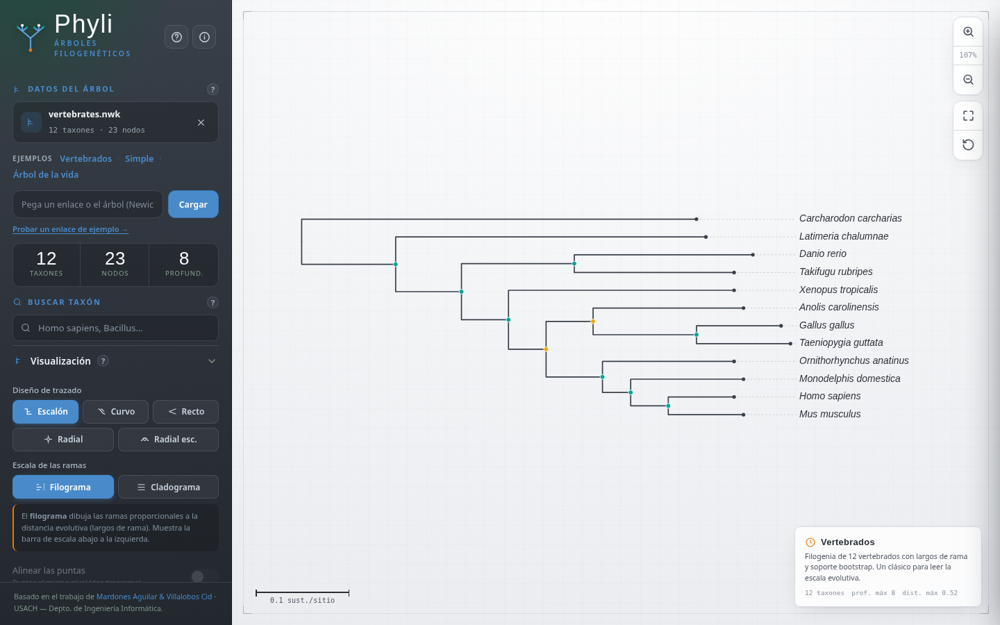
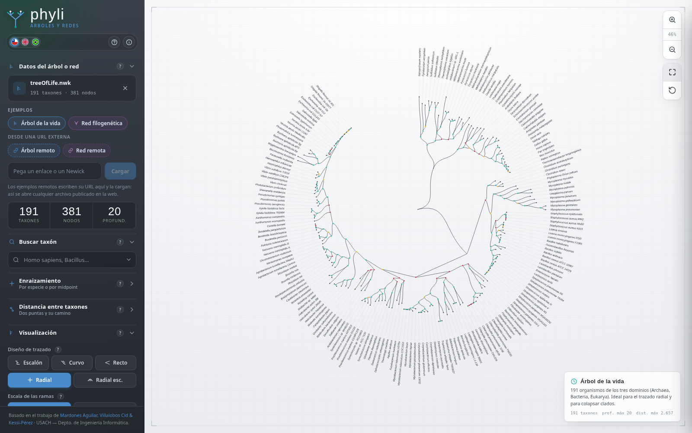
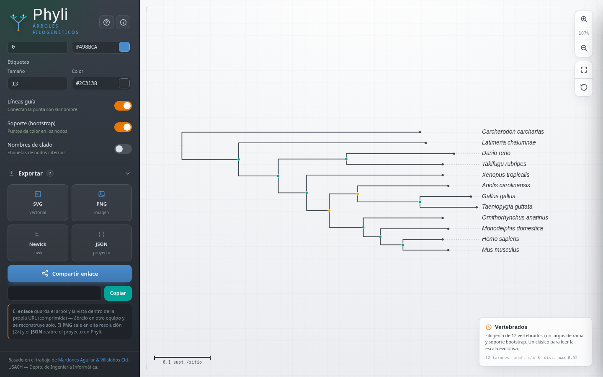

# Phyli

<p align="center">
  
</p>

<p align="center">
  <strong>Interactive phylogenetic tree visualisation in the browser</strong><br>
  <strong>Visualización interactiva de árboles filogenéticos en el navegador</strong>
</p>

<p align="center">
  <a href="#english">English</a> ·
  <a href="#espanol">Español</a> ·
  <a href="#screenshots--capturas">Screenshots / Capturas</a> ·
  <a href="#software-architecture">Software architecture</a> ·
  <a href="#arquitectura-del-software">Arquitectura del software</a>
</p>

---

## Screenshots / Capturas

| Main interface / Interfaz principal | Radial layout / Trazado radial |
|---|---|
|  |  |

| Export tools / Herramientas de exportación |
|---|
|  |

---

# English

## 1. What is Phyli?

**Phyli** is a client-side web application for loading, visualising, rooting, exploring, annotating, and exporting phylogenetic trees. It is intended for teaching, exploratory analysis, research support, and rapid figure preparation from trees in **Newick** format.

Phyli runs entirely in the browser. The tree file is processed locally by JavaScript, so the application does not require a backend, a database, a login system, or server-side computation. A static web server is enough to publish it.

**Live deployment:** <https://mvillalobosc.diinf.usach.cl/Phyli/>

## 2. Main capabilities

- Load trees from local files, pasted text, remote URLs, URL hashes, or built-in examples.
- Parse **Newick** trees with branch lengths, internal clade names, and support values.
- Reopen complete **JSON project** files exported from Phyli.
- Switch the interface between Spanish, English, and Portuguese.
- Search tips/taxa by complete or partial name.
- Reroot the tree by a selected reference taxon or by midpoint.
- Render the tree as step, curved, straight, radial, or radial-step layouts.
- Switch between **phylogram** and **cladogram** interpretation.
- Align tips, ladderise clades, change radial angle, and modify tip spacing.
- Collapse, focus, and colour clades interactively.
- Display internal support values using colour-coded node markers.
- Export the current view as **SVG**, **PNG**, **Newick**, **JSON**, or a shareable compressed link.

## 3. Repository structure

Recommended structure for a GitHub repository or GitHub Pages deployment:

```text
.
├── index.html
├── README.md
├── LICENSE.md
├── CITATION.cff
├── .nojekyll
├── assets/
│   ├── screenshot-home.png
│   ├── screenshot-radial.png
│   └── screenshot-export.png
└── examples/
    ├── simple.nwk
    ├── vertebrates.nwk
    └── tree-of-life.nwk
```

### File roles

| File or folder | Required? | Role |
|---|---:|---|
| `index.html` | Yes | Main single-page application. It contains the HTML structure, CSS, and JavaScript logic. |
| `README.md` | Strongly recommended | Project documentation shown by GitHub. |
| `assets/` | Recommended | Screenshots and visual resources used by the README or the interface. |
| `examples/` | Recommended | Example trees loaded by the application. |
| `LICENSE.md` | Recommended | Usage, attribution, redistribution, and modification terms. |
| `CITATION.cff` | Recommended for academic software | Enables GitHub's **Cite this repository** button. |
| `.nojekyll` | Optional | Prevents GitHub Pages from processing the site with Jekyll. Useful for static apps. |
| `.htaccess` | Only for Apache | Useful on Apache servers, but ignored by GitHub Pages. |
| `404.html` | Optional | Custom 404 page for GitHub Pages or static hosting. |

## 4. User manual

### 4.1 Loading a tree

Phyli supports several entry points:

| Method | Description |
|---|---|
| Local file | Drag a `.nwk`, `.tree`, or `.json` file into the upload area, or use the file picker. |
| Built-in examples | Load a predefined tree, such as vertebrates, simple, or tree-of-life. |
| Text input | Paste a Newick string or Phyli JSON project. |
| URL input | Load a remote `.nwk`, `.tree`, or `.json` file. The remote server must allow browser access through CORS. |
| URL hash | Open a tree directly from the address, for example `#(A:1,(B:1,C:1));`. |

After loading, the sidebar reports the number of taxa, total nodes, and tree depth.

### 4.2 Input formats

#### Newick

Newick represents nested groups using parentheses. Branch lengths follow colons, and the tree ends with a semicolon.

```newick
(Cat:0.3,(Mouse:0.2,Human:0.2)[95]:0.1);
```

| Element | Meaning |
|---|---|
| `(Mouse:0.2,Human:0.2)` | Internal clade containing two tips. |
| `:0.2` | Branch length. |
| `[95]` | Support value, usually bootstrap support. |
| Text after `)` | Internal clade name. |
| `;` | End of tree. |

#### JSON project

The JSON project format is generated by Phyli. It stores the tree plus visual state: layout, scale mode, colours, collapsed clades, clade colours, selected taxon, and viewport settings. Use it when you need to continue editing the same visualisation later.

### 4.3 Searching taxa

Use **Search taxon** to locate a tip by name. Partial matches are accepted. When a result is selected, Phyli highlights the taxon and recentres the viewport. If the taxon is inside a collapsed clade, the application expands the required path so the selected tip becomes visible.

### 4.4 Rooting

Phyli provides two rooting strategies.

| Strategy | Technical behaviour | Recommended use |
|---|---|---|
| Root by species/taxon | Converts the tree into an undirected graph and places a new root on the edge connected to the selected tip. If branch lengths exist, the edge is split into two proportional segments. | Use when a reference species or outgroup is known. |
| Root by midpoint | Finds the two most distant tips and places the root at half of the path distance between them. | Use as an exploratory method when no outgroup is available. |

Rooting updates the internal tree topology and is reflected in the exported Newick file.

### 4.5 Layout and scale

| Option | Description |
|---|---|
| Step | Rectangular tree with right-angle branches. Useful for standard figures. |
| Curved | Smooth transitions between parent and child branches. Useful for presentations. |
| Straight | Direct diagonal segments between nodes. |
| Radial | Circular or fan-like projection. Useful for compact exploration. |
| Radial step | Radial projection with stepped branches. |
| Phylogram | Branch lengths are proportional to evolutionary distance. A scale bar is displayed. |
| Cladogram | Branch lengths are ignored; only topology is shown. |

### 4.6 Interaction model

| Action | Result |
|---|---|
| Mouse wheel | Zooms the tree around the cursor position. |
| Drag canvas | Pans the tree. |
| Hover branch or node | Shows taxon, branch length, support, or descendant information. |
| Click internal node | Opens node actions: focus, collapse, colour clade, or reset colour. |
| Collapse clade | Replaces a subtree with a compact wedge while keeping its descendant count. |
| Focus clade | Centres the selected clade in the viewport. |
| Reset view | Fits the complete tree to the current viewport. |

### 4.7 Exporting

| Export | Output | Notes |
|---|---|---|
| SVG | `.svg` vector image | Best for manuscripts and later editing in Inkscape, Illustrator, or Figma. |
| PNG | `.png` raster image | Exported at high resolution for slides, reports, and teaching. |
| Newick | `.nwk` tree file | Reflects the current rooted topology. |
| JSON | `.json` project file | Stores the tree and visual configuration for reopening in Phyli. |
| Share link | URL | Encodes tree and visual state in the address. Long trees may produce long URLs. |

---

## 5. Software architecture

Phyli is implemented as a **static single-page application**. The current version is intentionally simple to deploy: the whole application can live in `index.html`.

```text
Browser
  │
  ├── HTML interface
  │     ├── sidebar controls
  │     ├── accordion panels
  │     ├── help popovers
  │     └── SVG viewport
  │
  ├── CSS layer
  │     ├── USACH visual palette
  │     ├── responsive sidebar/canvas layout
  │     ├── tree styling
  │     └── language and help controls
  │
  └── JavaScript layer
        ├── input loading
        ├── Newick parser
        ├── tree preparation/statistics
        ├── rooting engine
        ├── layout engine
        ├── SVG renderer
        ├── interaction controller
        ├── export pipeline
        └── multilingual interface
```

## 6. Core runtime state

The application keeps its active state in a central JavaScript object. Conceptually, the state follows this structure:

```js
const S = {
  root: null,
  name: '',
  shape: 'step',
  mode: 'phylo',
  aligned: false,
  ladder: true,
  angle: 360,
  leafGap: 24,
  style: {
    pathW: 1.6,
    pathC: '#394049',
    nodeR: 0,
    nodeC: '#498BCA',
    labelS: 13,
    labelC: '#2C3138'
  },
  show: {
    guides: true,
    support: true,
    internal: false
  },
  view: { k: 1, x: 0, y: 0 },
  collapsed: new Set(),
  cladeColors: new Map(),
  highlight: null,
  selected: null,
  stats: null,
  layoutInfo: null
};
```

This state object separates:

- **Data state:** tree root, tree name, statistics.
- **Visual state:** layout type, scale mode, radial angle, spacing, style.
- **Interaction state:** selected node, highlighted taxon, collapsed clades, viewport transform.
- **Export state:** the current topology and visual settings used by SVG, PNG, Newick, JSON, and share links.

## 7. Internal tree data model

After parsing, each node is normalised into a JavaScript object. The effective data model is:

```js
{
  id: 'n17',              // internal unique identifier
  name: 'Homo_sapiens',   // tip or internal clade name
  raw: 'Homo_sapiens',    // original label when available
  len: 0.012,             // branch length from parent
  support: 95,            // optional support value
  children: [],           // child nodes

  // computed fields
  parent: null,
  depth: 0,
  dist: 0,
  leafCount: 1,
  maxDescDepth: 0,
  maxDescDist: 0,
  isLeaf: true
}
```

Computed fields are regenerated when the tree is loaded or rerooted. They support layout, statistics, collapsed clades, support display, and export.

## 8. Processing pipeline

The application follows this pipeline when a tree is loaded or changed:

```text
Input
  ↓
Detect input type
  ↓
Parse Newick or JSON project
  ↓
Normalise node structure
  ↓
Compute statistics and derived fields
  ↓
Synchronise UI controls
  ↓
Compute layout coordinates
  ↓
Render SVG
  ↓
Attach interactions and export state
```

### 8.1 Newick parser

The parser tokenises the input using Newick delimiters:

```text
(  )  ,  :  ;
```

It then builds a nested node structure using an ancestor stack. The parser handles:

- tip names;
- internal clade names;
- branch lengths;
- support values expressed in brackets, such as `[95]`;
- support-like internal labels when they are numeric;
- final semicolon trimming.

Invalid structures, such as unexpected commas or unmatched parentheses, are reported as user-facing errors.

### 8.2 Preparation and statistics

After parsing, Phyli traverses the tree to compute:

| Field | Purpose |
|---|---|
| `depth` | Topological depth from the current root. |
| `dist` | Accumulated branch-length distance from the current root. |
| `leafCount` | Number of descendant tips. |
| `maxDescDepth` | Deepest descendant depth under a node. |
| `maxDescDist` | Greatest descendant branch-length distance under a node. |
| `stats.hasLen` | Whether the tree has usable branch lengths. |
| `stats.maxDist` | Maximum root-to-tip branch-length distance. |
| `stats.maxDepth` | Maximum topological depth. |

These values are used by the phylogram/cladogram modes, the scale bar, the radial projection, the collapsed clade wedges, and the midpoint rooting.

## 9. Rooting engine

Rooting uses a temporary undirected graph representation of the current tree.

### 9.1 Graph conversion

Each parent-child relationship becomes an undirected weighted edge:

```text
parent ── len ── child
```

The graph allows the algorithm to traverse the tree from any node, independent of the original root direction.

### 9.2 Root by taxon

The selected taxon is matched against the visible leaf list. Phyli accepts exact matches and partial matches when they are unambiguous. After the target leaf is found:

1. The tree is converted into an undirected graph.
2. The edge connected to the selected leaf is identified.
3. A new artificial root is inserted on that edge.
4. The tree is cloned outward from both sides of the new root.
5. Computed fields, collapsed clades, selections, and highlights are refreshed.
6. The viewer is rendered again.

If branch lengths are present, the selected edge is split to preserve distance information.

### 9.3 Midpoint rooting

Midpoint rooting estimates a root without requiring a known outgroup:

1. Collect all leaves.
2. Run a depth-first traversal from an arbitrary leaf.
3. Identify the farthest leaf `A`.
4. Run a second traversal from `A`.
5. Identify the farthest leaf `B`.
6. Reconstruct the path between `A` and `B`.
7. Place the root at half of the total path distance.
8. Split the edge where the midpoint falls.
9. Rebuild and render the rooted tree.

This procedure is linear in the number of nodes for tree-shaped input.

## 10. Layout engine

The layout engine separates two axes:

- **Across axis:** order and spacing of terminal elements.
- **Depth axis:** topological depth or branch-length distance.

### 10.1 Across-axis assignment

Terminal nodes are assigned sequential positions using the configured tip spacing. Internal nodes are placed at the midpoint between their first and last child. Collapsed clades receive a wider terminal span based on descendant count.

### 10.2 Depth-axis assignment

Phyli supports two depth interpretations:

| Mode | Coordinate rule |
|---|---|
| Phylogram | `x = accumulated branch length × scale factor`. |
| Cladogram | `x = topological depth × fixed level width`. |

When **Align tips** is enabled, terminal nodes are projected to a common outer coordinate, producing a dendrogram-like view.

### 10.3 Radial projection

For radial views, rectangular coordinates are converted into polar coordinates:

```text
angle = terminal position / total terminal span × selected fan angle
radius = depth coordinate
x = cos(angle) × radius
y = sin(angle) × radius
```

The radial angle can be reduced below 360° to create fan-shaped trees.

## 11. SVG rendering pipeline

The renderer clears the viewport and rebuilds the tree as grouped SVG elements:

```text
<g id="tree-root">
  <g> guide lines </g>
  <g> branches </g>
  <g> collapsed clade wedges </g>
  <g> support markers </g>
  <g> internal node hit targets </g>
  <g> labels </g>
</g>
```

This ordering keeps labels readable, branches behind nodes, and interactive hit targets available even when node markers are hidden.

### 11.1 Branch drawing

Branch paths are generated according to the active layout:

| Layout | Path behaviour |
|---|---|
| Step | Horizontal and vertical segments. |
| Curved | Bezier-like transition between parent and child. |
| Straight | Direct segment. |
| Radial | Polar projection with radial positioning. |
| Radial step | Radial projection with stepped branch geometry. |

### 11.2 Collapsed clades

When a clade is collapsed, the full subtree is not drawn. Instead, Phyli renders a wedge marker. The wedge indicates that hidden descendants remain under that node, while reducing visual clutter in large trees.

### 11.3 Support markers

Support values are displayed as internal node markers using three support classes:

| Support | Colour category | Interpretation |
|---|---|---|
| `≥ 95` | High | Strongly supported grouping. |
| `70–94` | Medium | Moderate support. |
| `< 70` | Low | Weak or uncertain support. |

## 12. Interaction controller

Phyli uses direct DOM and SVG events. The main interaction logic includes:

- wheel-based zooming;
- pointer-based panning;
- node and branch hover tooltips;
- node action popovers;
- search result highlighting;
- automatic expansion of collapsed paths when a selected taxon is hidden;
- accordion-based sidebar organisation;
- help popovers attached to `?` controls.

The viewport transform is stored as:

```js
view: { k: zoomScale, x: translateX, y: translateY }
```

This transform is applied to the SVG group rather than recalculating all node positions during pan/zoom operations.

## 13. Export system

### 13.1 SVG export

SVG export serialises the current tree drawing into a standalone vector file. This preserves labels, branches, support markers, colours, and collapsed clade indicators.

Recommended use: manuscripts, diagrams, and later editing in vector design software.

### 13.2 PNG export

PNG export follows this process:

```text
build export SVG
  ↓
serialise SVG to string
  ↓
create Blob URL
  ↓
load into Image
  ↓
draw into Canvas at high resolution
  ↓
download PNG
```

The raster export is suitable for slides, reports, and quick sharing.

### 13.3 Newick export

Newick export walks through the current rooted topology and serialises the tree recursively. If the user rerooted the tree, the exported `.nwk` reflects that topology.

### 13.4 JSON export

JSON export stores the full project state. It is the best option when the user wants to reopen the same Phyli session later.

### 13.5 Share links

Share links encode the tree and relevant visual state inside the URL. This enables reproducible interactive views without storing data on a server. Very large trees can generate long URLs, so JSON export is safer for large projects.

## 14. Multilingual interface

Phyli has an internal language layer for UI text. The interface currently supports:

- Spanish;
- English;
- Portuguese.

The user chooses a language through the flag buttons. The language system updates titles, labels, tooltips, help messages, dynamic messages, and metadata where applicable.

A practical extension pattern is:

1. Add a new language code to the language dictionary.
2. Add translated UI strings.
3. Add or update the flag button.
4. Test static labels, dynamic messages, popovers, export messages, and help panels.

## 15. Development guide

### 15.1 Local execution

Because Phyli is static, it can be opened directly in a browser. For development, a local server is recommended:

```bash
python -m http.server 8000
```

Then open:

```text
http://localhost:8000/
```

A local server avoids browser restrictions that can affect file loading and relative paths.

### 15.2 Editing the application

The current implementation is concentrated in `index.html`.

Recommended editing order:

1. Update HTML controls or sidebar structure.
2. Update CSS classes and responsive rules.
3. Update JavaScript state or event bindings.
4. Test with all built-in examples.
5. Test SVG, PNG, Newick, JSON, and share-link export.
6. Test language switching after loading a tree and after opening popovers.

### 15.3 Adding a new example tree

1. Add a `.nwk` file to `examples/`.
2. Add a button or option in the examples section.
3. Register the path in the loading logic.
4. Test the example in GitHub Pages or the final static server.

Recommended file naming:

```text
examples/my-example.nwk
```

### 15.4 Adding a new visual control

A new control should update the central state and then call the render pipeline.

```text
control event
  ↓
update S
  ↓
computeLayout()
  ↓
render()
  ↓
fit() only when geometry changes enough to require refitting
```

Use `fit()` carefully. Calling it after every small style change can annoy users because it resets their current viewport.

### 15.5 Adding a new export format

A new export format should use the current state instead of reading from the DOM when possible. For visual exports, reuse the export-specific SVG builder so the output matches what the user sees.

## 16. Testing checklist

Use this checklist before publishing a release.

### Input and parsing

- [ ] Load `examples/simple.nwk`.
- [ ] Load `examples/vertebrates.nwk`.
- [ ] Load `examples/tree-of-life.nwk`.
- [ ] Load a local `.nwk` file.
- [ ] Load a local `.json` project.
- [ ] Paste a Newick tree manually.
- [ ] Load a tree through URL hash.
- [ ] Confirm that invalid Newick produces a readable error.

### Visualisation

- [ ] Test step, curved, straight, radial, and radial-step layouts.
- [ ] Test phylogram and cladogram modes.
- [ ] Test aligned tips.
- [ ] Test ladderisation.
- [ ] Test radial angle changes.
- [ ] Test tip spacing changes.
- [ ] Test branch colour, branch width, label size, and label colour.

### Rooting

- [ ] Root by a known taxon.
- [ ] Root by midpoint.
- [ ] Export Newick after rooting and reopen it.
- [ ] Test ambiguous taxon names.
- [ ] Test midpoint with a tree that has branch lengths.

### Interaction

- [ ] Search a visible taxon.
- [ ] Search a taxon inside a collapsed clade.
- [ ] Collapse and expand clades.
- [ ] Colour and reset clade colours.
- [ ] Focus on a clade.
- [ ] Zoom and pan on desktop.
- [ ] Test on a narrow screen.

### Export

- [ ] Export SVG and open it.
- [ ] Export PNG and verify resolution.
- [ ] Export Newick and reopen it.
- [ ] Export JSON and reopen it.
- [ ] Copy the share link and open it in a new tab.

### Internationalisation

- [ ] Switch to Spanish before loading a tree.
- [ ] Switch to English after loading a tree.
- [ ] Switch to Portuguese after opening a help popover.
- [ ] Check button labels, toast messages, help panels, and export messages.

## 17. Performance notes

The layout and rendering pipeline is linear for most tree operations. For a tree with `n` nodes:

| Operation | Expected cost |
|---|---|
| Tree traversal/statistics | `O(n)` |
| Rectangular layout | `O(n)` |
| Radial projection | `O(n)` |
| SVG render | `O(n)` DOM/SVG elements |
| Midpoint rooting | `O(n)` for tree traversal |
| Search | `O(number of leaves)` |

Very large trees may become slow because every visible branch, label, marker, and hit target is represented as an SVG/DOM element. For very large datasets, future versions could use virtualised labels, Canvas/WebGL rendering, or progressive clade expansion.

## 18. Browser compatibility

Phyli targets current desktop and laptop browsers:

- Chrome / Chromium;
- Microsoft Edge;
- Firefox;
- Safari.

The app uses standard web APIs: SVG, Canvas, Blob URLs, FileReader, DOM events, and local in-memory JavaScript objects. No external JavaScript framework is required.

## 19. Privacy and data handling

Phyli processes tree data in the browser. Local files are not uploaded to a Phyli backend because there is no backend. Remote URL loading only requests the file from the URL provided by the user. Share links can include compressed tree data in the URL, so avoid using them for private or sensitive datasets.

## 20. Known limitations

- Newick dialects vary; unusual annotations may need preprocessing.
- Very large trees can produce dense labels and heavy SVG output.
- Share links are limited by practical browser URL length limits.
- Remote file loading depends on the target server's CORS configuration.
- The midpoint method assumes meaningful branch lengths when branch lengths are available.

## 21. Citation

If you use Phyli in teaching, research, or software demonstrations, cite the project and acknowledge the original work.

Suggested citation metadata is provided in `CITATION.cff` when the repository is included.

## 22. Credits

Phyli recognises the original and continuing work of:

| Author | Email |
|---|---|
| Rodrigo Mardones Aguilar | [rodrigo.mardones.a@usach.cl](mailto:rodrigo.mardones.a@usach.cl) |
| Eduardo Kessi-Pérez | [eduardo.kessi@usach.cl](mailto:eduardo.kessi@usach.cl]) |
| Manuel Villalobos Cid | [manuel.villalobos.c@usach.cl](mailto:manuel.villalobos.c@usach.cl) |

Institutional context: Universidad de Santiago de Chile, Facultad de Ingeniería, Departamento de Ingeniería Informática.

Development note: this repository was built with AI-assisted support using ChatGPT. ChatGPT was used to help organise the documentation, improve the technical explanations, refine the multilingual interface, and prepare the repository structure for GitHub. All final decisions, authorship, validation, and content review were carried out by the authors.
---

# Español

<a id="espanol"></a>

## 1. ¿Qué es Phyli?

**Phyli** es una aplicación web del lado del cliente para cargar, visualizar, enraizar, explorar, anotar y exportar árboles filogenéticos. Está pensada para docencia, análisis exploratorio, apoyo a la investigación y preparación rápida de figuras a partir de árboles en formato **Newick**.

Phyli se ejecuta por completo en el navegador. El archivo del árbol se procesa localmente con JavaScript, por lo que la aplicación no requiere backend, base de datos, sistema de usuarios ni procesamiento en el servidor. Basta con un servidor estático para publicarla.

**Despliegue público:** <https://mvillalobosc.diinf.usach.cl/Phyli/>

## 2. Funcionalidades principales

- Carga de árboles a partir de archivos locales, texto pegado, URLs remotas, hashes de URL o ejemplos integrados.
- Lectura de árboles **Newick** con longitudes de rama, nombres de clados internos y valores de soporte.
- Reapertura de proyectos completos en formato **JSON** exportados desde Phyli.
- Cambio de interfaz entre español, inglés y portugués.
- Búsqueda de puntas/taxones por nombre completo o parcial.
- Enraizamiento del árbol mediante un taxón de referencia o mediante el método de punto medio.
- Visualización en trazado escalonado, curvo, recto, radial o radial escalonado.
- Cambio entre la interpretación de un **filograma** y de un **cladograma**.
- Alineación de puntas, ordenamiento de clados, ajuste de ángulo radial y separación entre taxones.
- Colapso, enfoque y coloreado interactivo de clados.
- Visualización de valores de soporte interno mediante marcadores de color.
- Exportación de la vista actual en **SVG**, **PNG**, **Newick**, **JSON** o como enlace compartido comprimido.

## 3. Estructura del repositorio

Estructura recomendada para GitHub o GitHub Pages:

```text
.
├── index.html
├── README.md
├── LICENSE.md
├── CITATION.cff
├── .nojekyll
├── assets/
│   ├── screenshot-home.png
│   ├── screenshot-radial.png
│   └── screenshot-export.png
└── examples/
    ├── simple.nwk
    ├── vertebrates.nwk
    └── tree-of-life.nwk
```

### Rol de cada archivo

| Archivo o carpeta | ¿Necesario? | Rol |
|---|---:|---|
| `index.html` | Sí | Aplicación principal. Contiene estructura HTML, estilos CSS y lógica JavaScript. |
| `README.md` | Muy recomendado | Documentación del proyecto disponible en GitHub. |
| `assets/` | Recomendado | Capturas de pantalla y recursos visuales utilizados en el README o en la interfaz. |
| `examples/` | Recomendado | Árboles de ejemplo cargados por la aplicación. |
| `LICENSE.md` | Recomendado | Condiciones de uso, atribución, redistribución y modificación. |
| `CITATION.cff` | Recomendado para software académico | Activa el botón **Cite this repository** en GitHub. |
| `.nojekyll` | Opcional | Evita que GitHub Pages procese el sitio con Jekyll. Útil para apps estáticas. |
| `.htaccess` | Solo para Apache | Sirve en servidores Apache, pero GitHub Pages lo ignora. |
| `404.html` | Opcional | Página de error personalizada para hosting estático. |

## 4. Manual de uso

### 4.1 Cargar un árbol

Phyli permite iniciar de varias formas:

| Método | Descripción |
|---|---|
| Archivo local | Arrastra un archivo `.nwk`, `.tree` o `.json`, o usa el selector de archivo. |
| Ejemplos integrados | Carga un árbol predefinido, como el de los vertebrados, un árbol simple o el árbol de la vida. |
| Texto pegado | Pega una cadena Newick o un proyecto JSON de Phyli. |
| URL remota | Carga un archivo `.nwk`, `.tree` o `.json` desde una URL remota. El servidor remoto debe permitir el acceso desde el navegador mediante CORS. |
| Hash de URL | Abre un árbol directamente desde la dirección, por ejemplo `#(A:1,(B:1,C:1));`. |

Tras cargar el árbol, la barra lateral muestra el número de taxones, de nodos y la profundidad.

### 4.2 Formatos de entrada

#### Newick

Newick representa los grupos anidados entre paréntesis. Los largos de rama van después de dos puntos y el árbol termina con punto y coma.

```newick
(Gato:0.3,(Raton:0.2,Humano:0.2)[95]:0.1);
```

| Elemento | Significado |
|---|---|
| `(Raton:0.2,Humano:0.2)` | Clado interno con dos puntas. |
| `:0.2` | Largo de rama. |
| `[95]` | Valor de soporte, usualmente bootstrap. |
| Texto después de `)` | Nombre de clado interno. |
| `;` | Fin del árbol. |

#### Proyecto JSON

El formato JSON del proyecto es generado por Phyli. Guarda el árbol y el estado visual: diseño, modo de escala, colores, clados colapsados, colores de clado, taxón seleccionado y estado de la vista. Úsalo cuando quieras continuar editando la misma visualización más adelante.

### 4.3 Buscar taxones

Usa **Buscar taxón** para localizar una punta por su nombre. Se aceptan coincidencias parciales. Cuando se elige un resultado, Phyli resalta el taxón y recentra la vista. Si el taxón está dentro de un clado colapsado, la aplicación expande la ruta necesaria para que sea visible.

### 4.4 Enraizamiento

Phyli ofrece dos estrategias de enraizamiento.

| Estrategia | Comportamiento técnico | Uso recomendado |
|---|---|---|
| Enraizar por especie/taxón | Convierte el árbol en un grafo no dirigido y ubica una nueva raíz en la arista que conecta al taxón seleccionado. Si existen largos de rama, la arista se divide en dos segmentos proporcionales. | Útil cuando se conoce una especie de referencia o grupo externo. |
| Enraizar por midpoint | Encuentra las dos puntas más distantes y ubica la raíz a mitad de la distancia entre ellas. | Útil como método exploratorio cuando no hay grupo externo. |

El enraizamiento actualiza la topología interna del árbol y se refleja en el archivo Newick exportado.

### 4.5 Diseño y escala

| Opción | Descripción |
|---|---|
| Escalón | Árbol rectangular con ramas en ángulo recto. Útil para figuras estándar. |
| Curvo | Transiciones suaves entre ramas padre e hijo. Útil para presentaciones. |
| Recto | Segmentos diagonales directos entre nodos. |
| Radial | Proyección circular o en abanico. Útil para exploración compacta. |
| Radial escalonado | Proyección radial con geometría escalonada. |
| Filograma | Los largos de rama son proporcionales a distancia evolutiva. Se muestra la barra de escala. |
| Cladograma | Ignora las longitudes de rama; muestra solo la topología. |

### 4.6 Modelo de interacción

| Acción | Resultado |
|---|---|
| Rueda del mouse | Acerca o aleja el árbol en torno al cursor. |
| Arrastrar el lienzo | Desplaza la vista del árbol. |
| Pasar sobre una rama o un nodo | Muestra la información del taxón, la longitud de la rama, el soporte o los descendientes. |
| Clic en el nodo interno | Abre las acciones: enfocar, colapsar, colorear el clado o restablecer el color. |
| Colapsar clado | Reemplaza un subárbol por una cuña compacta conservando su número de descendientes. |
| Enfocar clado | Centra el clado seleccionado en la vista. |
| Restablecer vista | Ajusta el árbol completo al tamaño actual del visor. |

### 4.7 Exportación

| Exportación | Salida | Notas |
|---|---|---|
| SVG | Imagen vectorial `.svg` | Ideal para manuscritos y edición posterior en Inkscape, Illustrator o Figma. |
| PNG | Imagen ráster `.png` | Exportación en alta resolución para diapositivas, informes y docencia. |
| Newick | Archivo `.nwk` | Refleja la topología enraizada actual. |
| JSON | Proyecto `.json` | Guarda el árbol y la configuración visual para reabrirlo en Phyli. |
| Enlace compartible | URL | Codifica el árbol y el estado visual en la URL. En árboles grandes puede generar URL largas. |

---

## 5. Arquitectura del software

Phyli está implementado como una **aplicación estática de una sola página**. La versión actual se diseñó para despliegue simple: toda la aplicación puede vivir en `index.html`.

```text
Navegador
  │
  ├── Interfaz HTML
  │     ├── controles laterales
  │     ├── paneles desplegables
  │     ├── ayudas emergentes
  │     └── visor SVG
  │
  ├── Capa CSS
  │     ├── paleta visual USACH
  │     ├── diseño responsive sidebar/lienzo
  │     ├── estilos del árbol
  │     └── controles de idioma y ayuda
  │
  └── Capa JavaScript
        ├── carga de entrada
        ├── parser Newick
        ├── preparación y estadísticas del árbol
        ├── motor de enraizamiento
        ├── motor de layout
        ├── renderizador SVG
        ├── controlador de interacción
        ├── pipeline de exportación
        └── interfaz multilingüe
```

## 6. Estado central de ejecución

La aplicación mantiene su estado activo en un objeto JavaScript central. Conceptualmente, sigue esta estructura:

```js
const S = {
  root: null,
  name: '',
  shape: 'step',
  mode: 'phylo',
  aligned: false,
  ladder: true,
  angle: 360,
  leafGap: 24,
  style: {
    pathW: 1.6,
    pathC: '#394049',
    nodeR: 0,
    nodeC: '#498BCA',
    labelS: 13,
    labelC: '#2C3138'
  },
  show: {
    guides: true,
    support: true,
    internal: false
  },
  view: { k: 1, x: 0, y: 0 },
  collapsed: new Set(),
  cladeColors: new Map(),
  highlight: null,
  selected: null,
  stats: null,
  layoutInfo: null
};
```

Este objeto separa:

- **Estado de datos:** raíz del árbol, nombre del archivo, estadísticas.
- **Estado visual:** tipo de trazado, modo de escala, ángulo radial, separación, estilo.
- **Estado de interacción:** nodo seleccionado, taxón resaltado, clados colapsados, transformación de la vista.
- **Estado de exportación:** topología y configuración visuales compatibles con SVG, PNG, Newick, JSON y enlaces compartibles.

## 7. Modelo interno de árbol

Después del parseo, cada nodo se convierte en un objeto JavaScript. El modelo efectivo es:

```js
{
  id: 'n17',              // identificador interno único
  name: 'Homo_sapiens',   // nombre de punta o clado interno
  raw: 'Homo_sapiens',    // etiqueta original cuando existe
  len: 0.012,             // largo de rama desde el padre
  support: 95,            // valor opcional de soporte
  children: [],           // nodos hijos

  // campos calculados
  parent: null,
  depth: 0,
  dist: 0,
  leafCount: 1,
  maxDescDepth: 0,
  maxDescDist: 0,
  isLeaf: true
}
```

Los campos calculados se regeneran al cargar o al enraizar el árbol. Estos campos soportan layout, estadísticas, clados colapsados, visualización de soporte y exportación.

## 8. Pipeline de procesamiento

Cuando se carga o modifica un árbol, la aplicación sigue este flujo:

```text
Entrada
  ↓
Detección del tipo de entrada
  ↓
Parseo de Newick o proyecto JSON
  ↓
Normalización de nodos
  ↓
Cálculo de estadísticas y campos derivados
  ↓
Sincronización de controles de interfaz
  ↓
Cálculo de coordenadas de layout
  ↓
Render SVG
  ↓
Activación de interacciones y estado de exportación
```

### 8.1 Parser Newick

El parser tokeniza la entrada usando los delimitadores Newick:

```text
(  )  ,  :  ;
```

Luego construye una estructura anidada usando una pila de ancestros. El parser maneja:

- nombres de puntas;
- nombres de clados internos;
- largos de rama;
- valores de soporte en corchetes, como `[95]`;
- etiquetas internas numéricas interpretables como soporte;
- limpieza del punto y coma final.

Las estructuras inválidas, como comas inesperadas o paréntesis no balanceados, se informan al usuario como errores legibles.

### 8.2 Preparación y estadísticas

Después del parseo, Phyli recorre el árbol para calcular:

| Campo | Propósito |
|---|---|
| `depth` | Profundidad topológica desde la raíz actual. |
| `dist` | Distancia acumulada por largos de rama desde la raíz. |
| `leafCount` | Número de puntas descendientes. |
| `maxDescDepth` | Mayor profundidad descendente desde un nodo. |
| `maxDescDist` | Mayor distancia descendente desde un nodo. |
| `stats.hasLen` | Indica si el árbol tiene largos de rama utilizables. |
| `stats.maxDist` | Mayor distancia raíz-punta. |
| `stats.maxDepth` | Mayor profundidad topológica. |

Estos valores se usan en filogramas/cladogramas, barras de escala, proyecciones radiales, cuñas de clados colapsados y enraizamiento por midpoint.

## 9. Motor de enraizamiento

El enraizamiento utiliza una representación temporal en forma de grafo no dirigido del árbol actual.

### 9.1 Conversión a grafo

Cada relación padre-hijo se transforma en una arista no dirigida ponderada:

```text
padre ── len ── hijo
```

El grafo permite recorrer el árbol desde cualquier nodo, independientemente de la dirección de la raíz original.

### 9.2 Enraizamiento por taxón

Se busca el taxón seleccionado en la lista de hojas visibles. Phyli acepta coincidencias exactas y parciales no ambiguas. Cuando encuentra la hoja objetivo:

1. Convierte el árbol en un grafo no dirigido.
2. Identifica la arista conectada a la hoja seleccionada.
3. Inserta una nueva raíz artificial en esa arista.
4. Clona el árbol hacia ambos lados a partir de la nueva raíz.
5. Refresca campos calculados, clados colapsados, selección y resaltado.
6. Vuelve a renderizar la vista.

Si existen largos de rama, la arista seleccionada se divide para preservar la información de distancia.

### 9.3 Enraizamiento por midpoint

El midpoint estima una raíz sin requerir un grupo externo conocido:

1. Recolecta todas las hojas.
2. Ejecuta un recorrido a partir de una hoja arbitraria.
3. Identifica la hoja más lejana `A`.
4. Ejecuta un segundo recorrido desde `A`.
5. Identifica la hoja más lejana: `B`.
6. Reconstruye el camino entre `A` y `B`.
7. Ubica la raíz a mitad de la distancia total del camino.
8. Divide la arista en su punto medio.
9. Reconstruye y renderiza el árbol enraizado.

Este procedimiento es lineal respecto al número de nodos para entradas con estructura de árbol.

## 10. Motor de layout

El motor de layout separa dos ejes:

- **Eje transversal:** orden y separación de los elementos terminales.
- **Eje de profundidad:** profundidad topológica o distancia por longitud de rama.

### 10.1 Asignación del eje transversal

Los nodos terminales reciben posiciones secuenciales según la separación configurada. Los nodos internos se ubican en el punto medio entre su primer y último hijo. Los clados colapsados presentan un ancho mayor en función del número de descendientes.

### 10.2 Asignación del eje de profundidad

Phyli soporta dos interpretaciones:

| Modo | Regla de coordenadas |
|---|---|
| Filograma | `x = distancia acumulada × factor de escala`. |
| Cladograma | `x = profundidad topológica × ancho fijo de nivel`. |

Cuando **Alinear puntas** está activo, las puntas se proyectan a una coordenada externa común, generando una vista tipo dendrograma.

### 10.3 Proyección radial

En vistas radiales, las coordenadas rectangulares se convierten a coordenadas polares:

```text
ángulo = posición terminal / extensión terminal total × ángulo del abanico
radio = coordenada de profundidad
x = cos(ángulo) × radio
y = sin(ángulo) × radio
```

El ángulo radial puede reducirse por debajo de 360° para generar árboles en abanico.

## 11. Pipeline de renderizado SVG

El renderizador limpia el visor y reconstruye el árbol como grupos SVG:

```text
<g id="tree-root">
  <g> líneas guía </g>
  <g> ramas </g>
  <g> cuñas de clados colapsados </g>
  <g> marcadores de soporte </g>
  <g> áreas interactivas de nodos internos </g>
  <g> etiquetas </g>
</g>
```

Este orden mantiene las etiquetas legibles, las ramas detrás de los nodos y los objetivos interactivos disponibles incluso cuando los marcadores de nodo están ocultos.

### 11.1 Dibujo de ramas

Las rutas de las ramas se generan según el layout activo:

| Layout | Comportamiento de la ruta |
|---|---|
| Escalón | Segmentos horizontales y verticales. |
| Curvo | Transición suave entre padre e hijo. |
| Recto | Segmento directo. |
| Radial | Proyección polar con posicionamiento radial. |
| Radial escalonado | Proyección radial con geometría escalonada. |

### 11.2 Clados colapsados

Cuando un clado se colapsa, el subárbol completo no se dibuja. En su lugar, Phyli renderiza una cuña que indica la presencia de descendientes ocultos bajo ese nodo y reduce la saturación visual en árboles grandes.

### 11.3 Marcadores de soporte

Los valores de soporte se muestran como marcadores en nodos internos usando tres clases:

| Soporte | Categoría de color | Interpretación |
|---|---|---|
| `≥ 95` | Alto | Agrupamiento con fuerte respaldo. |
| `70–94` | Medio | Soporte moderado. |
| `< 70` | Bajo | Soporte débil o incierto. |

## 12. Controlador de interacción

Phyli usa eventos directos del DOM y de SVG. La lógica principal incluye:

- zoom con rueda del mouse;
- desplazamiento mediante arrastre;
- tooltips en nodos y ramas;
- popovers de acciones de nodo;
- resaltado de resultados de búsqueda;
- expansión automática de rutas colapsadas cuando el taxón buscado está oculto;
- organización lateral en acordeones;
- ayudas emergentes asociadas a controles `?`.

La transformación de la vista se almacena como:

```js
view: { k: zoomScale, x: translateX, y: translateY }
```

Esta transformación se aplica al grupo SVG principal, en lugar de recalcular las posiciones de los nodos durante el pan y el zoom.

## 13. Sistema de exportación

### 13.1 Exportación SVG

La exportación SVG serializa el dibujo actual del árbol en un archivo vectorial independiente. Conserva etiquetas, ramas, marcadores de soporte, colores y clados colapsados.

Uso recomendado: manuscritos, diagramas y edición posterior en software vectorial.

### 13.2 Exportación PNG

La exportación PNG sigue este proceso:

```text
construir SVG de exportación
  ↓
serializar SVG a texto
  ↓
crear Blob URL
  ↓
cargarlo como Image
  ↓
dibujar en Canvas a alta resolución
  ↓
descargar PNG
```

La salida ráster es útil para presentaciones, informes y material docente.

### 13.3 Exportación Newick

La exportación Newick recorre la topología enraizada actual y serializa el árbol de forma recursiva. Si el usuario enraizó el árbol, el archivo `.nwk` exportado refleja esa topología.

### 13.4 Exportación JSON

La exportación en JSON guarda el estado completo del proyecto. Es la mejor opción cuando se quiere reabrir la misma sesión de Phyli más adelante.

### 13.5 Enlaces compartibles

Los enlaces compartibles codifican el árbol y el estado visual relevante en la URL. Esto permite vistas interactivas reproducibles sin guardar datos en el servidor. En árboles muy grandes, la URL puede resultar demasiado larga, por lo que el JSON es más seguro para proyectos extensos.

## 14. Interfaz multilingüe

Phyli tiene una capa interna de idioma para los textos de interfaz. Actualmente soporta:

- español;
- inglés;
- portugués.

El usuario cambia el idioma mediante botones con banderas. El sistema actualiza títulos, etiquetas, tooltips, ayudas, mensajes dinámicos y metadatos cuando corresponde.

Patrón recomendado para extender idiomas:

1. Agregar un nuevo código de idioma al diccionario.
2. Agregar traducciones de las cadenas de la interfaz.
3. Agregar o actualizar el botón de bandera.
4. Probar etiquetas estáticas, mensajes dinámicos, popovers, mensajes de exportación y paneles de ayuda.

## 15. Guía de desarrollo

### 15.1 Ejecución local

Como Phyli es estático, puede abrirse directamente en el navegador. Para desarrollo se recomienda un servidor local:

```bash
python -m http.server 8000
```

Luego abrir:

```text
http://localhost:8000/
```

Un servidor local evita las restricciones del navegador que pueden afectar la carga de archivos y las rutas relativas.

### 15.2 Editar la aplicación

La implementación actual está concentrada en `index.html`.

Orden recomendado de edición:

1. Actualizar los controles HTML o la estructura lateral.
2. Actualizar las clases CSS y las reglas de respuesta.
3. Actualizar el estado de JavaScript o los enlaces de eventos.
4. Probar todos los ejemplos integrados.
5. Probar la exportación a SVG, PNG, Newick, JSON y un enlace compartible.
6. Probar el cambio de idioma después de cargar un árbol y abrir popovers.

### 15.3 Agregar un nuevo árbol de ejemplo

1. Agregar un archivo `.nwk` en `examples/`.
2. Agregar un botón u opción en la sección de ejemplos.
3. Registrar la ruta en la lógica de carga.
4. Probar el ejemplo en GitHub Pages o en el servidor estático final.

Nombre recomendado:

```text
examples/my-example.nwk
```

### 15.4 Agregar un nuevo control visual

Un nuevo control debe actualizar el estado central y luego llamar al pipeline de renderizado.

```text
evento del control
  ↓
actualizar S
  ↓
computeLayout()
  ↓
render()
  ↓
fit() solo si el cambio geométrico requiere reajustar la vista
```

Usa `fit()` con cuidado. Llamarlo después de cada cambio menor de estilo puede resultar molesto porque reinicia la vista actual del usuario.

### 15.5 Agregar un nuevo formato de exportación

Un nuevo formato debe usar el estado actual, no leer la interfaz manualmente cuando sea evitable. Para exportaciones visuales, reutiliza el constructor de exportación SVG para que la salida coincida con lo que el usuario ve.

## 16. Checklist de pruebas

### Entrada y parseo

- [ ] Cargar `examples/simple.nwk`.
- [ ] Cargar `examples/vertebrates.nwk`.
- [ ] Cargar `examples/tree-of-life.nwk`.
- [ ] Cargar un `.nwk` local.
- [ ] Cargar un proyecto `.json` local.
- [ ] Pegar un árbol Newick manualmente.
- [ ] Cargar un árbol mediante el hash de la URL.
- [ ] Confirmar que un Newick inválido produce un error legible.

### Visualización

- [ ] Probar escalón, curvo, recto, radial y radial escalonado.
- [ ] Probar filograma y cladograma.
- [ ] Probar alineación de puntas.
- [ ] Probar ordenamiento de clados.
- [ ] Probar cambios de ángulo radial.
- [ ] Probar separación entre taxones.
- [ ] Probar el color de las ramas, el grosor de las ramas, el tamaño de las etiquetas y el color de las etiquetas.

### Enraizamiento

- [ ] Enraizar por un taxón conocido.
- [ ] Enraizar por midpoint.
- [ ] Exportar el Newick después de enraizarlo y reabrirlo.
- [ ] Probar nombres ambiguos de taxón.
- [ ] Probar midpoint con un árbol con ramas largas.

### Interacción

- [ ] Buscar un taxón visible.
- [ ] Buscar un taxón dentro de un clado colapsado.
- [ ] Colapsar y expandir clados.
- [ ] Colorear y restablecer los colores del clado.
- [ ] Enfocar un clado.
- [ ] Probar el zoom y el pan en el escritorio.
- [ ] Probar en pantalla estrecha.

### Exportación

- [ ] Exportar SVG y abrirlo.
- [ ] Exportar PNG y verificar resolución.
- [ ] Exportar Newick y reabrirlo.
- [ ] Exportar JSON y reabrirlo.
- [ ] Copiar el enlace compartido y abrirlo en una nueva pestaña.

### Internacionalización

- [ ] Cambiar a español antes de cargar un árbol.
- [ ] Cambiar a inglés después de cargar un árbol.
- [ ] Cambiar al portugués después de abrir la ayuda.
- [ ] Revisar etiquetas, mensajes, ayudas y la exportación.

## 17. Notas de rendimiento

La mayoría de las operaciones de layout y de renderizado son lineales. Para un árbol con `n` nodos:

| Operación | Costo esperado |
|---|---|
| Recorrido y estadísticas | `O(n)` |
| Layout rectangular | `O(n)` |
| Proyección radial | `O(n)` |
| Render SVG | `O(n)` elementos DOM/SVG |
| Enraizamiento por midpoint | `O(n)` |
| Búsqueda | `O(número de hojas)` |

Los árboles muy grandes pueden volverse lentos porque cada rama, etiqueta, marcador y área interactiva visibles son elementos SVG/DOM. Versiones futuras podrían usar etiquetas virtualizadas, Canvas/WebGL o expansión progresiva de clados.

## 18. Compatibilidad de navegadores

Phyli apunta a navegadores modernos:

- Chrome / Chromium;
- Microsoft Edge;
- Firefox;
- Safari.

La app usa APIs web estándar: SVG, Canvas, Blob URLs, FileReader, eventos DOM y objetos JavaScript en memoria. No requiere framework JavaScript externo.

## 19. Privacidad y manejo de datos

Phyli procesa los árboles en el navegador. Los archivos locales no se suben a un backend de Phyli porque no existe ningún backend. La carga por URL remota solo solicita el archivo desde la dirección indicada por el usuario. Los enlaces compartibles pueden incluir datos comprimidos del árbol en la URL; por eso no conviene usarlos con datos privados o sensibles.

## 20. Limitaciones conocidas

- Existen dialectos distintos de Newick; anotaciones poco comunes pueden requerir preprocesamiento.
- Los árboles muy grandes pueden generar etiquetas densas y SVG pesados.
- Los enlaces compartibles dependen de los límites prácticos de longitud de las URL.
- La carga de archivos remotos depende de la configuración de CORS del servidor de origen.
- El midpoint asume que los largos de rama son significativos cuando están disponibles.

## 21. Citación

Si usas Phyli en docencia, investigación o demostraciones de software, cita el proyecto y reconoce el trabajo original.

La metadata sugerida se entrega en `CITATION.cff` cuando el archivo se incluye en el repositorio.

## 22. Créditos

Phyli reconoce el trabajo original y la continuidad de:

| Autor | Email |
|---|---|
| Rodrigo Mardones Aguilar | [rodrigo.mardones.a@usach.cl](mailto:rodrigo.mardones.a@usach.cl) |
| Eduardo Kessi-Pérez | [eduardo.kessi@usach.cl](mailto:eduardo.kessi@usach.cl]) |
| Manuel Villalobos Cid | [manuel.villalobos.c@usach.cl](mailto:manuel.villalobos.c@usach.cl) |

Contexto institucional: Universidad de Santiago de Chile, Facultad de Ingeniería, Departamento de Ingeniería Informática.

Nota de desarrollo: este repositorio fue construido con apoyo asistido por IA mediante ChatGPT. La herramienta se utilizó para organizar la documentación, mejorar las explicaciones técnicas, refinar la interfaz multilingüe y preparar la estructura del repositorio en GitHub. Todas las decisiones finales, la autoría, la validación y la revisión del contenido fueron realizadas por los autores.
