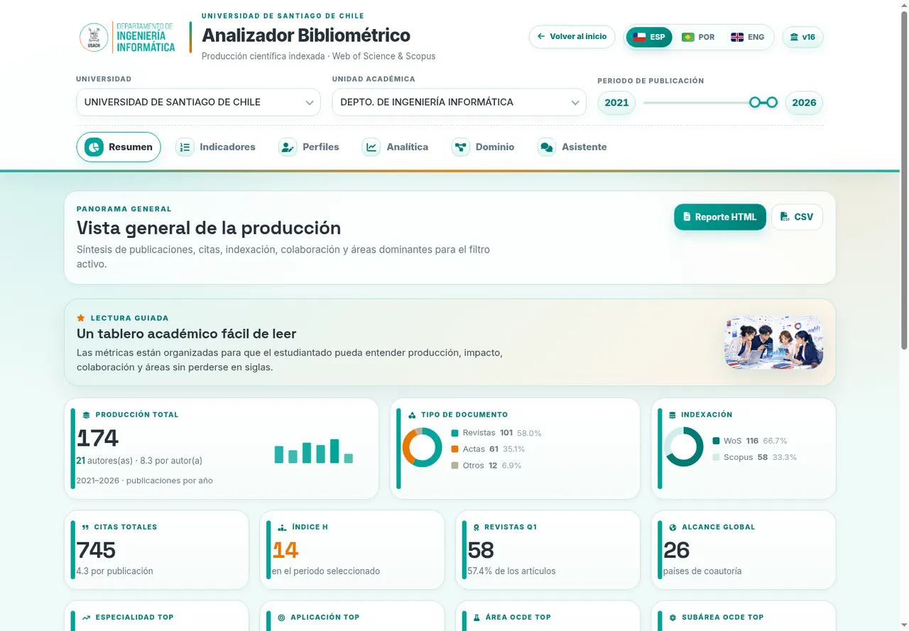

# Research Analyser · DIINF USACH

> **Carga desde el navegador de GitHub:** descomprime el ZIP y arrastra los archivos y carpetas que contiene, no el ZIP. Esta edición tiene 74 archivos, pesa aproximadamente 14 MiB descomprimida y ningún archivo supera 7 MiB.
> **GitHub web upload:** extract the ZIP and upload its contents, not the ZIP itself. This edition contains 74 files, is approximately 14 MiB after extraction, and no file exceeds 7 MiB.
> **Envio pela web do GitHub:** descompacte o ZIP e envie seu conteúdo, não o próprio ZIP. Esta edição contém 74 arquivos, ocupa aproximadamente 14 MiB descompactada e nenhum arquivo supera 7 MiB.


[Español](#español) · [English](#english) · [Português](#português)

---

<a id="español"></a>

# Español

Suite web estática para explorar la producción académica y los trabajos de título del Departamento de Ingeniería Informática de la Universidad de Santiago de Chile. El repositorio reúne dos aplicaciones independientes, una portada común, documentación, capturas de pantalla y configuración de despliegue para GitHub Pages.


## Aplicaciones incluidas

| Módulo | Versión de interfaz | Alcance principal |
|---|---:|---|
| **Analizador Bibliométrico** | v16 | Publicaciones, autores, citas, indexación, revistas, colaboración, perfiles, áreas disciplinares, analítica comparativa y reportes. |
| **Analizador de Memorias DIINF** | v2 | Trabajos de título, programas, profesores guía y co-guía, perfiles, dominios temáticos, comparación y reportes. |

Ambas aplicaciones ofrecen interfaz en **español, inglés y portugués**, filtros institucionales y temporales, visualizaciones interactivas, exportación de reportes HTML y CSV, y un asistente local que consulta los datos cargados en el navegador. También pueden conectarse opcionalmente a un servidor Ollama.

## Capturas de pantalla

### Analizador Bibliométrico




### Analizador de Memorias


## Funcionalidades principales

### Publicaciones

- Resumen de producción, citas, índice h, revistas Q1, alcance internacional y áreas dominantes.
- Indicadores institucionales y por académico o académica.
- Perfiles con trayectoria, cuartiles, tipos documentales, coautorías, revistas y publicaciones.
- Analítica con hallazgos automáticos, buscador global, comparación mediante chi-cuadrado y oportunidades de colaboración.
- Vistas de dominio con áreas de especialidad, aplicación, OCDE y palabras clave.
- Asistente local para consultar autores, publicaciones, temas, años, citas y coautorías.
- Reportes autónomos en HTML y exportaciones CSV.

### Memorias y tesis

- Resumen de trabajos de título, pregrado, posgrado, co-guías, programas y años de actividad.
- Indicadores del departamento y tabla comparativa por académico o académica.
- Perfiles con trayectoria, programas, guía y co-guía, Sankey, red académica y nube de palabras.
- Analítica con hallazgos, continuidad, búsqueda global, oportunidades de colaboración y comparación chi-cuadrado.
- Dominio temático mediante áreas de conocimiento, aplicación, SWEBOK y palabras clave.
- Asistente local para consultar memorias, guías, co-guías, áreas, años y temas.
- Reportes HTML y CSV que respetan los filtros activos.

## Ejecución local

La suite no requiere compilación, Node.js, Shiny ni un backend. Puede abrirse directamente con doble clic en `index.html`. Para evitar restricciones de algunos navegadores sobre archivos locales, se recomienda servir la carpeta mediante HTTP:

```bash
python -m http.server 8000
```

Luego abre:

```text
http://localhost:8000
```


## Despliegue en GitHub Pages

El repositorio incluye `.github/workflows/deploy-pages.yml`.

1. Crea un repositorio en GitHub y sube todo el contenido.
2. En **Settings → Pages**, selecciona **GitHub Actions** como fuente.
3. Realiza un push a la rama `main`.
4. El flujo publicará la raíz del repositorio como sitio estático.

La aplicación también puede desplegarse en Netlify, Cloudflare Pages, Vercel o un servidor institucional. El archivo de entrada es `index.html`.

## Estructura del repositorio

```text
.
├── index.html                     # Selector principal
├── publicaciones/                 # Analizador Bibliométrico
│   ├── index.html, app*.js y styles.css
│   └── data/data.js               # Base comprimida para el navegador
├── tesis/                         # Analizador de Memorias
│   ├── index.html, app*.js y styles.css
│   └── data/data.js               # Base comprimida para el navegador
├── shared/                        # Librerías, fuentes e imágenes compartidas
├── docs/screenshots/              # Capturas principales
├── .github/workflows/             # Publicación en GitHub Pages
├── CITATION.cff
└── LICENSE
```

## Idiomas

La interfaz de ambas aplicaciones dispone de español, inglés y portugués. Al modificar textos visibles, deben actualizarse las tres variantes en los archivos de internacionalización correspondientes:

- `publicaciones/app_i18n_ext.js`
- `tesis/app_i18n.js`
- traducciones integradas en los demás archivos `app*.js`

Los nombres propios, títulos, resúmenes y otros campos originales pueden permanecer en el idioma de la fuente.

## Asistente local y Ollama

El asistente funciona inicialmente con reglas locales y no necesita servicios externos. El modo Ollama es opcional y requiere un servidor accesible desde el navegador, un modelo instalado y una configuración CORS adecuada. No uses `OLLAMA_ORIGINS=*` en un despliegue público sin evaluar sus riesgos; limita los orígenes al dominio de la aplicación cuando sea posible.

## Datos, privacidad y seguridad

> **Advertencia importante:** esta es una aplicación estática. Cualquier archivo incluido en un repositorio o sitio público puede descargarse directamente, incluido `data/data.js`. La clave solicitada por la interfaz para descargar un CSV controla únicamente el botón visible y **no protege los archivos publicados**.

Antes de publicar el repositorio, revisa que los datos, correos, fotografías, enlaces y metadatos puedan difundirse. Para mantener una base realmente privada se requiere retirarla del sitio estático y servirla desde un backend autenticado.


## Citación

La información para citar el software se encuentra en [`CITATION.cff`](CITATION.cff). El Analizador Bibliométrico se relaciona con el trabajo:

> M. Villalobos-Cid, P. Cabezas-Carvajal, C. Ilabaca y L. Chourio-Acevedo. “A Web-Based Tool to Explore Research Production Focused on Student Engagement”. SCCC 2025. DOI: `10.1109/SCCC67219.2025.11420777`.

## Autoría

- **Manuel Villalobos Cid**: desarrollo de la suite y del Analizador Bibliométrico.
- **Manuel Villalobos-Cid y Valentina Cares Cárdenas**: Analizador de Memorias DIINF.
- Departamento de Ingeniería Informática, Universidad de Santiago de Chile.

## Contribución y licencia

No se concede una licencia abierta por defecto. Revisa [LICENSE](LICENSE) antes de publicar, modificar o reutilizar el código fuera de los fines autorizados por sus autores.

[Volver al inicio](#research-analyser--diinf-usach)

---

<a id="english"></a>

# English

A static web suite for exploring the academic output and final degree projects of the Departamento de Ingeniería Informática, Universidad de Santiago de Chile. The repository contains two independent applications, a shared landing page, multilingual documentation, screenshots, and GitHub Pages deployment configuration.


## Included applications

| Module | Interface version | Main scope |
|---|---:|---|
| **Bibliometric Analyser** | v16 | Publications, authors, citations, indexing, journals, collaboration, profiles, disciplinary areas, comparative analytics, and reports. |
| **DIINF Final Project Analyser** | v2 | Final degree projects, programmes, supervisors and co-supervisors, profiles, thematic domains, comparisons, and reports. |

Both applications provide interfaces in **Spanish, English, and Portuguese**, institutional and time filters, interactive visualisations, HTML and CSV reports, and a local assistant that queries data loaded in the browser. An optional Ollama connection is also available.

## Screenshots

### Bibliometric Analyser


### Final Project Analyser


## Main features

### Publications

- Overview of output, citations, h-index, Q1 journals, international reach, and dominant areas.
- Institutional and academic-level indicators.
- Profiles with annual trajectories, quartiles, document types, co-authorship, journals, and publications.
- Analytics with automatic findings, global search, chi-square comparisons, and collaboration opportunities.
- Domain views covering specialist, application, OECD, and keyword classifications.
- Local assistant for questions about authors, publications, topics, years, citations, and co-authorship.
- Standalone HTML reports and CSV exports.

### Final degree projects

- Overview of projects, undergraduate and postgraduate programmes, co-supervision, and annual activity.
- Department-level indicators and academic comparison tables.
- Profiles with trajectories, programmes, supervision roles, Sankey diagrams, academic networks, and word clouds.
- Analytics covering findings, continuity, global search, collaboration opportunities, and chi-square comparisons.
- Thematic analysis through knowledge areas, application areas, SWEBOK, and keywords.
- Local assistant for questions about projects, supervisors, co-supervisors, areas, years, and topics.
- Filter-aware HTML and CSV reports.

## Local use

The suite requires no build process, Node.js, Shiny, or backend. It can be opened directly by double-clicking `index.html`. To avoid browser restrictions on local files, serving the directory over HTTP is recommended:

```bash
python -m http.server 8000
```

Then open:

```text
http://localhost:8000
```

## GitHub Pages deployment

The repository includes `.github/workflows/deploy-pages.yml`.

1. Create a GitHub repository and upload all files.
2. In **Settings → Pages**, select **GitHub Actions** as the source.
3. Push to the `main` branch.
4. The workflow will publish the repository root as a static website.

The site can also be deployed to Netlify, Cloudflare Pages, Vercel, or an institutional web server. The entry point is `index.html`.

## Repository structure

```text
.
├── index.html                     # Main application selector
├── publicaciones/                 # Bibliometric Analyser
│   ├── index.html, app*.js, and styles.css
│   └── data/data.js               # Browser-ready compressed database
├── tesis/                         # Final Project Analyser
│   ├── index.html, app*.js, and styles.css
│   └── data/data.js               # Browser-ready compressed database
├── shared/                        # Shared libraries, fonts, and images
├── docs/screenshots/              # Main screenshots
├── .github/workflows/             # GitHub Pages deployment
├── CITATION.cff
└── LICENSE
```

## Languages

Both interfaces support Spanish, English, and Portuguese. Visible text changes should be reflected in all three variants, especially in:

- `publicaciones/app_i18n_ext.js`
- `tesis/app_i18n.js`
- translations embedded in the remaining `app*.js` files

Names, titles, abstracts, and original source fields may remain in their source language.

## Local assistant and Ollama

The assistant uses local rules by default and does not require an external service. Ollama mode is optional and requires a browser-accessible server, an installed model, and suitable CORS settings. Do not use `OLLAMA_ORIGINS=*` on a public deployment without assessing the risk; restrict allowed origins to the application domain whenever possible.

## Data, privacy, and security

> **Important warning:** this is a static application. Every file published in a public repository or website can be downloaded directly, including `data/data.js`, CSV files, and XLSX files. The password requested by the CSV download button only controls the interface and **does not protect published files**.

Before publishing, verify that the data, email addresses, photographs, links, and metadata are authorised for public distribution. Truly private data must be removed from the static site and delivered by an authenticated backend.


## Citation

Citation metadata is provided in [`CITATION.cff`](CITATION.cff). The Bibliometric Analyser is related to:

> M. Villalobos-Cid, P. Cabezas-Carvajal, C. Ilabaca, and L. Chourio-Acevedo. “A Web-Based Tool to Explore Research Production Focused on Student Engagement”. SCCC 2025. DOI: `10.1109/SCCC67219.2025.11420777`.

## Authors

- **Manuel Villalobos Cid**: suite and Bibliometric Analyser development.
- **Manuel Villalobos-Cid and Valentina Cares Cárdenas**: DIINF Final Project Analyser.
- Departamento de Ingeniería Informática, Universidad de Santiago de Chile.

## Contributing and licence

No open-source licence is granted by default. Review [LICENSE](LICENSE) before publishing, modifying, or reusing the code beyond the purposes authorised by its authors.

[Back to top](#research-analyser--diinf-usach)

---

<a id="português"></a>

# Português

Suíte web estática para explorar a produção acadêmica e os trabalhos de conclusão do Departamento de Ingeniería Informática, Universidad de Santiago de Chile. O repositório reúne duas aplicações independentes, uma página inicial comum, documentação multilíngue, capturas de tela e configuração de implantação no GitHub Pages.


## Aplicações incluídas

| Módulo | Versão da interface | Escopo principal |
|---|---:|---|
| **Analisador Bibliométrico** | v16 | Publicações, autores, citações, indexação, periódicos, colaboração, perfis, áreas disciplinares, análises comparativas e relatórios. |
| **Analisador de Trabalhos DIINF** | v2 | Trabalhos de conclusão, cursos, orientadores e coorientadores, perfis, domínios temáticos, comparações e relatórios. |

As duas aplicações oferecem interface em **espanhol, inglês e português**, filtros institucionais e temporais, visualizações interativas, relatórios HTML e CSV e um assistente local que consulta os dados carregados no navegador. Também é possível conectar opcionalmente um servidor Ollama.

## Capturas de tela

### Analisador Bibliométrico


### Analisador de Trabalhos


## Funcionalidades principais

### Publicações

- Resumo de produção, citações, índice h, periódicos Q1, alcance internacional e áreas dominantes.
- Indicadores institucionais e por acadêmico ou acadêmica.
- Perfis com trajetória anual, quartis, tipos de documento, coautoria, periódicos e publicações.
- Análises com achados automáticos, busca global, comparação por qui-quadrado e oportunidades de colaboração.
- Visões de domínio com áreas de especialidade, aplicação, OCDE e palavras-chave.
- Assistente local para consultas sobre autores, publicações, temas, anos, citações e coautorias.
- Relatórios HTML autônomos e exportações CSV.

### Trabalhos de conclusão

- Resumo de trabalhos, graduação, pós-graduação, coorientação, cursos e atividade anual.
- Indicadores do departamento e tabela comparativa por acadêmico ou acadêmica.
- Perfis com trajetória, cursos, orientação e coorientação, Sankey, rede acadêmica e nuvem de palavras.
- Análises com achados, continuidade, busca global, oportunidades de colaboração e comparação por qui-quadrado.
- Domínio temático por áreas de conhecimento, aplicação, SWEBOK e palavras-chave.
- Assistente local para consultas sobre trabalhos, orientadores, coorientadores, áreas, anos e temas.
- Relatórios HTML e CSV que respeitam os filtros ativos.

## Execução local

A suíte não requer compilação, Node.js, Shiny ou backend. É possível abrir `index.html` diretamente. Para evitar restrições do navegador sobre arquivos locais, recomenda-se servir a pasta por HTTP:

```bash
python -m http.server 8000
```

Depois, abra:

```text
http://localhost:8000
```


## Implantação no GitHub Pages

O repositório inclui `.github/workflows/deploy-pages.yml`.

1. Crie um repositório no GitHub e envie todo o conteúdo.
2. Em **Settings → Pages**, selecione **GitHub Actions** como origem.
3. Faça push para a branch `main`.
4. O workflow publicará a raiz do repositório como site estático.

A aplicação também pode ser implantada no Netlify, Cloudflare Pages, Vercel ou em um servidor institucional. O arquivo de entrada é `index.html`.

## Estrutura do repositório

```text
.
├── index.html                     # Seletor principal
├── publicaciones/                 # Analisador Bibliométrico
│   ├── index.html, app*.js e styles.css
│   └── data/data.js               # Base comprimida para o navegador
├── tesis/                         # Analisador de Trabalhos Finais
│   ├── index.html, app*.js e styles.css
│   └── data/data.js               # Base comprimida para o navegador
├── shared/                        # Bibliotecas, fontes e imagens compartilhadas
├── docs/screenshots/              # Capturas principais
├── .github/workflows/             # Publicação no GitHub Pages
├── CITATION.cff
└── LICENSE
```

## Idiomas

As duas interfaces oferecem espanhol, inglês e português. Qualquer alteração em textos visíveis deve ser replicada nas três variantes, especialmente em:

- `publicaciones/app_i18n_ext.js`
- `tesis/app_i18n.js`
- traduções incorporadas nos demais arquivos `app*.js`

Nomes próprios, títulos, resumos e outros campos originais podem permanecer no idioma da fonte.

## Assistente local e Ollama

O assistente funciona inicialmente com regras locais e não depende de serviços externos. O modo Ollama é opcional e requer servidor acessível pelo navegador, modelo instalado e CORS configurado. Evite `OLLAMA_ORIGINS=*` em uma implantação pública sem avaliar os riscos; sempre que possível, limite as origens ao domínio da aplicação.

## Dados, privacidade e segurança

> **Aviso importante:** esta é uma aplicação estática. Todo arquivo publicado em um repositório ou site público pode ser baixado diretamente, incluindo `data/data.js`, arquivos CSV e XLSX. A senha solicitada pelo botão de download controla apenas a interface e **não protege os arquivos publicados**.

Antes de publicar, confirme que dados, e-mails, fotografias, links e metadados podem ser divulgados. Dados realmente privados devem ser removidos do site estático e fornecidos por um backend autenticado.


## Citação

Os metadados de citação estão em [`CITATION.cff`](CITATION.cff). O Analisador Bibliométrico está relacionado ao trabalho:

> M. Villalobos-Cid, P. Cabezas-Carvajal, C. Ilabaca e L. Chourio-Acevedo. “A Web-Based Tool to Explore Research Production Focused on Student Engagement”. SCCC 2025. DOI: `10.1109/SCCC67219.2025.11420777`.

## Autoria

- **Manuel Villalobos Cid**: desenvolvimento da suíte e do Analisador Bibliométrico.
- **Manuel Villalobos-Cid e Valentina Cares Cárdenas**: Analisador de Trabalhos DIINF.
- Departamento de Ingeniería Informática, Universidad de Santiago de Chile.

## Contribuição e licença

Nenhuma licença aberta é concedida por padrão. Revise [LICENSE](LICENSE) antes de publicar, modificar ou reutilizar o código fora das finalidades autorizadas por seus autores.

[Voltar ao início](#research-analyser--diinf-usach)
