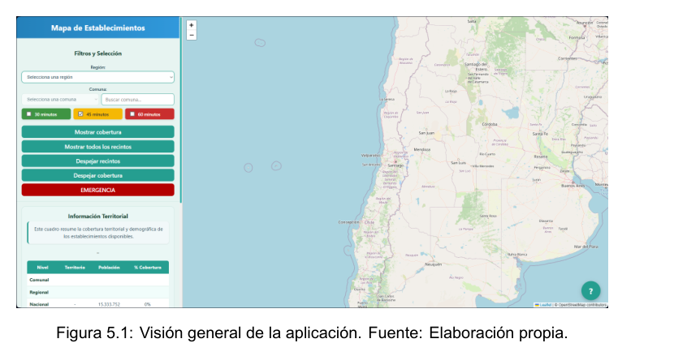
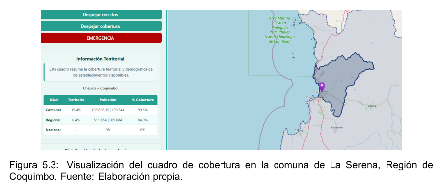
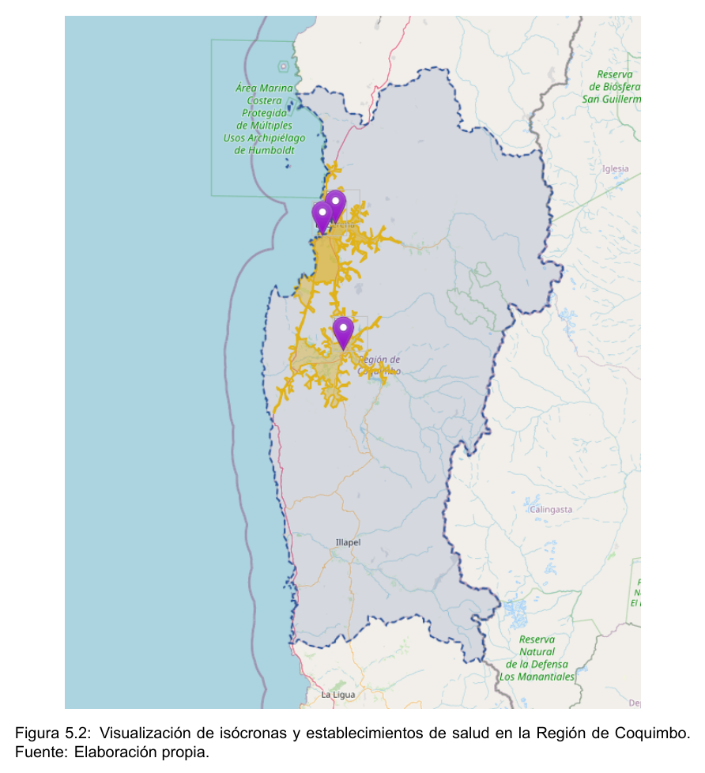
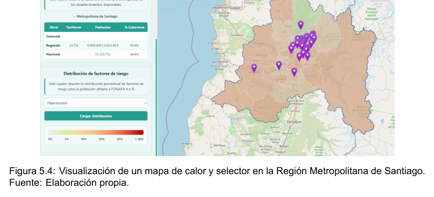
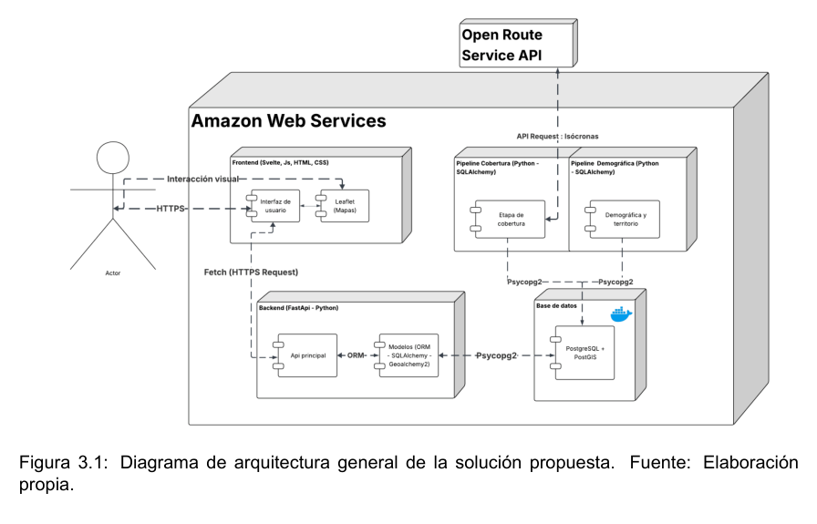
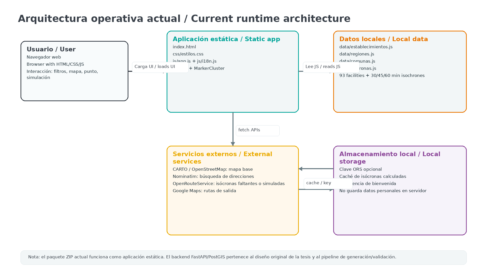
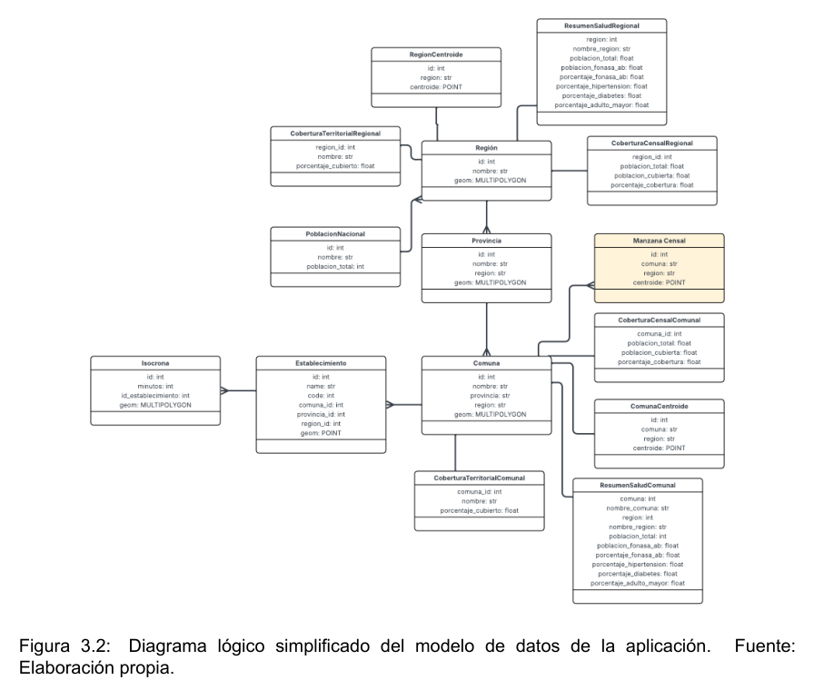
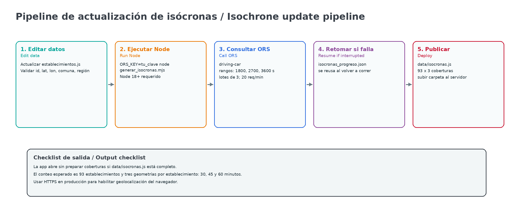

# StrokeAccessCL

**Visualizador web para analizar la cobertura hospitalaria y la accesibilidad geográfica de servicios de atención para ataque cerebrovascular (ACV) en Chile.**  
**Web viewer for analysing hospital coverage and geographic accessibility of stroke care services in Chile.**



**Live deployment / Despliegue público:** https://mvillalobosc.diinf.usach.cl/StrokeAccessCL/

**Español** · **English** · **Screenshots / Capturas** · **Software architecture / Arquitectura** · **Citation / Cita**

---

## Screenshots / Capturas

| General view / Vista general | Coverage example / Ejemplo de cobertura |
|---|---|
|  |  |

| Isochrones / Isócronas | Heatmap / Mapa de calor |
|---|---|
|  |  |

---

# Español

## 1. ¿Qué es StrokeAccessCL?

StrokeAccessCL es una aplicación web interactiva para visualizar la cobertura hospitalaria y la accesibilidad geográfica de los servicios de atención para ataque cerebrovascular (ACV) a nivel nacional en Chile. La herramienta permite revisar establecimientos de salud, tiempos de acceso en automóvil, cobertura regional y comunal, indicadores territoriales y escenarios hipotéticos de nuevos puntos de atención.

La versión incluida en este repositorio está preparada para publicarse como **sitio estático**. Esto significa que puede funcionar en GitHub Pages, Apache, Nginx o cualquier servidor simple de archivos, sin backend propio ni base de datos activa en producción.

## 2. Propósito de la aplicación

El objetivo práctico de la aplicación es apoyar el análisis territorial de acceso a establecimientos que atienden emergencias por ACV. Para ello combina:

| Elemento | Uso dentro de la aplicación |
|---|---|
| Establecimientos de salud | Marcadores de hospitales y clínicas que atienden ACV. |
| Isócronas de 30, 45 y 60 minutos | Áreas alcanzables por automóvil desde los establecimientos. |
| Regiones y comunas | Filtros territoriales y contexto geográfico. |
| Indicadores regionales | Resumen de variables sanitarias y demográficas asociadas al análisis. |
| Consulta de ubicación | Evaluación de puntos específicos mediante dirección, GPS o clic en el mapa. |
| Simulación | Exploración de cobertura hipotética desde un nuevo punto de atención. |

## 3. Usuarios esperados

| Usuario | Qué necesita | Funciones relevantes |
|---|---|---|
| Público general | Explorar establecimientos cercanos o revisar zonas cubiertas. | Búsqueda por dirección, ubicación del navegador, clic en el mapa. |
| Equipo técnico | Validar datos, capas y comportamiento del visor. | Archivos `data/*.js`, filtros, consola del navegador, checklist. |
| Analista o autoridad sanitaria | Comparar cobertura territorial y brechas de acceso. | Isócronas, indicadores regionales, mapas de calor y simulación. |
| Desarrollador | Adaptar, publicar o mantener el sitio. | Estructura estática, `generar_isocronas.mjs`, GitHub Pages. |

## 4. Funcionalidades principales

- Mapa interactivo basado en Leaflet.
- Visualización nacional de establecimientos de atención ACV.
- Filtros por región, comuna y establecimiento.
- Capas de isócronas para 30, 45 y 60 minutos en automóvil.
- Consulta desde dirección, ubicación del navegador o punto manual en el mapa.
- Paneles de cobertura territorial y poblacional.
- Mapas de calor con indicadores regionales.
- Simulación temporal de nuevos puntos de atención.
- Interfaz multilingüe: español, inglés y portugués.
- Datos precalculados para que el visor cargue sin depender de una API en cada uso.

## 5. Manual de uso

### 5.1 Abrir la aplicación

La entrada principal es:

```text
index.html
```

En un servidor público, basta con abrir la URL del sitio. Para una prueba local rápida, se puede abrir `index.html` directamente en el navegador. Si el navegador bloquea rutas locales, usar un servidor simple:

```bash
python3 -m http.server 8000
```

Luego abrir:

```text
http://localhost:8000
```

### 5.2 Filtrar por región y comuna

1. Abrir la aplicación.
2. Seleccionar una región desde el panel lateral.
3. Seleccionar una comuna si se necesita mayor detalle.
4. Activar o desactivar las capas de 30, 45 y 60 minutos.
5. Revisar el mapa, los establecimientos visibles y los paneles de resumen.

### 5.3 Revisar un establecimiento

1. Buscar el establecimiento por nombre, región o comuna.
2. Seleccionarlo desde el listado o pinchar su marcador en el mapa.
3. Revisar las isócronas asociadas.
4. Comparar el alcance de 30, 45 y 60 minutos.
5. Quitar la selección para volver al mapa general.

### 5.4 Consultar una ubicación específica

La aplicación permite consultar un punto de tres formas:

| Método | Descripción | Nota técnica |
|---|---|---|
| Dirección | Escribir una dirección y seleccionar una sugerencia. | Usa Nominatim/OpenStreetMap. |
| Ubicación del navegador | Usar el GPS del navegador. | Requiere `https` o `localhost`. |
| Punto manual | Marcar un punto directamente en el mapa. | Útil para análisis exploratorio. |

El resultado permite observar si la ubicación queda dentro de coberturas precalculadas y revisar establecimientos cercanos.

### 5.5 Usar mapas de calor

Los mapas de calor permiten comparar regiones mediante indicadores agregados. Son útiles para observar patrones generales, detectar posibles brechas y apoyar análisis exploratorios. No reemplazan análisis epidemiológicos completos ni datos oficiales en tiempo real.

### 5.6 Simular un nuevo punto de atención

La simulación permite ubicar un punto hipotético y estimar la cobertura que tendría un nuevo establecimiento. Esta operación es temporal: no modifica los archivos reales del proyecto.

Para convertir una simulación en dato permanente se debe:

1. Agregar el establecimiento en `data/establecimientos.js`.
2. Regenerar `data/isocronas.js` con una clave propia de OpenRouteService.
3. Revisar visualmente el mapa.
4. Hacer commit de los cambios en el repositorio.

## 6. Estructura del repositorio

Estructura recomendada para GitHub o GitHub Pages:

```text
.
├── index.html
├── README.md
├── CITATION.cff
├── LICENSE
├── package.json
├── .nojekyll
├── .htaccess
├── assets/
│   ├── app_overview.png
│   ├── isochrones_coquimbo.png
│   ├── la_serena_coverage.png
│   ├── rm_heatmap.png
│   ├── architecture_original.png
│   ├── architecture_static_runtime.png
│   ├── data_model.png
│   └── isochrone_update_pipeline.png
├── css/
│   └── estilos.css
├── js/
│   ├── app.js
│   └── i18n.js
├── data/
│   ├── establecimientos.js
│   ├── regiones.js
│   ├── comunas.js
│   └── isocronas.js
└── vendor/
    ├── leaflet.css
    ├── leaflet.js
    ├── MarkerCluster.css
    └── leaflet.markercluster.js
```

### Rol de los archivos principales

| Archivo o carpeta | Rol |
|---|---|
| `index.html` | Página principal de la aplicación. Carga estilos, datos, bibliotecas y lógica. |
| `README.md` | Único documento técnico y de uso del repositorio. GitHub lo muestra automáticamente. |
| `assets/` | Imágenes usadas por este documento y por la presentación del proyecto. |
| `css/` | Estilos visuales de la aplicación. |
| `js/app.js` | Lógica principal del visor: mapa, filtros, capas, consultas, simulación y exportación. |
| `js/i18n.js` | Textos de la interfaz en español, inglés y portugués. |
| `data/establecimientos.js` | Datos de establecimientos de salud. |
| `data/regiones.js` | Geometrías regionales. |
| `data/comunas.js` | Geometrías comunales. |
| `data/isocronas.js` | Polígonos precalculados de cobertura por tiempo. |
| `vendor/` | Dependencias locales de Leaflet y MarkerCluster. |
| `generar_isocronas.mjs` | Script opcional para regenerar isócronas. |
| `CITATION.cff` | Metadatos de citación para GitHub. |
| `.nojekyll` | Evita que GitHub Pages procese el sitio con Jekyll. |
| `.htaccess` | Configuración útil para Apache. GitHub Pages la ignora. |

## 7. Arquitectura del software

La tesis original considera una arquitectura con frontend, backend, base de datos espacial y servicios externos. Para facilitar la publicación abierta, este repositorio queda como una versión estática: el navegador carga datos locales y ejecuta la lógica de visualización directamente en JavaScript.



### Arquitectura estática publicada



```text
Browser
  │
  ├── index.html
  │     ├── loads CSS
  │     ├── loads Leaflet and MarkerCluster
  │     ├── loads local data files
  │     └── creates the application shell
  │
  ├── js/i18n.js
  │     └── UI texts in Spanish, English and Portuguese
  │
  ├── js/app.js
  │     ├── map initialisation
  │     ├── layer management
  │     ├── region/commune/facility filters
  │     ├── location query
  │     ├── heatmaps and indicators
  │     └── simulation tools
  │
  └── data/*.js
        ├── facilities
        ├── regional geometries
        ├── commune geometries
        └── precomputed isochrones
```

## 8. Tecnologías usadas

| Componente | Tecnología | Función |
|---|---|---|
| Interfaz | HTML, CSS, JavaScript | Estructura, estilos y comportamiento del visor. |
| Mapa | Leaflet | Visualización cartográfica interactiva. |
| Agrupación de marcadores | Leaflet.markercluster | Agrupa establecimientos cuando el zoom es bajo. |
| Datos geográficos | GeoJSON en archivos JavaScript | Regiones, comunas e isócronas. |
| Isócronas | OpenRouteService | Generación de polígonos por tiempo de viaje en automóvil. |
| Geocodificación | Nominatim/OpenStreetMap | Búsqueda de direcciones. |
| Publicación | GitHub Pages o servidor estático | Despliegue sin backend. |

## 9. Modelo de datos



La aplicación trabaja con cuatro grupos de datos principales:

| Grupo | Archivo | Contenido mínimo esperado |
|---|---|---|
| Establecimientos | `data/establecimientos.js` | `id`, nombre, latitud, longitud, región, comuna y atributos básicos. |
| Regiones | `data/regiones.js` | Geometría regional y código territorial. |
| Comunas | `data/comunas.js` | Geometría comunal y relación con región. |
| Isócronas | `data/isocronas.js` | Geometrías por establecimiento y tiempo: 30, 45 y 60 minutos. |

## 10. Flujo de ejecución

```text
Abrir index.html
   ↓
Cargar CSS, Leaflet, MarkerCluster y datos locales
   ↓
Inicializar textos multilingües desde js/i18n.js
   ↓
Inicializar mapa, marcadores, filtros y estado global desde js/app.js
   ↓
Dibujar establecimientos, regiones, comunas e isócronas
   ↓
Usuario filtra, consulta una ubicación o simula un punto
   ↓
Actualizar capas, paneles, resultados y mensajes
```

## 11. Isócronas y OpenRouteService

Las isócronas base ya vienen precalculadas en:

```text
data/isocronas.js
```

Esto permite que el sitio cargue las coberturas sin consultar OpenRouteService en cada visita. El repositorio público **no incluye una clave de OpenRouteService**. Si necesitas regenerar isócronas o calcular una simulación en vivo, usa una clave propia.

Para regenerar todas las isócronas:

```bash
ORS_KEY=tu_clave node generar_isocronas.mjs
```

El script genera nuevamente:

```text
data/isocronas.js
```



## 12. Mantención de datos

### 12.1 Actualizar establecimientos

Editar:

```text
data/establecimientos.js
```

Checklist mínimo:

- Mantener un `id` único por establecimiento.
- Verificar latitud y longitud.
- Confirmar que región y comuna coincidan con los códigos usados por la aplicación.
- Revisar que el marcador aparezca en el mapa.
- Regenerar isócronas si el punto cambió o si se agregó un nuevo establecimiento.

### 12.2 Actualizar regiones o comunas

Editar:

```text
data/regiones.js
data/comunas.js
```

Recomendaciones:

- Usar GeoJSON simplificado para no sobrecargar el navegador.
- Mantener códigos territoriales consistentes.
- Probar filtros por región y comuna después del cambio.

### 12.3 Actualizar indicadores

Los indicadores agregados usados por la interfaz están definidos en `js/app.js`. Si se reemplazan por nuevos datos, revisar:

- nombre de la variable;
- unidad;
- región asociada;
- escala de visualización;
- texto mostrado en la interfaz.

## 13. Publicación manual en GitHub

Para subirlo manualmente, sin comandos:

1. Descargar y descomprimir el ZIP del proyecto.
2. Crear un repositorio vacío en GitHub.
3. Entrar al repositorio.
4. Seleccionar `Add file → Upload files`.
5. Arrastrar **el contenido descomprimido**, no el ZIP.
6. Confirmar el commit.
7. Revisar que `README.md` e `index.html` queden en la raíz.

Para activar GitHub Pages:

```text
Settings → Pages → Build and deployment
Source: Deploy from a branch
Branch: main
Folder: /root
Save
```

La URL quedará con una forma similar a:

```text
https://usuario.github.io/StrokeAccessCL/
```

## 14. Checklist antes de publicar

- [ ] `README.md` está en la raíz.
- [ ] `index.html` está en la raíz.
- [ ] `assets/` está en la raíz y contiene las imágenes usadas por el README.
- [ ] `css/`, `js/`, `data/` y `vendor/` están en la raíz.
- [ ] No hay claves privadas en el repositorio.
- [ ] `data/isocronas.js` carga correctamente.
- [ ] La app abre en `localhost`.
- [ ] Los filtros por región y comuna funcionan.
- [ ] Las capas de 30, 45 y 60 minutos se dibujan.
- [ ] La búsqueda de dirección funciona con conexión a internet.
- [ ] GitHub Pages apunta a `main` y `/root`.

## 15. Problemas frecuentes

| Problema | Causa probable | Solución |
|---|---|---|
| El README no se ve en GitHub | `README.md` no está en la raíz o se subió el ZIP sin descomprimir. | Subir archivos y carpetas sueltas. |
| La aplicación no abre | `index.html` no está en la raíz. | Revisar estructura del repositorio. |
| No se ven imágenes en el README | Falta `assets/` o las rutas cambiaron. | Verificar `assets/app_overview.png`. |
| No aparecen isócronas | No cargó `data/isocronas.js`. | Abrir consola del navegador y revisar errores 404. |
| GPS no funciona | El navegador exige `https` o `localhost`. | Usar GitHub Pages o servidor local. |
| La simulación no calcula | Falta clave de OpenRouteService o se agotó el límite. | Agregar clave propia desde la ayuda de la aplicación. |
| El sitio funciona local pero no en GitHub Pages | Rutas mal subidas o carpeta incorrecta en Pages. | Usar branch `main` y folder `/root`. |

## 16. Advertencia de uso

StrokeAccessCL es una herramienta de visualización y análisis territorial. No reemplaza atención médica, sistemas de despacho de emergencias, protocolos clínicos, ni información oficial en tiempo real. Ante sospecha de ACV, se debe activar el sistema de emergencia correspondiente.

## 17. Cita sugerida

Guajardo Arias, I. A., Villalobos Cid, M. J., Giglio Gutiérrez, J., & Universidad de Santiago de Chile, Facultad de Ingeniería, Departamento de Ingeniería Informática. (2025). *Implementación de un sistema de visualización para el análisis espacio-temporal de la cobertura hospitalaria y la accesibilidad de los servicios de atención para el ataque cerebrovascular a nivel nacional en Chile*. Universidad de Santiago de Chile.

El archivo `CITATION.cff` permite que GitHub muestre el botón **Cite this repository**.

---

# English

## 1. What is StrokeAccessCL?

StrokeAccessCL is an interactive web application for visualising hospital coverage and geographic accessibility of stroke care services across Chile. It displays health facilities, travel-time isochrones, regional and communal filters, territorial indicators, location queries and hypothetical simulations of new care points.

The version included in this repository is prepared as a **static website**. It can be deployed on GitHub Pages, Apache, Nginx or any simple static file server without a dedicated backend or active production database.

## 2. Application purpose

The practical goal of the application is to support territorial analysis of access to facilities that provide stroke care. It combines:

| Element | Use in the application |
|---|---|
| Health facilities | Markers for hospitals and clinics that provide stroke care. |
| 30, 45 and 60 minute isochrones | Areas reachable by car from each facility. |
| Regions and communes | Territorial filters and geographic context. |
| Regional indicators | Summary of health and demographic variables linked to the analysis. |
| Location query | Evaluation of specific points by address, GPS or map click. |
| Simulation | Exploration of hypothetical coverage from a new care point. |

## 3. Expected users

| User | Need | Relevant features |
|---|---|---|
| General public | Explore nearby facilities or covered areas. | Address search, browser location, map click. |
| Technical team | Validate data, layers and viewer behaviour. | `data/*.js` files, filters, browser console, checklist. |
| Health analyst or planner | Compare territorial coverage and access gaps. | Isochrones, regional indicators, heatmaps and simulation. |
| Developer | Adapt, publish or maintain the site. | Static structure, `generar_isocronas.mjs`, GitHub Pages. |

## 4. Main capabilities

- Interactive map built with Leaflet.
- National visualisation of stroke care facilities.
- Filters by region, commune and facility.
- 30, 45 and 60 minute car-travel isochrone layers.
- Query by address, browser location or manual point on the map.
- Territorial and population coverage panels.
- Heatmaps with regional indicators.
- Temporary simulation of new care points.
- Multilingual interface: Spanish, English and Portuguese.
- Precomputed data so the viewer does not depend on API calls on every visit.

## 5. User guide

### 5.1 Open the application

The main entry point is:

```text
index.html
```

On a public server, open the site URL. For local testing, `index.html` can be opened directly in the browser. If local paths are blocked, start a simple server:

```bash
python3 -m http.server 8000
```

Then open:

```text
http://localhost:8000
```

### 5.2 Filter by region and commune

1. Open the application.
2. Select a region from the side panel.
3. Select a commune when local detail is needed.
4. Toggle the 30, 45 and 60 minute layers.
5. Review the map, visible facilities and summary panels.

### 5.3 Inspect a facility

1. Search by facility name, region or commune.
2. Select it from the list or click its marker on the map.
3. Review the associated isochrones.
4. Compare 30, 45 and 60 minute reach.
5. Clear the selection to return to the general map.

### 5.4 Query a specific location

The application supports three methods:

| Method | Description | Technical note |
|---|---|---|
| Address | Type an address and select a suggestion. | Uses Nominatim/OpenStreetMap. |
| Browser location | Use the browser GPS. | Requires `https` or `localhost`. |
| Manual point | Place a point directly on the map. | Useful for exploratory analysis. |

The result helps determine whether the location falls within precomputed coverages and shows nearby facilities.

### 5.5 Use heatmaps

Heatmaps compare regions using aggregated indicators. They are useful for broad pattern detection and exploratory analysis. They do not replace full epidemiological analysis or official real-time data.

### 5.6 Simulate a new care point

Simulation allows a hypothetical point to be placed on the map and estimates the coverage of a new facility. This action is temporary and does not modify the project data files.

To make a simulated point permanent:

1. Add the facility to `data/establecimientos.js`.
2. Regenerate `data/isocronas.js` with your own OpenRouteService key.
3. Visually inspect the map.
4. Commit the changes to the repository.

## 6. Repository structure

Recommended structure for GitHub or GitHub Pages:

```text
.
├── index.html
├── README.md
├── CITATION.cff
├── LICENSE
├── package.json
├── .nojekyll
├── .htaccess
├── assets/
├── css/
├── js/
├── data/
└── vendor/
```

### Main file roles

| File or folder | Role |
|---|---|
| `index.html` | Main application page. Loads styles, data, libraries and logic. |
| `README.md` | Single technical and user document for the repository. GitHub renders it automatically. |
| `assets/` | Images used by this document and project presentation. |
| `css/` | Visual styles. |
| `js/app.js` | Main viewer logic: map, filters, layers, queries, simulation and export. |
| `js/i18n.js` | Interface text in Spanish, English and Portuguese. |
| `data/establecimientos.js` | Health facility data. |
| `data/regiones.js` | Regional geometries. |
| `data/comunas.js` | Commune geometries. |
| `data/isocronas.js` | Precomputed time-based coverage polygons. |
| `vendor/` | Local Leaflet and MarkerCluster dependencies. |
| `generar_isocronas.mjs` | Optional script to regenerate isochrones. |
| `CITATION.cff` | Citation metadata for GitHub. |
| `.nojekyll` | Prevents GitHub Pages from processing the site with Jekyll. |
| `.htaccess` | Useful for Apache servers. Ignored by GitHub Pages. |

## 7. Software architecture

The original thesis version considered a frontend, backend, spatial database and external services. For open publication, this repository uses a static version: the browser loads local data and runs the visualisation logic directly in JavaScript.


### Published static architecture


```text
Browser
  │
  ├── index.html
  │     ├── loads CSS
  │     ├── loads Leaflet and MarkerCluster
  │     ├── loads local data files
  │     └── creates the application shell
  │
  ├── js/i18n.js
  │     └── UI texts in Spanish, English and Portuguese
  │
  ├── js/app.js
  │     ├── map initialisation
  │     ├── layer management
  │     ├── region/commune/facility filters
  │     ├── location query
  │     ├── heatmaps and indicators
  │     └── simulation tools
  │
  └── data/*.js
        ├── facilities
        ├── regional geometries
        ├── commune geometries
        └── precomputed isochrones
```

## 8. Technologies

| Component | Technology | Function |
|---|---|---|
| Interface | HTML, CSS, JavaScript | Viewer structure, styling and behaviour. |
| Map | Leaflet | Interactive cartographic visualisation. |
| Marker clustering | Leaflet.markercluster | Groups facility markers at low zoom levels. |
| Geographic data | GeoJSON inside JavaScript files | Regions, communes and isochrones. |
| Isochrones | OpenRouteService | Travel-time polygon generation by car. |
| Geocoding | Nominatim/OpenStreetMap | Address search. |
| Deployment | GitHub Pages or static server | Deployment without backend. |

## 9. Data model


The application uses four main data groups:

| Group | File | Minimum expected content |
|---|---|---|
| Facilities | `data/establecimientos.js` | `id`, name, latitude, longitude, region, commune and basic attributes. |
| Regions | `data/regiones.js` | Regional geometry and territorial code. |
| Communes | `data/comunas.js` | Commune geometry and region relationship. |
| Isochrones | `data/isocronas.js` | Geometries by facility and time: 30, 45 and 60 minutes. |

## 10. Runtime flow

```text
Open index.html
   ↓
Load CSS, Leaflet, MarkerCluster and local data
   ↓
Initialise multilingual text from js/i18n.js
   ↓
Initialise map, markers, filters and global state from js/app.js
   ↓
Draw facilities, regions, communes and isochrones
   ↓
User filters, queries a location or simulates a point
   ↓
Update layers, panels, results and messages
```

## 11. Isochrones and OpenRouteService

The base isochrones are already precomputed in:

```text
data/isocronas.js
```

This lets the site load coverages without calling OpenRouteService on every visit. The public repository **does not include an OpenRouteService key**. To regenerate isochrones or compute a live simulation, use your own key.

To regenerate all isochrones:

```bash
ORS_KEY=your_key node generar_isocronas.mjs
```

The script writes:

```text
data/isocronas.js
```


## 12. Data maintenance

### 12.1 Update facilities

Edit:

```text
data/establecimientos.js
```

Minimum checklist:

- Keep a unique `id` for each facility.
- Check latitude and longitude.
- Confirm that region and commune match the codes used by the application.
- Check that the marker appears on the map.
- Regenerate isochrones if the point changed or a new facility was added.

### 12.2 Update regions or communes

Edit:

```text
data/regiones.js
data/comunas.js
```

Recommendations:

- Use simplified GeoJSON to avoid heavy browser rendering.
- Keep territorial codes consistent.
- Test region and commune filters after the change.

### 12.3 Update indicators

Aggregated indicators used by the interface are defined in `js/app.js`. If they are replaced by new data, check:

- variable name;
- unit;
- associated region;
- visual scale;
- interface text.

## 13. Manual GitHub publication

To upload it manually:

1. Download and unzip the project ZIP.
2. Create an empty GitHub repository.
3. Open the repository.
4. Select `Add file → Upload files`.
5. Drag the **unzipped contents**, not the ZIP file.
6. Commit the upload.
7. Check that `README.md` and `index.html` are at the root.

To enable GitHub Pages:

```text
Settings → Pages → Build and deployment
Source: Deploy from a branch
Branch: main
Folder: /root
Save
```

The URL will look similar to:

```text
https://username.github.io/StrokeAccessCL/
```

## 14. Pre-publication checklist

- [ ] `README.md` is at the root.
- [ ] `index.html` is at the root.
- [ ] `assets/` is at the root and contains the images used by the README.
- [ ] `css/`, `js/`, `data/` and `vendor/` are at the root.
- [ ] No private keys are stored in the repository.
- [ ] `data/isocronas.js` loads correctly.
- [ ] The app opens on `localhost`.
- [ ] Region and commune filters work.
- [ ] The 30, 45 and 60 minute layers draw correctly.
- [ ] Address search works with internet connection.
- [ ] GitHub Pages points to `main` and `/root`.

## 15. Troubleshooting

| Problem | Likely cause | Fix |
|---|---|---|
| README does not render on GitHub | `README.md` is not at the root or the ZIP was uploaded directly. | Upload loose files and folders. |
| The application does not open | `index.html` is not at the root. | Check repository structure. |
| README images do not appear | Missing `assets/` or changed paths. | Check `assets/app_overview.png`. |
| Isochrones do not appear | `data/isocronas.js` did not load. | Open browser console and check 404 errors. |
| GPS does not work | Browser requires `https` or `localhost`. | Use GitHub Pages or a local server. |
| Simulation does not compute | Missing OpenRouteService key or exhausted quota. | Add your own key from the application help panel. |
| Site works locally but not on GitHub Pages | Wrong paths or wrong Pages folder. | Use branch `main` and folder `/root`. |

## 16. Disclaimer

StrokeAccessCL is a territorial visualisation and analysis tool. It does not replace medical care, emergency dispatch systems, clinical protocols or official real-time information. If stroke is suspected, the corresponding emergency system must be activated.

## 17. Suggested citation

Guajardo Arias, I. A., Villalobos Cid, M. J., Giglio Gutiérrez, J., & Universidad de Santiago de Chile, Facultad de Ingeniería, Departamento de Ingeniería Informática. (2025). *Implementación de un sistema de visualización para el análisis espacio-temporal de la cobertura hospitalaria y la accesibilidad de los servicios de atención para el ataque cerebrovascular a nivel nacional en Chile*. Universidad de Santiago de Chile.

The `CITATION.cff` file lets GitHub show the **Cite this repository** button.
