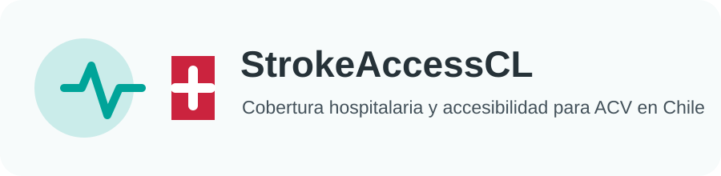
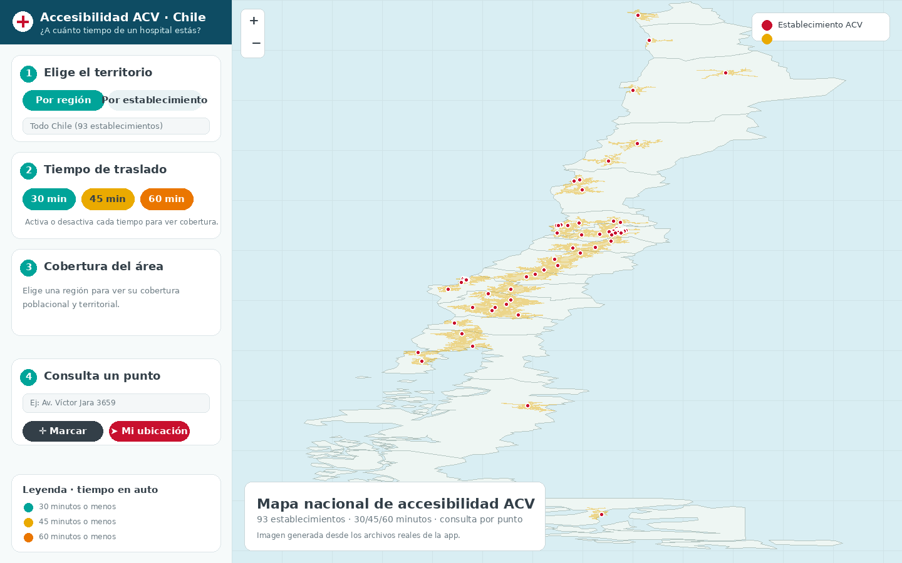
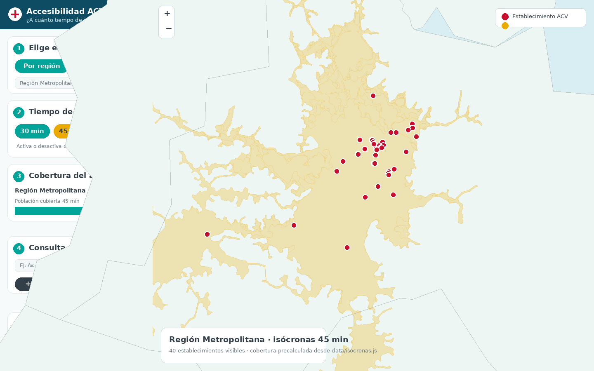
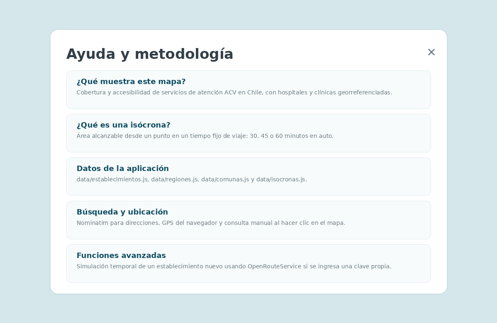
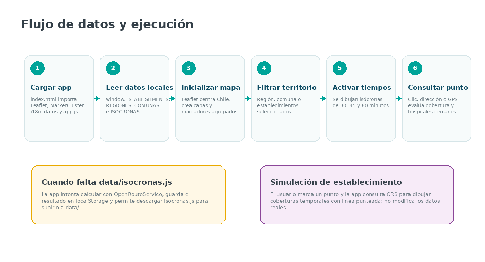
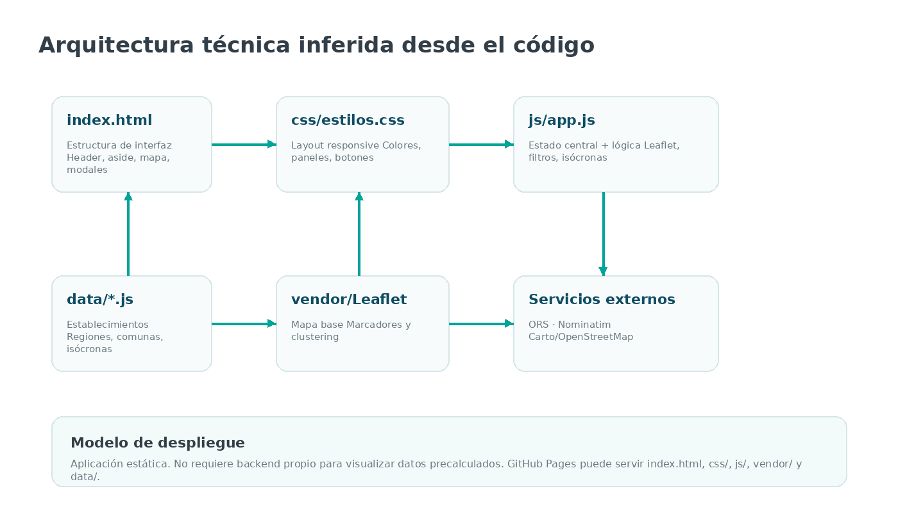

# StrokeAccessCL

<p align="center">
  
</p>

<p align="center">
  <b>Mapa interactivo de accesibilidad hospitalaria para atención de ataque cerebrovascular en Chile</b><br>
  <b>Interactive web map for stroke-care hospital accessibility in Chile</b><br>
  <b>Mapa interativo de acessibilidade hospitalar para atendimento de AVC no Chile</b>
</p>

<p align="center">
  <a href="#español">Español</a> ·
  <a href="#english">English</a> ·
  <a href="#português">Português</a> ·
  <a href="#capturas--screenshots--capturas">Capturas</a> ·
  <a href="#arquitectura-técnica--technical-architecture--arquitetura-técnica">Arquitectura</a> ·
  <a href="#despliegue-manual-en-github-pages">GitHub Pages</a>
</p>

<p align="center">
  
</p>

---

## Español

### 1. ¿Qué es StrokeAccessCL?

**StrokeAccessCL** es una aplicación web estática para visualizar la accesibilidad geográfica a establecimientos con atención de ataque cerebrovascular (ACV) en Chile. La interfaz permite explorar establecimientos, regiones, comunas, coberturas por tiempo de traslado e información contextual desde un mapa interactivo.

La aplicación está implementada como un sitio web del lado del cliente. No requiere backend propio para visualizar los datos ya incluidos en el repositorio. El navegador carga archivos JavaScript locales con establecimientos, límites administrativos e isócronas precalculadas, y usa Leaflet para dibujar el mapa.

Despliegue público actual: `https://mvillalobosc.diinf.usach.cl/StrokeAccessCL/`

### 2. Funcionalidades principales

- Visualiza **93 establecimientos** con atención ACV georreferenciados en Chile.
- Permite filtrar por **región**, **comuna con establecimiento** o **establecimiento específico**.
- Muestra coberturas de viaje en auto para **30, 45 y 60 minutos**.
- Usa isócronas precalculadas desde `data/isocronas.js` cuando el archivo está disponible.
- Permite consultar un punto mediante clic en el mapa, búsqueda de dirección o geolocalización del navegador.
- Informa hospitales cercanos al punto consultado y entrega enlaces de ruta en Google Maps.
- Incluye una función avanzada para simular un establecimiento nuevo usando OpenRouteService.
- Permite descargar los establecimientos como CSV y las coberturas como `isocronas.js`.
- Soporta interfaz en **español**, **inglés** y **portugués** mediante `js/i18n.js`.

### 3. Estructura del repositorio

```text
.
├── index.html
├── README.md
├── CITATION.cff
├── LICENSE
├── package.json
├── .nojekyll
├── .gitignore
├── generar_isocronas.mjs
├── assets/
│   ├── screenshot-main.png
│   ├── screenshot-region.png
│   ├── screenshot-help.png
│   ├── architecture-code.png
│   ├── pipeline-code.png
│   └── logo.svg
├── css/
│   └── estilos.css
├── js/
│   ├── app.js
│   └── i18n.js
├── data/
│   ├── establecimientos.js
│   ├── regiones.js
│   ├── comunas.js
│   └── isocronas.js
└── vendor/
    ├── leaflet.css
    ├── leaflet.js
    ├── MarkerCluster.css
    └── leaflet.markercluster.js
```

| Archivo o carpeta | Rol |
|---|---|
| `index.html` | Define la estructura de la interfaz: encabezado, panel lateral, mapa, bienvenida y ayuda. |
| `css/estilos.css` | Contiene el diseño visual, los colores, las tarjetas, el panel lateral, los modales y la respuesta móvil. |
| `js/app.js` | Contiene la lógica principal: estado, mapa Leaflet, filtros, isócronas, consulta de puntos, simulación y descargas. |
| `js/i18n.js` | Diccionario multilingüe usado por la interfaz. |
| `data/establecimientos.js` | Lista de establecimientos con coordenadas, región, comuna, código e identificador interno. |
| `data/regiones.js` | Capa GeoJSON de regiones usada para filtros y encuadre del mapa. |
| `data/comunas.js` | Capa GeoJSON de comunas usada para filtros y consulta territorial. |
| `data/isocronas.js` | Coberturas precalculadas para 30, 45 y 60 minutos por establecimiento. |
| `vendor/` | Dependencias locales de Leaflet y MarkerCluster. |
| `generar_isocronas.mjs` | Script auxiliar para generar o regenerar isócronas. |
| `assets/` | Imágenes usadas por este README. |

### 4. Capturas / Screenshots / Capturas

| Vista principal | Región con isócronas |
|---|---|
|  |  |

| Ayuda de la aplicación | Flujo de ejecución |
|---|---|
|  |  |

Las imágenes de este README se prepararon desde los archivos reales de la aplicación entregada: `index.html`, `css/`, `js/` y `data/`. No se usaron capturas ni figuras de la memoria escrita.

### 5. Manual de uso

#### 5.1 Elegir territorio

El panel lateral permite trabajar en dos modos:

| Modo | Uso |
|---|---|
| **Por región / comuna** | Filtra el mapa por región y luego por comuna que contiene al menos un establecimiento. |
| **Por establecimiento** | Permite buscar establecimientos por nombre o comuna y mostrar solo los seleccionados. |

Al elegir una región, la aplicación centra el mapa sobre el territorio correspondiente y actualiza el panel de cobertura.

#### 5.2 Activar tiempos de traslado

Los botones **30 min**, **45 min** y **60 min** activan o desactivan las capas de isócronas. Cada isócrona representa el área desde la cual se alcanza un establecimiento con atención ACV en ese tiempo de viaje en auto.

| Tiempo | Color usado por la app | Uso principal |
|---|---|---|
| 30 minutos | Verde azulado `#00A499` | Cobertura cercana. |
| 45 minutos | Amarillo `#EAAA00` | Tiempo de referencia principal usado en el panel. |
| 60 minutos | Naranjo `#EA7600` | Cobertura ampliada. |

#### 5.3 Ver cobertura del área

El paso 3 del panel muestra tarjetas de cobertura. El contenido cambia según el contexto:

- Si no hay región seleccionada, muestra el resumen nacional.
- Si hay región seleccionada, muestra cobertura regional.
- Si hay comuna seleccionada, estima cobertura comunal con las geometrías disponibles.
- Si hay un establecimiento destacado, muestra información del establecimiento, comuna, región y cobertura asociada.

#### 5.4 Consultar un punto

La aplicación permite consultar un punto de tres formas:

1. Escribir una dirección en el buscador.
2. Usar el botón **Mi ubicación**.
3. Usar **Marcar en el mapa** y hacer clic sobre el punto de interés.

Luego, la aplicación revisa si el punto cae dentro de alguna isócrona activa o cargada y lista los hospitales más cercanos usando distancia en línea recta. Para navegación práctica, entrega enlaces a Google Maps.

#### 5.5 Simular un establecimiento nuevo

En **Funciones avanzadas**, el usuario puede marcar un punto como si ahí existiera un nuevo establecimiento con atención ACV. La aplicación consulta OpenRouteService y dibuja coberturas temporales para 30, 45 y 60 minutos.

Esta simulación:

- No se guarda en `data/establecimientos.js`.
- No modifica las isócronas reales.
- Usa línea punteada y colores por tiempo.
- Requiere clave de OpenRouteService si se ejecuta desde la versión pública de GitHub.

### 6. Arquitectura técnica / Technical architecture / Arquitetura técnica

<p align="center">
  
</p>

StrokeAccessCL es una aplicación web estática. Su ejecución ocurre en el navegador:

```text
Browser
  │
  ├── index.html
  │     ├── header
  │     ├── sidebar controls
  │     ├── Leaflet map container
  │     ├── welcome overlay
  │     └── help/methodology overlay
  │
  ├── css/estilos.css
  │     ├── layout
  │     ├── responsive rules
  │     ├── buttons/cards/modals
  │     └── colour system
  │
  ├── js/i18n.js
  │     └── ES / EN / PT interface strings
  │
  ├── data/*.js
  │     ├── establishments
  │     ├── regions
  │     ├── comunas
  │     └── precomputed isochrones
  │
  └── js/app.js
        ├── application state
        ├── Leaflet map setup
        ├── marker clustering
        ├── isochrone drawing
        ├── region/comuna/facility filters
        ├── point evaluation
        ├── simulated facility mode
        └── CSV / isochrone downloads
```

### 7. Estado central de ejecución

La aplicación usa un objeto de estado en `js/app.js`. La estructura conceptual es:

```javascript
const S = {
  region: '',
  comuna: '',
  filtroHosp: new Set(),
  activos: {30: false, 45: false, 60: false},
  iso: {},
  capas: {},
  sel: null,
  cargando: null,
  puntoModo: false,
  simModo: false,
  sim: null,
  nacional: null,
  nacionalSalud: null
};
```

Este estado separa filtros territoriales, tiempos activos, geometrías de isócronas, capas dibujadas, establecimiento destacado, modo de consulta por punto y modo de simulación.

### 8. Flujo de datos

<p align="center">
  
</p>

El flujo principal es:

```text
Abrir index.html
  ↓
Cargar Leaflet, MarkerCluster, i18n y data/*.js
  ↓
Inicializar mapa y marcadores
  ↓
Leer isócronas precalculadas desde data/isocronas.js
  ↓
Aplicar filtros por región, comuna o establecimiento
  ↓
Activar capas de 30, 45 o 60 minutos
  ↓
Consultar punto, geolocalización o simulación
```

Si `data/isocronas.js` no existe o está incompleto, la aplicación intenta completar las coberturas usando OpenRouteService. Los resultados pueden guardarse en `localStorage` y descargarse como un nuevo `isocronas.js`.

### 9. APIs y dependencias externas

| Servicio | Uso en la app | Archivo donde aparece |
|---|---|---|
| Leaflet | Renderizado del mapa y capas GeoJSON. | `vendor/leaflet.js`, `js/app.js` |
| Leaflet MarkerCluster | Agrupación visual de marcadores. | `vendor/leaflet.markercluster.js` |
| CARTO / OpenStreetMap | Teselas del mapa base. | `js/app.js` |
| OpenRouteService | Cálculo de isócronas para coberturas y simulaciones. | `js/app.js`, `generar_isocronas.mjs` |
| Nominatim / OpenStreetMap | Búsqueda de direcciones en Chile. | `js/app.js` |
| Google Maps | Enlaces externos de ruta. | `js/app.js` |

### 10. Clave de OpenRouteService

La versión preparada para GitHub no publica una clave de OpenRouteService dentro de `js/app.js`. Esto evita subir una credencial a un repositorio público.

La visualización normal funciona con `data/isocronas.js`. Para recalcular coberturas o usar simulación de establecimientos, ingresa una clave propia en:

```text
Ayuda y metodología → OpenRouteService key
```

La clave se guarda solo en el navegador mediante `localStorage`.

### 11. Ejecución local

No se necesita instalar dependencias para ver la app. Basta con servir la carpeta como sitio estático.

Con Python 3:

```bash
python3 -m http.server 8000
```

Luego abre:

```text
http://localhost:8000/
```

También puedes usar el script definido en `package.json`:

```bash
npm run start
```

### 12. Despliegue manual en GitHub Pages

1. Crea un repositorio vacío en GitHub.
2. Descomprime este ZIP.
3. Sube el contenido completo a la raíz del repositorio, no el ZIP.
4. Verifica que `index.html` y `README.md` queden en la raíz.
5. En GitHub, entra a:

```text
Settings → Pages → Build and deployment
```

6. Configura:

```text
Source: Deploy from a branch
Branch: main
Folder: /root
```

7. Guarda la configuración.

GitHub Pages publicará la app usando `index.html`. El README se verá automáticamente en la página principal del repositorio.

### 13. Mantención de datos

#### 13.1 Actualizar establecimientos

Edita `data/establecimientos.js`. Cada registro debe mantener esta estructura:

```javascript
{
  code: 101100,
  name: "Hospital Dr Juan Noé Crevanni (Arica)",
  lat: -18.482478,
  lon: -70.312948,
  comuna: "Arica",
  provincia: "Arica",
  region: "Región de Arica y Parinacota",
  cod_comuna: 15101,
  codregion: 15,
  id: 1
}
```

Reglas prácticas:

- `id` debe ser único.
- `lat` y `lon` deben estar en WGS84.
- `codregion` debe coincidir con `data/regiones.js`.
- `cod_comuna` debe coincidir con `data/comunas.js`.
- Si agregas un establecimiento, también debes generar sus isócronas.

#### 13.2 Actualizar límites territoriales

Los archivos `data/regiones.js` y `data/comunas.js` deben exponer objetos GeoJSON en variables globales:

```javascript
window.REGIONES = {...};
window.COMUNAS = {...};
```

La app usa estos polígonos para encuadrar el mapa, filtrar comunas y determinar en qué comuna cae un punto consultado.

#### 13.3 Regenerar isócronas

Las coberturas se guardan en:

```text
data/isocronas.js
```

Formato esperado:

```javascript
window.ISOCRONAS = {
  "1": {
    "30": { "type": "Polygon", "coordinates": [...] },
    "45": { "type": "Polygon", "coordinates": [...] },
    "60": { "type": "Polygon", "coordinates": [...] }
  }
};
```

Para regenerarlas puedes usar la app o el script `generar_isocronas.mjs`. Si usas la app, al terminar la preparación descarga `isocronas.js` desde la ventana de ayuda y súbelo a `data/`.

### 14. Checklist antes de publicar

- [ ] `index.html` abre correctamente.
- [ ] `README.md` se ve en GitHub con las imágenes de `assets/`.
- [ ] No hay claves privadas publicadas en `js/app.js`.
- [ ] `data/establecimientos.js` carga 93 establecimientos o el número actualizado esperado.
- [ ] `data/isocronas.js` contiene coberturas para los establecimientos vigentes.
- [ ] Los filtros de región y comuna funcionan.
- [ ] Los botones 30/45/60 dibujan coberturas.
- [ ] El buscador de dirección responde con conexión a internet.
- [ ] La geolocalización se prueba desde `https` o `localhost`.
- [ ] GitHub Pages está configurado en `main / root`.

### 15. Limitaciones conocidas

- Las isócronas dependen de la red vial y del servicio OpenRouteService cuando se recalculan.
- El GPS del navegador requiere `https` o `localhost`.
- La búsqueda de direcciones depende de Nominatim y de conexión a internet.
- La cobertura comunal en línea se estima con muestreo de puntos, no reemplaza una estimación censal completa.
- Si se agregan nuevos establecimientos, deben actualizarse también las coberturas.
- En árboles de datos muy pesados o muchas geometrías activas, el navegador puede tardar más en renderizar.

### 16. Cita sugerida

Guajardo Arias, I. A., Villalobos Cid, M. J., & Giglio Gutiérrez, J. (2025). *Implementación de un sistema de visualización para el análisis espacio-temporal de la cobertura hospitalaria y la accesibilidad de los servicios de atención para el ataque cerebrovascular a nivel nacional en Chile*. Universidad de Santiago de Chile, Facultad de Ingeniería, Departamento de Ingeniería Informática.

La metadata para GitHub también está disponible en `CITATION.cff`.

### 17. Créditos

Trabajo asociado a la Universidad de Santiago de Chile, Facultad de Ingeniería, Departamento de Ingeniería Informática.

Autores reconocidos en la cita del proyecto:

| Autor | Rol |
|---|---|
| Iván Alejandro Guajardo Arias | Desarrollo original de la herramienta y memoria asociada. |
| Manuel José Villalobos Cid | Profesor guía / colaboración académica. |
| Juan Giglio Gutiérrez | Profesor co-guía / colaboración académica. |

Nota de preparación del repositorio: este paquete fue organizado con apoyo de ChatGPT para dejar una estructura publicable en GitHub, concentrando la documentación en un único `README.md`, sin generar documentación separada en múltiples archivos Markdown.

---

## English

### 1. What is StrokeAccessCL?

**StrokeAccessCL** is a static web application for visualising geographic accessibility to stroke-care facilities in Chile. It allows users to explore facilities, administrative territories, travel-time coverage and point-based accessibility from an interactive map.

The app runs in the browser. It does not require a custom backend to display the included data. Local JavaScript files provide facilities, administrative boundaries and precomputed isochrones, while Leaflet renders the map.

Current public deployment: `https://mvillalobosc.diinf.usach.cl/StrokeAccessCL/`

### 2. Main capabilities

- Display 93 georeferenced stroke-care facilities in Chile.
- Filter by region, comuna or selected facility.
- Show 30, 45 and 60 minute car-travel isochrones.
- Load precomputed coverage from `data/isocronas.js`.
- Query a point by map click, address search or browser geolocation.
- List nearby hospitals and provide Google Maps route links.
- Simulate a new temporary facility with OpenRouteService.
- Export facilities as CSV and coverage as `isocronas.js`.
- Switch the interface between Spanish, English and Portuguese.

### 3. Technical model

StrokeAccessCL is a client-side application:

```text
index.html → css/estilos.css → js/i18n.js → data/*.js → js/app.js → Leaflet map
```

The main runtime logic lives in `js/app.js`. It creates the Leaflet map, loads markers, manages filters, draws isochrones, evaluates queried points, handles simulated facilities and exports data.

### 4. Data files

| File | Purpose |
|---|---|
| `data/establecimientos.js` | Facility list with coordinates and administrative metadata. |
| `data/regiones.js` | Region boundaries as GeoJSON. |
| `data/comunas.js` | Comuna boundaries as GeoJSON. |
| `data/isocronas.js` | Precomputed 30/45/60 minute isochrone geometries. |

### 5. Local run

```bash
python3 -m http.server 8000
```

Open:

```text
http://localhost:8000/
```

### 6. GitHub Pages deployment

Upload all files to the root of a GitHub repository. Then configure:

```text
Settings → Pages → Deploy from a branch → main → /root
```

GitHub Pages will serve `index.html` as the application and render `README.md` in the repository landing page.

### 7. OpenRouteService key

The GitHub-ready version does not publish a hardcoded OpenRouteService key. The included `data/isocronas.js` supports normal visualisation. Live recalculation and simulated facilities require a personal ORS key, which can be pasted in the help modal and is stored only in the browser.

---

## Português

### 1. O que é StrokeAccessCL?

**StrokeAccessCL** é uma aplicação web estática para visualizar a acessibilidade geográfica a estabelecimentos com atendimento de AVC no Chile. A interface permite explorar hospitais e clínicas, regiões, comunas, coberturas por tempo de deslocamento e consultas por ponto em um mapa interativo.

A aplicação roda no navegador. Não requer backend próprio para visualizar os dados já incluídos no repositório. Os arquivos JavaScript locais carregam estabelecimentos, limites administrativos e isócronas pré-calculadas, enquanto o Leaflet desenha o mapa.

Implantação pública atual: `https://mvillalobosc.diinf.usach.cl/StrokeAccessCL/`

### 2. Funcionalidades principais

- Mostra 93 estabelecimentos georreferenciados com atendimento de AVC.
- Filtra por região, comuna ou estabelecimento específico.
- Exibe isócronas de 30, 45 e 60 minutos de viagem de carro.
- Usa coberturas pré-calculadas em `data/isocronas.js`.
- Consulta pontos por clique no mapa, endereço ou geolocalização do navegador.
- Lista hospitais próximos e abre rotas no Google Maps.
- Permite simular temporariamente um novo estabelecimento com OpenRouteService.
- Exporta estabelecimentos como CSV e coberturas como `isocronas.js`.
- Suporta interface em espanhol, inglês e português.

### 3. Execução local

```bash
python3 -m http.server 8000
```

Depois abra:

```text
http://localhost:8000/
```

### 4. Publicação no GitHub Pages

Suba todos os arquivos para a raiz do repositório. Depois configure:

```text
Settings → Pages → Deploy from a branch → main → /root
```

### 5. Observação sobre chave OpenRouteService

A versão preparada para GitHub não publica uma chave OpenRouteService no código. A visualização normal funciona com `data/isocronas.js`. Para recalcular coberturas ou simular estabelecimentos, use uma chave própria no modal de ajuda.
