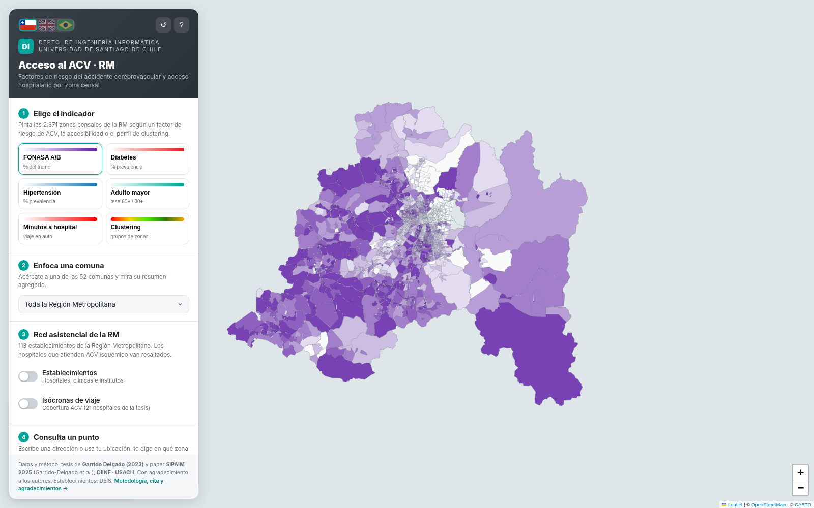
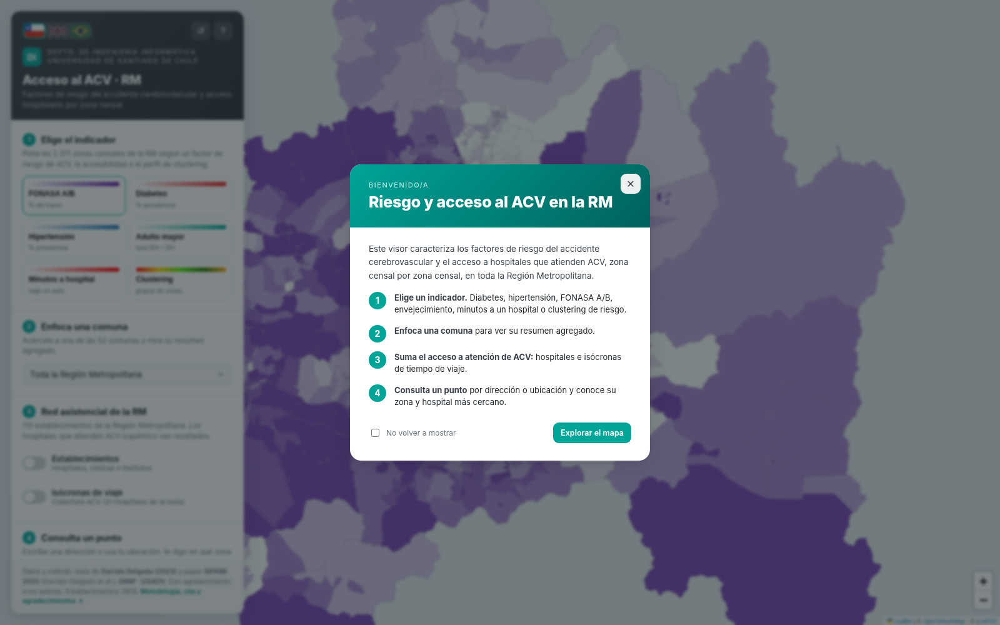
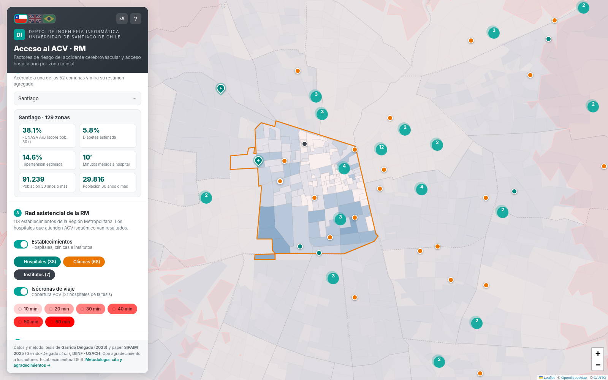
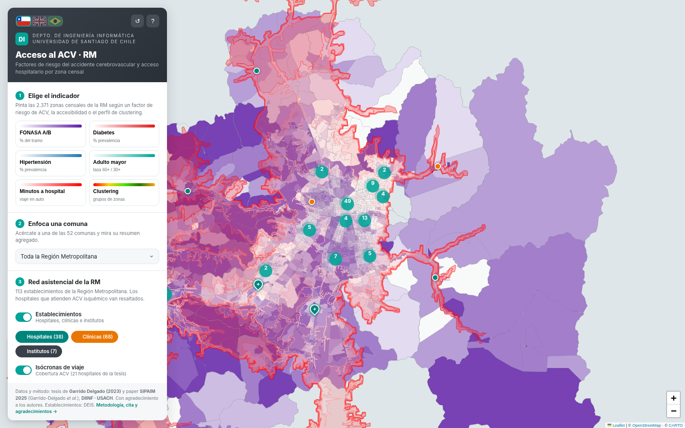
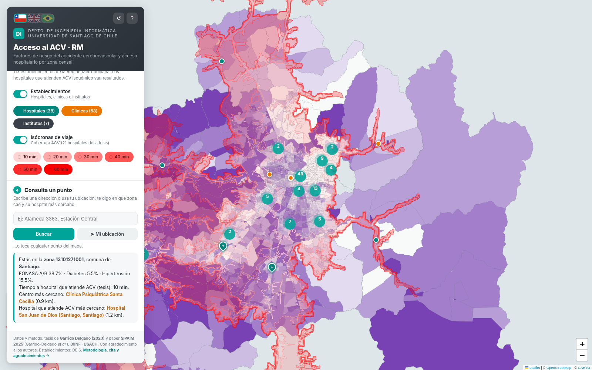
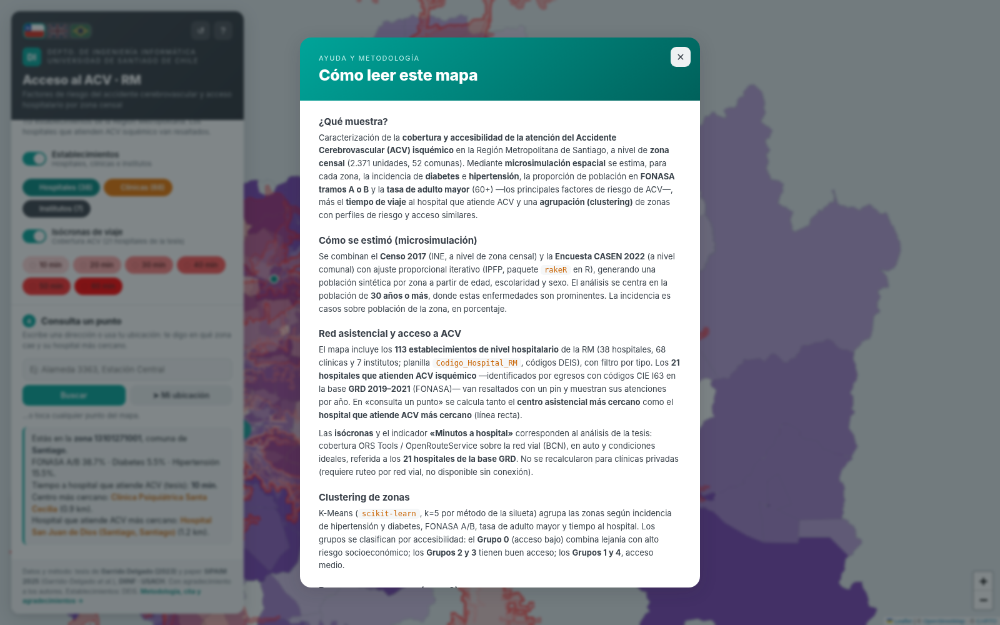

# StrokeAccessRM

**Visualización interactiva de factores de riesgo de accidente cerebrovascular y accesibilidad hospitalaria en la Región Metropolitana de Santiago.**  
**Interactive visualisation of stroke risk factors and hospital accessibility in the Santiago Metropolitan Region.**

[Español](#español) · [English](#english) · [Capturas / Screenshots](#capturas--screenshots) · [Datos](#7-datos-y-esquema) · [Data](#7-data-and-schema) · [Arquitectura](#9-arquitectura) · [Architecture](#9-architecture)

StrokeAccessRM es una aplicación web estática desarrollada en el Departamento de Ingeniería Informática de la Universidad de Santiago de Chile. Permite explorar 2.371 zonas censales, 52 comunas, factores de riesgo de accidente cerebrovascular (ACV), accesibilidad hospitalaria, isócronas de viaje y perfiles de clustering. La aplicación funciona en el navegador con Leaflet y no requiere backend, base de datos ni proceso de compilación.

StrokeAccessRM is a static web application developed at the Department of Computer Science of Universidad de Santiago de Chile. It allows users to explore 2,371 census zones, 52 municipalities, stroke risk factors, hospital accessibility, travel-time isochrones, and clustering profiles. The application runs in the browser with Leaflet and requires no backend, database, or build step.

**Despliegue público / Live deployment:** <https://mvillalobosc.diinf.usach.cl/StrokeAccessRM/>

---

## Capturas / Screenshots

### Inicio y guía / Home and guide

| Vista principal / Main view | Guía inicial / Welcome guide |
|---|---|
|  |  |

### Exploración territorial / Territorial exploration

| Resumen comunal / Municipality summary | Red hospitalaria e isócronas / Hospital network and isochrones |
|---|---|
|  |  |

### Consulta y metodología / Point query and methodology

| Consulta de un punto / Point query | Ayuda y metodología / Help and methodology |
|---|---|
|  |  |

---

# Español

## 1. ¿Qué es StrokeAccessRM?

StrokeAccessRM es un visor cartográfico para analizar la distribución espacial de factores de riesgo asociados al ACV isquémico y la accesibilidad a centros hospitalarios en la Región Metropolitana de Santiago.

La aplicación integra resultados de microsimulación espacial, análisis de isócronas y clustering. Cada zona censal puede visualizarse según:

- porcentaje de población perteneciente a FONASA A o B;
- incidencia estimada de diabetes;
- incidencia estimada de hipertensión;
- tasa de población adulta mayor;
- tiempo de viaje al hospital que atiende ACV más cercano;
- grupo de clustering con perfil de riesgo y acceso similar.

El visor también incorpora establecimientos hospitalarios de la Región Metropolitana, filtros por tipo, resúmenes comunales y una herramienta para consultar un punto mediante una dirección, la ubicación del navegador o un clic sobre el mapa.

## 2. Funcionalidades principales

### Indicadores por zona censal

- Mapa coroplético para las 2.371 zonas censales de la Región Metropolitana.
- Seis indicadores intercambiables desde el panel lateral.
- Leyenda dinámica con intervalos y colores específicos para cada variable.
- Información detallada de cada zona mediante ventanas emergentes.
- Atenuación de zonas fuera de la comuna seleccionada.

### Resumen por comuna

- Selector para las 52 comunas de la Región Metropolitana.
- Ajuste automático del mapa a la comuna seleccionada.
- Agregación de zonas censales y recálculo de porcentajes sobre la población de 30 años o más.
- Resumen de FONASA A/B, diabetes, hipertensión, población de 30 años o más, población de 60 años o más y tiempo medio al hospital.

### Red asistencial

- 113 establecimientos de nivel hospitalario:
  - 38 hospitales;
  - 68 clínicas;
  - 7 institutos.
- Filtro interactivo por tipo de establecimiento.
- Agrupamiento visual de marcadores con Leaflet.markercluster.
- Resaltado de los 21 hospitales que atendieron ACV isquémico en la base GRD 2019–2021.
- Frecuencias de atención por hospital para 2019, 2020, 2021 y promedio anual.

### Isócronas y accesibilidad

- Seis capas de tiempo de viaje: 10, 20, 30, 40, 50 y 60 minutos.
- Activación independiente de cada intervalo.
- Visualización combinada con zonas censales y establecimientos.
- Indicador de minutos al hospital basado en el análisis de la tesis.

### Consulta de un punto

- Búsqueda de direcciones mediante Nominatim de OpenStreetMap.
- Uso opcional de la geolocalización del navegador.
- Consulta directa mediante clic en el mapa.
- Identificación de la zona censal usando un algoritmo punto-en-polígono.
- Cálculo del establecimiento más cercano y del hospital que atiende ACV más cercano mediante distancia geodésica en línea recta.
- Presentación de indicadores de riesgo de la zona consultada.

### Interfaz

- Español, inglés y portugués.
- Detección automática del idioma del navegador.
- Persistencia local del idioma y de la preferencia de mostrar la guía inicial.
- Diseño adaptable para escritorio y dispositivos móviles.
- Ayuda integrada con metodología, fuentes, limitaciones y citas.

## 3. Ejecución local

No se necesita instalar paquetes ni compilar el proyecto.

### Opción recomendada: servidor local

Desde la carpeta del repositorio:

```bash
python -m http.server 8000
```

Luego abre:

```text
http://localhost:8000/
```

También puedes usar Apache, Nginx, VS Code Live Server o cualquier otro servidor estático.

### Apertura directa

La mayor parte de la aplicación funciona al abrir `index.html` directamente. Se recomienda un servidor local porque algunos navegadores restringen funciones como geolocalización, solicitudes remotas o almacenamiento cuando la página se abre mediante `file://`.

## 4. Publicación en GitHub Pages

El repositorio incluye `.github/workflows/pages.yml`, que publica automáticamente la aplicación cuando se actualiza la rama `main`.

1. Crea un repositorio en GitHub.
2. Copia el contenido de esta carpeta en la raíz del repositorio.
3. Sube los archivos a la rama `main`.
4. Abre **Settings → Pages**.
5. En **Source**, selecciona **GitHub Actions**.
6. Revisa la ejecución del flujo **Deploy static site to Pages** en la pestaña **Actions**.

La URL tendrá una forma similar a:

```text
https://USUARIO.github.io/NOMBRE-DEL-REPOSITORIO/
```

La aplicación utiliza rutas relativas, por lo que funciona correctamente dentro de un repositorio de proyecto. El archivo `.nojekyll` evita el procesamiento mediante Jekyll.

## 5. Flujo de uso

### 5.1 Elegir un indicador

Selecciona una tarjeta en el paso 1 del panel. El mapa y la leyenda se actualizan inmediatamente. Los indicadores disponibles son FONASA A/B, diabetes, hipertensión, adulto mayor, minutos a hospital y clustering.

### 5.2 Enfocar una comuna

Selecciona una comuna en el paso 2. La aplicación ajusta la vista, delimita la comuna y muestra un resumen calculado a partir de sus zonas censales.

### 5.3 Explorar la red asistencial

Activa **Establecimientos** para mostrar hospitales, clínicas e institutos. Puedes activar o desactivar cada categoría. Los hospitales que atienden ACV aparecen resaltados.

Activa **Isócronas de viaje** para mostrar las áreas de cobertura de 10 a 60 minutos. Cada intervalo puede ocultarse de forma independiente.

### 5.4 Consultar un punto

Puedes escribir una dirección, usar la ubicación del dispositivo o tocar el mapa. El visor identifica la zona censal, muestra sus indicadores y calcula las distancias al establecimiento más cercano y al hospital que atiende ACV más cercano.

## 6. Metodología resumida

### Microsimulación espacial

El estudio combinó información del Censo 2017 a nivel de zona censal con variables de la Encuesta CASEN 2022. La población sintética se obtuvo mediante ajuste proporcional iterativo, usando el paquete `rakeR` en R. Las variables comunes para el ajuste fueron edad, escolaridad y sexo.

Los indicadores mostrados se concentran en población de 30 años o más e incluyen diabetes, hipertensión, pertenencia a FONASA A/B y población adulta mayor.

### Accesibilidad e isócronas

Los hospitales que atendieron ACV isquémico se identificaron a partir de registros GRD 2019–2021 y códigos CIE relacionados con infarto cerebral. Las isócronas se generaron con ORS Tools/OpenRouteService sobre una red vial, usando tiempos de conducción en condiciones ideales.

### Clustering

Las zonas censales se agruparon mediante K-Means con cinco grupos, seleccionados mediante el método de la silueta. El modelo usa diabetes, hipertensión, FONASA A/B, tasa de adulto mayor y tiempo al hospital.

### Diferencia entre el estudio y esta aplicación

La tesis desplegó originalmente los resultados mediante ArcGIS Online. StrokeAccessRM implementa un visor web independiente con Leaflet, datos locales y funciones adicionales de consulta, filtros, internacionalización y cálculo en el navegador.

## 7. Datos y esquema

Los datos se distribuyen como objetos GeoJSON asignados a variables globales JavaScript. Esto permite cargar la aplicación sin realizar solicitudes a un backend.

### `data/resultados.js`

Contiene 2.371 zonas censales en `window.DATA_RESULTADOS`.

| Campo | Descripción |
|---|---|
| `geocodigo` | Identificador de la zona censal. |
| `nom_comuna` | Nombre de la comuna. |
| `codigo_com` | Código de la comuna. |
| `P_AB` | Porcentaje estimado de población FONASA A/B sobre población de 30 años o más. |
| `P_DB_Diabe` | Porcentaje estimado de diabetes. |
| `P_HT` | Porcentaje estimado de hipertensión. |
| `FonasaAoB` | Conteo estimado de personas FONASA A/B. |
| `Diabetes` | Conteo estimado de personas con diabetes. |
| `Hipertensi` | Conteo estimado de personas con hipertensión. |
| `POB_30_MAS` | Población de 30 años o más. |
| `POB_60_MAS` | Población de 60 años o más. |
| `TASA_ADULT` | Tasa de población de 60 años o más respecto de la población de 30 años o más. |
| `minutos_vi` | Tiempo estimado de viaje al hospital. |
| `cluster` | Grupo K-Means, de 0 a 4. |

### `data/comunas.js`

Contiene 52 límites comunales en `window.DATA_COMUNAS`.

| Campo | Descripción |
|---|---|
| `NOM_COMUNA` | Nombre de la comuna. |
| `CUT` | Código Único Territorial. |
| `NOM_PROVIN` | Provincia. |

### `data/isocronas.js`

Contiene seis geometrías multipoligonales en `window.DATA_ISOCRONAS`. El campo `contour` identifica los intervalos de 10, 20, 30, 40, 50 y 60 minutos.

### `data/hospitales.js`

Contiene 113 establecimientos en `window.DATA_HOSPITALES`.

| Campo | Descripción |
|---|---|
| `nombre` | Nombre del establecimiento. |
| `tipo` | Hospital, clínica o instituto. |
| `comuna` | Comuna del establecimiento. |
| `acv` | Indica si el establecimiento forma parte de los hospitales que atendieron ACV en la base analizada. |
| `f2019`, `f2020`, `f2021` | Frecuencia de atención de ACV por año. |
| `fprom` | Promedio anual. |

## 8. Dependencias

### Incluidas localmente

- Leaflet 1.9.4.
- Leaflet.markercluster.
- Datos geográficos y lógica de la aplicación.

### Servicios remotos

- Teselas CARTO/OpenStreetMap para el mapa base.
- Nominatim/OpenStreetMap para búsqueda de direcciones.
- Google Fonts para las tipografías Bricolage Grotesque e Inter.

Si no existe conexión, los indicadores, límites, isócronas, establecimientos y cálculos locales siguen disponibles, pero el mapa base, las fuentes remotas y la búsqueda de direcciones pueden no cargarse.

## 9. Arquitectura

```text
Navegador
  │
  ├── index.html
  │     ├── interfaz y diseño responsive
  │     ├── internacionalización ES / EN / PT
  │     ├── configuración de indicadores y colores
  │     ├── renderizado Leaflet / GeoJSON
  │     ├── filtros y resúmenes comunales
  │     ├── consulta punto-en-polígono
  │     ├── cálculo de distancia Haversine
  │     └── modales, guía y persistencia local
  │
  ├── data/
  │     ├── resultados.js
  │     ├── comunas.js
  │     ├── isocronas.js
  │     └── hospitales.js
  │
  └── lib/
        ├── Leaflet 1.9.4
        └── Leaflet.markercluster
```

### Flujo de carga

```text
Cargar bibliotecas locales
  ↓
Cargar objetos GeoJSON como variables globales
  ↓
Inicializar mapa y capas
  ↓
Construir tarjetas, leyendas, selectores y filtros
  ↓
Aplicar idioma inicial
  ↓
Renderizar zonas censales y activar interacciones
```

### Cálculos en el navegador

- **Punto-en-polígono:** ray casting sobre polígonos y multipolígonos GeoJSON.
- **Distancia:** fórmula de Haversine entre el punto consultado y cada establecimiento.
- **Resumen comunal:** suma de conteos y recálculo de porcentajes sobre población agregada.
- **Estilos:** selección de intervalos y colores en función del indicador activo.

## 10. Estructura del repositorio

```text
StrokeAccessRM/
├── index.html
├── README.md
├── LICENSE.md
├── CITATION.cff
├── CHANGELOG.md
├── CONTRIBUTING.md
├── SECURITY.md
├── THIRD_PARTY_NOTICES.md
├── .gitignore
├── .nojekyll
├── assets/
│   ├── screenshot-home.png
│   ├── screenshot-guide.png
│   ├── screenshot-comuna.png
│   ├── screenshot-network.png
│   ├── screenshot-query.png
│   └── screenshot-help.png
├── data/
│   ├── resultados.js
│   ├── comunas.js
│   ├── isocronas.js
│   └── hospitales.js
├── lib/
│   ├── leaflet.js
│   ├── leaflet.css
│   ├── leaflet.markercluster.js
│   └── recursos asociados
├── scripts/
│   └── validate-data.mjs
└── .github/
    ├── workflows/
    │   ├── pages.yml
    │   └── validate.yml
    ├── ISSUE_TEMPLATE/
    │   ├── bug_report.yml
    │   └── feature_request.yml
    └── PULL_REQUEST_TEMPLATE.md
```

## 11. Desarrollo

La aplicación no utiliza un sistema de compilación. Para modificarla:

1. edita `index.html` o los archivos de `data/`;
2. inicia un servidor estático;
3. abre las herramientas de desarrollo del navegador;
4. prueba indicadores, comunas, establecimientos, isócronas y consulta de puntos;
5. prueba español, inglés y portugués;
6. ejecuta la validación de datos;
7. actualiza las capturas cuando cambie la interfaz.

### Validación local

Con Node.js 20 o superior:

```bash
node scripts/validate-data.mjs
```

El script comprueba la existencia de los archivos principales, la estructura GeoJSON, los campos requeridos y las cantidades esperadas de zonas, comunas, isócronas y establecimientos.

## 12. Lista de pruebas

### Visualización

- [ ] Cargar las 2.371 zonas censales.
- [ ] Cambiar entre los seis indicadores.
- [ ] Verificar intervalos y leyendas.
- [ ] Abrir la información de una zona censal.
- [ ] Restablecer la vista completa.

### Comunas

- [ ] Seleccionar una comuna.
- [ ] Verificar el ajuste del mapa.
- [ ] Revisar los seis valores del resumen.
- [ ] Volver a toda la Región Metropolitana.

### Red asistencial

- [ ] Activar y desactivar establecimientos.
- [ ] Filtrar hospitales, clínicas e institutos.
- [ ] Abrir un establecimiento y revisar su información.
- [ ] Activar isócronas.
- [ ] Ocultar intervalos individuales.

### Consulta

- [ ] Consultar una dirección válida.
- [ ] Probar una dirección no encontrada.
- [ ] Consultar mediante clic en el mapa.
- [ ] Probar geolocalización en HTTPS.
- [ ] Verificar la zona y los dos establecimientos más cercanos.

### Interfaz

- [ ] Cambiar entre español, inglés y portugués.
- [ ] Probar la guía inicial y la opción de no volver a mostrarla.
- [ ] Abrir la ayuda metodológica.
- [ ] Probar en escritorio y pantalla estrecha.
- [ ] Confirmar que no existan errores en la consola.

## 13. Privacidad

Las capas geográficas y los cálculos principales se procesan localmente en el navegador. La aplicación no incluye un backend propio que reciba consultas o ubicaciones.

La búsqueda de direcciones envía el texto escrito a Nominatim/OpenStreetMap. La función **Mi ubicación** solicita permiso al navegador y usa las coordenadas solo durante la sesión para realizar el cálculo local. La política final de privacidad también depende del servidor donde se publique la aplicación y de cualquier modificación posterior.

## 14. Limitaciones

- Los tiempos de viaje corresponden a condiciones ideales y no incorporan tráfico, hora del día ni respuesta de ambulancia.
- Las isócronas se refieren a los hospitales incluidos en el análisis original y no se recalculan dinámicamente.
- La cercanía calculada al consultar un punto usa distancia en línea recta, no una ruta vial.
- Los indicadores combinan fuentes de distintos años: Censo 2017, GRD 2019–2021 y CASEN 2022.
- La microsimulación genera estimaciones para zonas pequeñas; no reemplaza registros clínicos individuales.
- La búsqueda de direcciones requiere conexión a Nominatim.
- El mapa base requiere conexión a los servidores de teselas.
- Las geometrías fueron simplificadas para facilitar su uso en la web.

## 15. Citación y créditos

### Tesis

> Garrido Delgado, D. A. (2023). *Análisis espacial y temporal para la caracterización de la cobertura hospitalaria y accesibilidad de los servicios de atención del Accidente Cerebrovascular en la Región Metropolitana de Santiago de Chile* [Tesis de Ingeniería de Ejecución en Computación e Informática, Universidad de Santiago de Chile].

**Profesor guía:** Manuel Villalobos Cid.  
**Profesor co-guía:** Matías Escudero Bell.

### Artículo

> Garrido-Delgado, D., Lillo-Vidal, J., Escudero-Bell, M., Hurtado-Meneses, V., & Villalobos-Cid, M. (2025). Spatiotemporal characterisation of stroke care accessibility and hospital coverage in the Santiago Metropolitan Region. *2025 21st International Symposium on Biomedical Image Processing and Analysis (SIPAIM)*, 1–5. <https://doi.org/10.1109/SIPAIM67325.2025.11283388>

### Créditos

- **Diego Andrés Garrido Delgado:** investigación original, preparación y análisis de datos.
- **Manuel Villalobos Cid:** profesor guía, adaptación y mantenimiento del visor.
- **Matías Escudero Bell:** profesor co-guía.
- **José Lillo Vidal y Victoria Hurtado Meneses:** coautoría del artículo SIPAIM 2025.
- **Departamento de Ingeniería Informática, Universidad de Santiago de Chile:** contexto institucional.

La preparación del repositorio y la organización de la documentación recibieron apoyo asistido por IA. La revisión técnica, la validación y la responsabilidad final corresponden a los autores y mantenedores.

## 16. Licencia

El código del repositorio se distribuye bajo la licencia MIT incluida en `LICENSE.md`. Las bibliotecas de terceros conservan sus licencias originales; revisa `THIRD_PARTY_NOTICES.md`.

---

# English

## 1. What is StrokeAccessRM?

StrokeAccessRM is a web map for analysing the spatial distribution of risk factors associated with ischaemic stroke and accessibility to hospital services in the Santiago Metropolitan Region.

The application combines spatial microsimulation, isochrone analysis, and clustering results. Each census zone can be displayed according to:

- the percentage of the population enrolled in FONASA groups A or B;
- estimated diabetes incidence;
- estimated hypertension incidence;
- older-adult population rate;
- travel time to the nearest hospital treating stroke;
- clustering group with a similar risk and accessibility profile.

The viewer also includes hospital-level facilities, filters by facility type, municipality summaries, and a point-query tool based on an address, browser location, or map click.

## 2. Main capabilities

### Census-zone indicators

- Choropleth map for 2,371 census zones.
- Six indicators selected from the side panel.
- Dynamic legends with indicator-specific breaks and colours.
- Detailed pop-ups for individual census zones.
- Visual dimming outside the selected municipality.

### Municipality summary

- Selector covering all 52 municipalities in the Metropolitan Region.
- Automatic map fit to the selected municipality.
- Aggregation of census zones and recalculation of percentages for the population aged 30 or older.
- Summary of FONASA A/B, diabetes, hypertension, population aged 30 or older, population aged 60 or older, and mean hospital travel time.

### Healthcare network

- 113 hospital-level facilities:
  - 38 hospitals;
  - 68 clinics;
  - 7 institutes.
- Interactive filtering by facility type.
- Marker clustering with Leaflet.markercluster.
- Highlighting of the 21 hospitals that treated ischaemic stroke in the 2019–2021 DRG dataset.
- Hospital frequencies for 2019, 2020, 2021, and the annual mean.

### Isochrones and accessibility

- Six travel-time layers: 10, 20, 30, 40, 50, and 60 minutes.
- Independent control of each interval.
- Combined display with census zones and healthcare facilities.
- Travel-time indicator based on the thesis analysis.

### Point query

- Address search through OpenStreetMap Nominatim.
- Optional browser geolocation.
- Direct query by clicking the map.
- Census-zone identification with a point-in-polygon algorithm.
- Calculation of the nearest facility and nearest stroke-treating hospital using straight-line geodesic distance.
- Display of the queried zone's risk indicators.

### Interface

- Spanish, English, and Portuguese.
- Automatic browser-language detection.
- Local persistence of language and welcome-guide preference.
- Responsive desktop and mobile layout.
- Integrated help covering methods, sources, limitations, and citation.

## 3. Local execution

No package installation or build process is required.

### Recommended option: local server

From the repository directory:

```bash
python -m http.server 8000
```

Then open:

```text
http://localhost:8000/
```

Apache, Nginx, VS Code Live Server, and other static servers can also be used.

### Direct opening

Most features work when `index.html` is opened directly. A local server is recommended because some browsers restrict geolocation, remote requests, or storage on `file://` pages.

## 4. Publishing with GitHub Pages

The repository includes `.github/workflows/pages.yml`, which deploys the application when the `main` branch is updated.

1. Create a GitHub repository.
2. Copy this folder's contents to the repository root.
3. Push the files to the `main` branch.
4. Open **Settings → Pages**.
5. Select **GitHub Actions** as the source.
6. Review the **Deploy static site to Pages** workflow under **Actions**.

The address will follow this pattern:

```text
https://USERNAME.github.io/REPOSITORY-NAME/
```

The application uses relative paths and works from a project repository. `.nojekyll` prevents Jekyll processing.

## 5. User workflow

### 5.1 Select an indicator

Choose a card in step 1 of the panel. The map and legend update immediately. Available indicators are FONASA A/B, diabetes, hypertension, older adults, minutes to hospital, and clustering.

### 5.2 Focus on a municipality

Choose a municipality in step 2. The application fits the map, outlines the municipality, and presents a summary computed from its census zones.

### 5.3 Explore the healthcare network

Enable **Facilities** to show hospitals, clinics, and institutes. Each category can be controlled separately. Hospitals treating stroke are highlighted.

Enable **Travel-time isochrones** to display 10–60 minute coverage areas. Each interval can be hidden independently.

### 5.4 Query a point

Enter an address, use the device location, or click the map. The viewer identifies the census zone, displays its indicators, and calculates distances to the nearest facility and nearest stroke-treating hospital.

## 6. Method summary

### Spatial microsimulation

The study combined 2017 Census information at census-zone level with variables from the 2022 CASEN survey. A synthetic population was generated through iterative proportional fitting with the `rakeR` package in R. Age, education, and sex were used as shared constraint variables.

The displayed indicators focus on the population aged 30 or older and include diabetes, hypertension, FONASA A/B, and older-adult population.

### Accessibility and isochrones

Hospitals treating ischaemic stroke were identified from 2019–2021 DRG records and ICD codes related to cerebral infarction. Isochrones were generated with ORS Tools/OpenRouteService over a road network, using ideal driving conditions.

### Clustering

Census zones were grouped with K-Means into five groups selected using the silhouette method. The model uses diabetes, hypertension, FONASA A/B, older-adult rate, and hospital travel time.

### Difference between the study and this application

The thesis originally deployed results through ArcGIS Online. StrokeAccessRM implements an independent Leaflet viewer with local data and additional point-query, filtering, internationalisation, and browser-side calculation features.

## 7. Data and schema

Data are distributed as GeoJSON objects assigned to global JavaScript variables. The browser can load all analytical layers without a backend.

### `data/resultados.js`

Contains 2,371 census zones in `window.DATA_RESULTADOS`.

| Field | Description |
|---|---|
| `geocodigo` | Census-zone identifier. |
| `nom_comuna` | Municipality name. |
| `codigo_com` | Municipality code. |
| `P_AB` | Estimated FONASA A/B percentage among people aged 30 or older. |
| `P_DB_Diabe` | Estimated diabetes percentage. |
| `P_HT` | Estimated hypertension percentage. |
| `FonasaAoB` | Estimated FONASA A/B count. |
| `Diabetes` | Estimated diabetes count. |
| `Hipertensi` | Estimated hypertension count. |
| `POB_30_MAS` | Population aged 30 or older. |
| `POB_60_MAS` | Population aged 60 or older. |
| `TASA_ADULT` | Population aged 60 or older relative to the population aged 30 or older. |
| `minutos_vi` | Estimated hospital travel time. |
| `cluster` | K-Means group from 0 to 4. |

### `data/comunas.js`

Contains 52 municipality boundaries in `window.DATA_COMUNAS`.

| Field | Description |
|---|---|
| `NOM_COMUNA` | Municipality name. |
| `CUT` | Unique territorial code. |
| `NOM_PROVIN` | Province. |

### `data/isocronas.js`

Contains six multipolygon geometries in `window.DATA_ISOCRONAS`. The `contour` field identifies the 10, 20, 30, 40, 50, and 60 minute intervals.

### `data/hospitales.js`

Contains 113 facilities in `window.DATA_HOSPITALES`.

| Field | Description |
|---|---|
| `nombre` | Facility name. |
| `tipo` | Hospital, clinic, or institute. |
| `comuna` | Municipality. |
| `acv` | Whether the facility belongs to the stroke-treating hospitals in the analysed dataset. |
| `f2019`, `f2020`, `f2021` | Stroke-care frequency by year. |
| `fprom` | Annual mean. |

## 8. Dependencies

### Bundled locally

- Leaflet 1.9.4.
- Leaflet.markercluster.
- Geographic data and application logic.

### Remote services

- CARTO/OpenStreetMap tiles for the base map.
- Nominatim/OpenStreetMap for address search.
- Google Fonts for Bricolage Grotesque and Inter.

Without a connection, indicators, boundaries, isochrones, facilities, and local calculations remain available, but the base map, remote fonts, and address search may not load.

## 9. Architecture

```text
Browser
  │
  ├── index.html
  │     ├── responsive interface
  │     ├── ES / EN / PT internationalisation
  │     ├── indicator and colour configuration
  │     ├── Leaflet / GeoJSON rendering
  │     ├── filters and municipality summaries
  │     ├── point-in-polygon query
  │     ├── Haversine distance calculation
  │     └── modals, guide, and local persistence
  │
  ├── data/
  │     ├── resultados.js
  │     ├── comunas.js
  │     ├── isocronas.js
  │     └── hospitales.js
  │
  └── lib/
        ├── Leaflet 1.9.4
        └── Leaflet.markercluster
```

### Loading pipeline

```text
Load local libraries
  ↓
Load GeoJSON objects as global variables
  ↓
Initialise the map and layers
  ↓
Build cards, legends, selectors, and filters
  ↓
Apply the initial language
  ↓
Render census zones and attach interactions
```

### Browser-side calculations

- **Point in polygon:** ray casting for GeoJSON polygons and multipolygons.
- **Distance:** Haversine formula between the query point and each facility.
- **Municipality summary:** aggregation of counts and recalculation of percentages over the combined population.
- **Styling:** interval and colour selection based on the active indicator.

## 10. Repository structure

```text
StrokeAccessRM/
├── index.html
├── README.md
├── LICENSE.md
├── CITATION.cff
├── CHANGELOG.md
├── CONTRIBUTING.md
├── SECURITY.md
├── THIRD_PARTY_NOTICES.md
├── .gitignore
├── .nojekyll
├── assets/
├── data/
├── lib/
├── scripts/
└── .github/
```

## 11. Development

The application has no build system. To modify it:

1. edit `index.html` or the files under `data/`;
2. start a static server;
3. open the browser developer tools;
4. test indicators, municipalities, facilities, isochrones, and point queries;
5. test Spanish, English, and Portuguese;
6. run the data validation script;
7. update screenshots after interface changes.

### Local validation

With Node.js 20 or newer:

```bash
node scripts/validate-data.mjs
```

The script checks the main files, GeoJSON structures, required fields, and expected counts of zones, municipalities, isochrones, and facilities.

## 12. Testing checklist

### Visualisation

- [ ] Load all 2,371 census zones.
- [ ] Switch between the six indicators.
- [ ] Verify breaks and legends.
- [ ] Open a census-zone pop-up.
- [ ] Reset the complete view.

### Municipalities

- [ ] Select a municipality.
- [ ] Verify map fitting.
- [ ] Review all six summary values.
- [ ] Return to the complete Metropolitan Region.

### Healthcare network

- [ ] Enable and disable facilities.
- [ ] Filter hospitals, clinics, and institutes.
- [ ] Open a facility and review its information.
- [ ] Enable isochrones.
- [ ] Hide individual intervals.

### Query

- [ ] Search for a valid address.
- [ ] Test an address that cannot be found.
- [ ] Query by clicking the map.
- [ ] Test geolocation over HTTPS.
- [ ] Verify the zone and the two nearest-facility results.

### Interface

- [ ] Switch between Spanish, English, and Portuguese.
- [ ] Test the welcome guide and its persistence option.
- [ ] Open the methodology help.
- [ ] Test desktop and narrow-screen layouts.
- [ ] Confirm that the browser console contains no errors.

## 13. Privacy

Geographic layers and core calculations are processed locally in the browser. The application has no dedicated backend receiving queries or locations.

Address searches send the entered text to OpenStreetMap Nominatim. **My location** requests browser permission and uses the coordinates during the current session for local calculations. Final privacy also depends on the hosting environment and later code changes.

## 14. Limitations

- Travel times assume ideal conditions and do not include traffic, time of day, or ambulance response.
- Isochrones refer to the hospitals in the original analysis and are not recalculated dynamically.
- Point-query proximity uses straight-line distance rather than road routing.
- Indicators combine sources from different years: 2017 Census, 2019–2021 DRG records, and 2022 CASEN.
- Spatial microsimulation produces small-area estimates and does not replace individual clinical records.
- Address search requires access to Nominatim.
- Base-map tiles require an internet connection.
- Geometries were simplified for web use.

## 15. Citation and credits

### Thesis

> Garrido Delgado, D. A. (2023). *Análisis espacial y temporal para la caracterización de la cobertura hospitalaria y accesibilidad de los servicios de atención del Accidente Cerebrovascular en la Región Metropolitana de Santiago de Chile* [Undergraduate thesis, Universidad de Santiago de Chile].

**Supervisor:** Manuel Villalobos Cid.  
**Co-supervisor:** Matías Escudero Bell.

### Paper

> Garrido-Delgado, D., Lillo-Vidal, J., Escudero-Bell, M., Hurtado-Meneses, V., & Villalobos-Cid, M. (2025). Spatiotemporal characterisation of stroke care accessibility and hospital coverage in the Santiago Metropolitan Region. *2025 21st International Symposium on Biomedical Image Processing and Analysis (SIPAIM)*, 1–5. <https://doi.org/10.1109/SIPAIM67325.2025.11283388>

### Credits

- **Diego Andrés Garrido Delgado:** original research, data preparation, and analysis.
- **Manuel Villalobos Cid:** supervisor, viewer adaptation, and maintenance.
- **Matías Escudero Bell:** co-supervisor.
- **José Lillo Vidal and Victoria Hurtado Meneses:** co-authorship of the SIPAIM 2025 paper.
- **Department of Computer Science, Universidad de Santiago de Chile:** institutional setting.

AI-assisted support was used to organise the repository and documentation. Technical review, validation, and final responsibility remain with the project authors and maintainers.

## 16. Licence

Repository code is distributed under the MIT Licence in `LICENSE.md`. Third-party libraries retain their original licences; see `THIRD_PARTY_NOTICES.md`.
